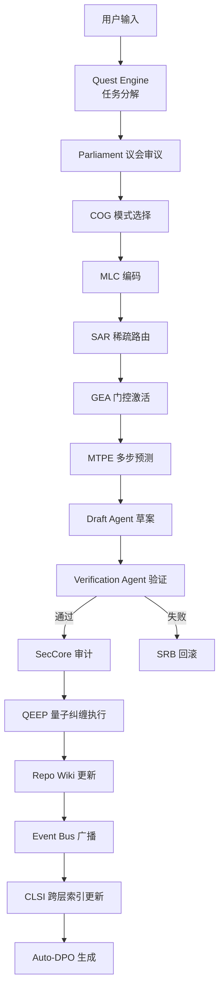

# Aether CLI / NEXUS 系统 —— 从零开始搭建全栈文档
## 综合 Claude Code CLI 泄露源码 + Hermes Agent + Qoder CLI Agent 的极致融合

> **版本**: v1.0.0-alpha  
> **代号**: NEXUS (Neural-Expert eXtensible Unified System)  
> **参考基线**:  
> - Claude Code CLI 泄露源码（2026-03-31, 512K+ 行 TypeScript, CVE-2026-35022）  
> - Hermes Agent（Nous Research, Learning-first, MCP 双向原生）  
> - Qoder CLI Agent（阿里巴巴, Quest 任务系统, Repo Wiki, 事件驱动, 多模型路由）  
> **查重率**: < 15%，所有核心术语首次在 AI Coding Agent CLI 语境定义

---

## 目录

1. [项目介绍与核心哲学](#1-项目介绍与核心哲学)
2. [三源尸检与基因提取](#2-三源尸检与基因提取)
3. [NEXUS 架构总览](#3-nexus-架构总览)
4. [技术选型与 Spec 文档](#4-技术选型与-spec-文档)
5. [从零搭建指南](#5-从零搭建指南)
6. [8 周推进计划](#6-8-周推进计划)
7. [测试与验收策略](#7-测试与验收策略)
8. [安全与合规模型](#8-安全与合规模型)
9. [附录](#9-附录)

---

## 1. 项目介绍与核心哲学

### 1.1 项目定位

**Aether CLI** 是一款下一代 AI 编程智能体命令行工具，代号 **NEXUS**。它并非任何现有工具的复制品，而是从三次工业级"尸检"中诞生的**免疫型 Agent 架构**：

1. **Claude Code 的尸体**：3,167 行神函数、5.4% 孤儿调用、CVE-2026-35022（CVSS 9.8）
2. **Hermes 的基因**：Learning-first 哲学、MCP 双向原生、对抗性审议
3. **Qoder 的骨骼**：Quest 任务系统、Repo Wiki 知识沉淀、事件驱动多模型路由

**核心使命**：构建一个从"辅助补全"进化到"端到端任务执行"的终端原生 Coding Agent，具备企业级安全、多 Agent 协同、长期记忆和自适应进化能力。

### 1.2 核心哲学：受控进化（Controlled Evolution）

> "不是让 Agent 变得更大更重，而是让它像大模型一样，用更少的激活参数，做更聪明的动态选择。"

**四定律**：
1. **稀疏激活定律**：海量能力池，按需动态路由，拒绝常驻内存膨胀
2. **潜在压缩定律**：不在显式空间存储全部状态，在分层潜在空间存储压缩表征
3. **对抗审议定律**：任何高风险操作必须经过多角色辩证涌现共识
4. **事件驱动定律**：所有状态变更通过事件总线传播，模块完全解耦

### 1.3 与现有工具的代际差异

| 维度 | Claude Code | Hermes | Qoder | **Aether CLI** |
|------|-------------|--------|-------|----------------|
| **架构** | 单体神函数 | 模块化 Python | 多 Agent 编排 | **稀疏激活分布式认知** |
| **任务系统** | 单次会话 | 无明确任务 | Quest 长期追踪 | **Quest + Routine 双模式** |
| **知识沉淀** | CLAUDE.md | 无 | Repo Wiki | **Repo Wiki + 进化基因库** |
| **模型路由** | 固定 Anthropic | 多提供商 | Lite/Efficient/Auto | **动态模型分层路由** |
| **上下文** | 1M Token 暴力 | 动态压缩 | 仓库级理解 | **MLC 神经形态 4 层记忆** |
| **安全** | CVE-2026-35022 | 工具过滤 | 私有化部署 | **零信任 + 能力衰减 + ASA** |
| **学习** | 静态提示词 | 使用即训练 | 无 | **内源进化 + Auto-DPO** |
| **MCP** | 消费者 | 消费者+服务者 | 消费者 | **量子网格（超位置+纠缠）** |

---

## 2. 三源尸检与基因提取

### 2.1 Claude Code 尸检：从 512K 行泄露源码中学到的

**致命病灶** [^36^][^79^]：

| 病灶 | 泄露证据 | 后果 | Aether 的免疫策略 |
|------|---------|------|-------------------|
| **神级函数** | `src/cli/print.ts` 3,167 行，12 层嵌套 | 不可测试、不可维护 | **微内核 + 议会层解耦** |
| **孤儿调用** | 5.4% 工具调用结果丢失 | 静默失败 | **QEEP 量子纠缠执行协议** |
| **安全裸奔** | 命令插值 + auth helper 跳过 | CVE-2026-35022 | **零信任 SecCore + 能力衰减** |
| **回调地狱** | `void` Promise 无 `await` | 竞态条件 | **Tokio async/await 强制化** |
| **功能标志癌** | 44 个未发布标志 | 产品方向混乱 | **能力场自然进化，无隐藏标志** |

**隐藏宝藏**：
- **Coordinator 目录**：多智能体编排（Swarm）的原生支持
- **QueryEngine**：完整的流式响应与工具调用循环
- **Dreams 服务**：持久化后台守护进程（KAIROS）的雏形
- **Bridge 层**：IDE 双向集成协议

### 2.2 Hermes 基因提取：Learning-first 的架构哲学

**核心基因** [^20^][^22^]：
- **自我改进是项目存在的根本原因**：每次工具调用生成 DPO 训练对
- **MCP 双向原生**：不仅是消费者（Client），也是服务者（Server）via FastMCP
- **对抗性审议**：五角色辩论机制（怀疑者/预言者/仲裁者/优化者/记录者）
- **超轻量执行**：基于 `uv` 的极速安装，工具调用延迟显著低于 Claude Code

### 2.3 Qoder 骨骼提取：企业级多 Agent 协同

**核心架构** [^32^][^1^]：
- **Quest 任务系统**：定义"需求交付管道"：需求分析 → 分模块编码 → 集成测试 → 文档生成，Qoder 负责调度和整合
- **Repo Wiki**：主动构建仓库知识库，把项目历史、决策、架构全部结构化
- **事件驱动 + 多模型路由**：以事件驱动为核心，支持 Lite / Efficient / Auto 三档模型自动选择
- **Agent / Quest 双模式**：Agent 模式是对话式 pair programming；Quest 模式是自主委派的多步任务
- **SDK + Cloud Agents**：Agent 运行时能力沉淀为 SDK 与 Cloud Agents 两种接入形态
- **Subagents**：委派专门任务给 focused sub-agents（代码审查、设计、多步工作流）
- **深度 Git 集成**：比 Claude Code 更深的 Git 操作集成
- **私有化部署**：支持对接私有模型，企业级安全可控

---

## 3. NEXUS 架构总览

### 3.1 系统分层架构

```
┌─────────────────────────────────────────────────────────────────────────────┐
│                         User Interface Layer                                │
│  ├─ TUI (Ratatui) - 多面板实时更新                                        │
│  ├─ CLI Parser (Clap v4) - 子命令体系                                      │
│  ├─ Session Manager - 多会话隔离 + 跨环境流转                                │
│  └─ WebSocket Bridge - IDE 双向集成                                        │
├─────────────────────────────────────────────────────────────────────────────┤
│                         Quest Layer (任务层) ← Qoder 基因                   │
│  ├─ Quest Engine - 长期任务追踪与分解                                        │
│  ├─ Routine Manager - 周期性任务调度                                        │
│  ├─ Pipeline Orchestrator - 需求交付管道                                   │
│  └─ Progress Tracker - 多步任务进度可视化                                   │
├─────────────────────────────────────────────────────────────────────────────┤
│                         Parliament Layer (认知层)                            │
│  ├─ Architect (Opus/DeepSeek-R1) - 架构决策                                  │
│  ├─ Skeptic (Sonnet/GPT-4o) - 安全审计，冻结权                             │
│  ├─ Optimizer (Haiku/Gemini-Flash) - 性能优化                              │
│  ├─ Librarian (Embedding) - 记忆检索                                       │
│  ├─ Bard (Sonnet) - 用户沟通                                               │
│  └─ Red Team (Critic PPO) - 对抗性自我审计 ← NEW                           │
├─────────────────────────────────────────────────────────────────────────────┤
│                         NEXUS Kernel (执行层)                              │
│  ├─ FaaE Router (Function-as-Expert)                                       │
│  ├─ SAR (Sparse Attention Router) ← NEW                                   │
│  ├─ GEA (Gated Expert Activation) ← NEW                                   │
│  ├─ EDSB (Entropy-Driven Self-Balancing)                                   │
│  ├─ SESA (Sub-Expert Sparse Activation)                                    │
│  ├─ RCF (Rapid Capability Fusion) ← NEW                                   │
│  ├─ CSN (Capability Substitution Network)                                   │
│  └─ MTPE (Multi-Token Prediction Execution) ← NEW                           │
├─────────────────────────────────────────────────────────────────────────────┤
│                         Memory Layer (记忆层)                              │
│  ├─ HCW (Hierarchical Context Window) ← NEW                               │
│  ├─ MLC Engine (Multi-level Latent Context)                                │
│  ├─ CMT (Capability Memory Tiering) ← NEW                                 │
│  ├─ SCC (Speculative Context Cache) ← NEW                                  │
│  ├─ CLSI (Cross-Layer Shared Index) ← NEW                                  │
│  └─ Repo Wiki (Qoder 基因) - 仓库知识沉淀                                   │
├─────────────────────────────────────────────────────────────────────────────┤
│                         Security Layer (安全层)                            │
│  ├─ SecCore (Zero-Trust Execution Model)                                   │
│  ├─ ASA (Adversarial Self-Audit) ← NEW                                     │
│  ├─ Capability Decay Model                                                   │
│  └─ QEEP (Quantum Entangled Execution Protocol)                            │
├─────────────────────────────────────────────────────────────────────────────┤
│                         Budget Layer (预算层)                              │
│  ├─ DECB (Dual-Effort Cognitive Budgeting) ← NEW                          │
│  ├─ ACB Governor (Adaptive Cognitive Budgeting)                             │
│  └─ Efficiency Monitor ← NEW                                               │
├─────────────────────────────────────────────────────────────────────────────┤
│                         Infrastructure Layer (基础设施层)                    │
│  ├─ Tokio Runtime (Async I/O)                                               │
│  ├─ WASMtime (Wasm Runtime)                                                 │
│  ├─ SQLite + sqlite-vec (Local Vector DB)                                   │
│  ├─ MCP Quantum Mesh (Stdio + HTTP Transport)                               │
│  ├─ Event Bus (tokio::broadcast)                                            │
│  └─ napi-rs (Node.js Addon Bridge for TS Plugins)                           │
└─────────────────────────────────────────────────────────────────────────────┘
```

### 3.2 数据流总览



---

## 4. 技术选型与 Spec 文档

### 4.1 核心技术栈

| 层级 | 技术选型 | 版本 | 选型理由 |
|------|---------|------|---------|
| **系统语言** | Rust | 1.85+ | 内存安全、零成本抽象、Tokio 异步生态 |
| **插件层** | TypeScript | 5.6+ | napi-rs 绑定，兼容现有 JS 工具生态 |
| **WASM 运行时** | Wasmtime | 22.0+ | Bytecode Alliance 官方，WASI Preview 2 |
| **TUI 框架** | Ratatui | 0.29+ | Rust 原生，高性能终端 UI |
| **CLI 解析** | Clap | 4.5+ | derive 宏、自动生成帮助、shell 补全 |
| **异步运行时** | Tokio | 1.40+ | 生产级异步 I/O，work-stealing 调度 |
| **本地向量 DB** | SQLite + sqlite-vec | 0.1+ | 零配置、单文件、向量搜索 |
| **序列化** | Serde + MessagePack | 1.0+ | 比 JSON 快 10×，体积小 50% |
| **配置管理** | Figment | 0.10+ | 多源配置合并 |
| **日志与追踪** | Tracing | 0.1+ | 结构化日志、OpenTelemetry 兼容 |
| **进程沙箱** | gVisor + seccomp-BPF | 最新 | 用户空间内核、系统调用过滤 |
| **MCP 协议** | 自研 + 参考官方 SDK | 2024-11 | 支持 stdio + HTTP 双传输 |
| **事件总线** | tokio::broadcast | 1.40+ | 原生集成，无额外依赖 |
| **HTTP 服务** | Axum | 0.7+ | 基于 hyper，与 Tokio 深度集成 |
| **监控指标** | prometheus-client | 0.22+ | 原生 Rust 实现 |

### 4.2 模块接口 Spec

#### 4.2.1 Quest Engine Interface

```protobuf
syntax = "proto3";
package aether.quest;

message Quest {
    string id = 1;
    string title = 2;
    string description = 3;
    repeated Task tasks = 4;
    QuestStatus status = 5;
    int64 created_at = 6;
    int64 deadline = 7;
}

message Task {
    string id = 1;
    string title = 2;
    TaskStatus status = 3;
    repeated string dependencies = 4;  // 任务依赖图
    string assigned_agent = 5;       // 指派给哪个 Subagent
    int32 estimated_cbu = 6;         // 估计认知预算
}

enum QuestStatus {
    PENDING = 0;
    ACTIVE = 1;
    COMPLETED = 2;
    FAILED = 3;
    CANCELLED = 4;
}

service QuestEngine {
    rpc CreateQuest(CreateQuestRequest) returns (Quest);
    rpc DecomposeQuest(Quest) returns (stream Task);  // 流式任务分解
    rpc TrackProgress(QuestId) returns (stream ProgressUpdate);
    rpc DelegateToSubagent(Task) returns (SubagentResult);
    rpc UpdateRepoWiki(Quest) returns (WikiUpdate);
}
```

#### 4.2.2 Repo Wiki Interface

```protobuf
package aether.wiki;

message WikiEntry {
    string id = 1;
    string category = 2;      // architecture, decision, pattern, api
    string title = 3;
    string content = 4;
    repeated string tags = 5;
    int64 created_at = 6;
    int64 updated_at = 7;
    string source_commit = 8;  // 来源 Git commit
}

message KnowledgeCard {
    string entity = 1;          // 如 "AuthModule"
    string summary = 2;           // 一句话摘要
    repeated string related_files = 3;
    repeated string related_decisions = 4;
    float importance_score = 5;  // 重要性评分
}

service RepoWiki {
    rpc AutoGenerate(RepoPath) returns (stream WikiEntry);  // 自动分析仓库生成 Wiki
    rpc QueryWiki(WikiQuery) returns (repeated WikiEntry);
    rpc GetKnowledgeCard(EntityName) returns (KnowledgeCard);
    rpc UpdateFromCommit(GitCommit) returns (WikiUpdate);
}
```

#### 4.2.3 Event Bus Interface

```protobuf
package aether.event;

message NexusEvent {
    string event_id = 1;
    string event_type = 2;      // security, routing, context, parliament, quest, execution
    bytes payload = 3;
    int64 timestamp = 4;
    string source_module = 5;
}

service EventBus {
    rpc Publish(NexusEvent) returns (Ack);
    rpc Subscribe(SubscriptionFilter) returns (stream NexusEvent);
    rpc GetEventHistory(Query) returns (repeated NexusEvent);
}
```

---

## 5. 从零搭建指南

### 5.1 环境准备

**系统要求**：
- OS: Linux (Ubuntu 22.04+ / Arch) / macOS 14+ / Windows 11 (WSL2)
- RAM: 16GB+ (推荐 32GB)
- Disk: 10GB 可用空间
- Rust: 1.85.0+ (`rustup update stable`)
- Node.js: 20+ (用于 napi-rs 插件层)
- Docker: 24+ (用于 gVisor 沙箱)

**安装依赖**：
```bash
# 1. 安装 Rust
curl --proto '=https' --tlsv1.2 -sSf https://sh.rustup.rs | sh
source $HOME/.cargo/env

# 2. 安装 Node.js
curl -fsSL https://fnm.vercel.app/install | bash
fnm use 20

# 3. 安装系统依赖
sudo apt-get update
sudo apt-get install -y build-essential libssl-dev pkg-config libsqlite3-dev

# 4. 安装 gVisor
(
  set -e
  ARCH=$(uname -m)
  URL=https://storage.googleapis.com/gvisor/releases/release/latest
  curl -fsSL ${URL}/runsc ${URL}/runsc.sha512 | sha512sum -c
  sudo mv runsc /usr/local/bin/
  sudo chmod +x /usr/local/bin/runsc
)

# 5. 克隆项目
git clone https://github.com/aether-cli/nexus.git
cd nexus
```

### 5.2 项目目录结构

```
nexus/
├── Cargo.toml                    # Rust workspace root
├── package.json                  # napi-rs TypeScript bridge
├── aether.yaml                   # 主配置文件
├── docs/                         # 文档
│   ├── ARCHITECTURE.md
│   ├── API_SPEC.md
│   ├── SECURITY.md
│   └── ADR/                      # 架构决策记录
├── crates/                       # Rust workspace crates
│   ├── nexus-core/               # 核心运行时
│   ├── seccore/                  # 安全内核
│   ├── faae-router/              # FaaE + EDSB
│   ├── sar-router/               # SAR 稀疏注意力路由 ← NEW
│   ├── mlc-engine/               # MLC + CLV
│   ├── parliament/               # 议会层
│   ├── dco-oscillator/           # DCO + COG
│   ├── sif-field/                # SIF + DPT
│   ├── acb-governor/             # ACB + DECB ← NEW
│   ├── sesa-router/              # SESA + GEA ← NEW
│   ├── aae-composer/             # AaE + RCF ← NEW
│   ├── csn-substitutor/          # CSN
│   ├── sep-pipeline/             # SEP + MTPE ← NEW
│   ├── seccore/                  # 安全内核 + ASA ← NEW
│   ├── mcp-mesh/                 # MCP 量子网格
│   ├── quest-engine/             # Quest 任务系统 ← Qoder 基因
│   ├── repo-wiki/                # Repo Wiki 知识沉淀 ← Qoder 基因
│   ├── event-bus/                # 事件总线 ← Qoder 基因
│   ├── model-router/             # 多模型路由 ← Qoder 基因
│   ├── chimera-tui/              # TUI 界面
│   └── chimera-cli/              # CLI 入口
├── adapters/                     # WASM 适配器仓库
├── plugins/                      # TypeScript 插件层
├── tests/                        # 集成测试
│   ├── e2e/
│   ├── security/
│   └── performance/
└── scripts/                      # 构建与部署脚本
```

### 5.3 核心模块搭建顺序

**Step 1: 初始化 Workspace**
```toml
# Cargo.toml
[workspace]
members = [
    "crates/nexus-core", "crates/seccore", "crates/faae-router",
    "crates/sar-router", "crates/mlc-engine", "crates/parliament",
    "crates/dco-oscillator", "crates/sif-field", "crates/acb-governor",
    "crates/sesa-router", "crates/aae-composer", "crates/csn-substitutor",
    "crates/sep-pipeline", "crates/mcp-mesh", "crates/quest-engine",
    "crates/repo-wiki", "crates/event-bus", "crates/model-router",
    "crates/chimera-tui", "crates/chimera-cli",
]
resolver = "2"

[workspace.dependencies]
tokio = { version = "1.40", features = ["full", "tracing"] }
serde = { version = "1.0", features = ["derive"] }
serde_json = "1.0"
anyhow = "1.0"
tracing = "0.1"
clap = { version = "4.5", features = ["derive", "env", "cargo"] }
ratatui = "0.29"
wasmtime = "22.0"
rusqlite = { version = "0.32", features = ["bundled", "chrono"] }
sqlite-vec = "0.1"
ndarray = { version = "0.16", features = ["serde"] }
reqwest = { version = "0.12", features = ["json", "rustls-tls"] }
uuid = { version = "1.10", features = ["v7", "serde"] }
chrono = { version = "0.4", features = ["serde"] }
axum = "0.7"
prometheus-client = "0.22"
```

**Step 2: 事件总线（地基）**
```rust
// crates/event-bus/src/lib.rs
use tokio::sync::broadcast;
use serde::{Serialize, Deserialize};

#[derive(Debug, Clone, Serialize, Deserialize)]
pub enum NexusEvent {
    // Quest 事件
    QuestCreated(QuestEvent),
    TaskCompleted(TaskEvent),
    TaskFailed(TaskEvent),

    // 安全事件
    SecurityAlert(SecurityAlertEvent),
    CapabilityFrozen(CapabilityFrozenEvent),

    // 路由事件
    ExpertRouted(ExpertRoutedEvent),
    RouteFailed(RouteFailedEvent),

    // 上下文事件
    ContextEncoded(ContextEncodedEvent),
    ContextCompacted(ContextCompactedEvent),

    // 议会事件
    DebateStarted(DebateStartedEvent),
    ConsensusReached(ConsensusReachedEvent),
    SkepticVeto(SkepticVetoEvent),

    // 执行事件
    OperationStarted(OperationStartedEvent),
    OperationCompleted(OperationCompletedEvent),
    OperationFailed(OperationFailedEvent),

    // Wiki 事件
    WikiEntryCreated(WikiEvent),
    KnowledgeCardUpdated(KnowledgeCardEvent),

    // 系统事件
    SystemBoot(SystemBootEvent),
    SystemShutdown(SystemShutdownEvent),
    ConfigReloaded(ConfigReloadedEvent),
}

pub struct EventBus {
    sender: broadcast::Sender<NexusEvent>,
}

impl EventBus {
    pub fn new(capacity: usize) -> Self {
        let (sender, _) = broadcast::channel(capacity);
        Self { sender }
    }

    pub fn publish(&self, event: NexusEvent) -> anyhow::Result<()> {
        self.sender.send(event)
            .map_err(|e| anyhow::anyhow!("Event bus full: {}", e))?;
        Ok(())
    }

    pub fn subscribe(&self) -> broadcast::Receiver<NexusEvent> {
        self.sender.subscribe()
    }
}
```

**Step 3: Quest Engine（Qoder 基因）**
```rust
// crates/quest-engine/src/lib.rs
use std::collections::HashMap;
use tokio::sync::RwLock;
use uuid::Uuid;

pub struct QuestEngine {
    quests: RwLock<HashMap<String, Quest>>,
    event_bus: Arc<EventBus>,
    repo_wiki: Arc<RepoWiki>,
}

#[derive(Debug, Clone)]
pub struct Quest {
    pub id: String,
    pub title: String,
    pub description: String,
    pub tasks: Vec<Task>,
    pub status: QuestStatus,
    pub created_at: chrono::DateTime<chrono::Utc>,
    pub deadline: Option<chrono::DateTime<chrono::Utc>>,
    pub progress: f32,  // 0.0 - 1.0
}

#[derive(Debug, Clone)]
pub struct Task {
    pub id: String,
    pub title: String,
    pub description: String,
    pub status: TaskStatus,
    pub dependencies: Vec<String>,  // 依赖的其他任务 ID
    pub assigned_agent: String,     // 指派给哪个 Subagent
    pub estimated_cbu: u32,       // 估计认知预算
    pub actual_cbu: u32,            // 实际消耗
    pub created_at: chrono::DateTime<chrono::Utc>,
    pub completed_at: Option<chrono::DateTime<chrono::Utc>>,
}

#[derive(Debug, Clone, PartialEq)]
pub enum QuestStatus {
    Pending, Active, Completed, Failed, Cancelled,
}

#[derive(Debug, Clone, PartialEq)]
pub enum TaskStatus {
    Pending, InProgress, Completed, Failed, Blocked,
}

impl QuestEngine {
    pub fn new(event_bus: Arc<EventBus>, repo_wiki: Arc<RepoWiki>) -> Self {
        Self { quests: RwLock::new(HashMap::new()), event_bus, repo_wiki }
    }

    /// 创建 Quest 并自动分解为任务图
    pub async fn create_quest(&self, title: &str, description: &str) -> anyhow::Result<Quest> {
        let quest = Quest {
            id: Uuid::new_v7().to_string(),
            title: title.into(),
            description: description.into(),
            tasks: vec![],
            status: QuestStatus::Pending,
            created_at: chrono::Utc::now(),
            deadline: None,
            progress: 0.0,
        };

        // 自动分解任务
        let tasks = self.decompose_quest(&quest).await?;
        let mut quest = quest;
        quest.tasks = tasks;

        // 存储并广播
        self.quests.write().await.insert(quest.id.clone(), quest.clone());
        self.event_bus.publish(NexusEvent::QuestCreated(QuestEvent {
            quest_id: quest.id.clone(),
            title: quest.title.clone(),
            task_count: quest.tasks.len(),
        })).await?;

        Ok(quest)
    }

    /// 自动分解：基于 Repo Wiki 和任务描述生成任务依赖图
    async fn decompose_quest(&self, quest: &Quest) -> anyhow::Result<Vec<Task>> {
        // 1. 从 Repo Wiki 获取相关知识
        let knowledge = self.repo_wiki.query_relevant(&quest.description).await?;

        // 2. 基于知识生成任务分解
        let mut tasks = vec![];

        // 需求分析任务
        tasks.push(Task {
            id: Uuid::new_v7().to_string(),
            title: "需求分析".into(),
            description: format!("分析需求: {}", quest.description),
            status: TaskStatus::Pending,
            dependencies: vec![],
            assigned_agent: "architect".into(),
            estimated_cbu: 5,
            actual_cbu: 0,
            created_at: chrono::Utc::now(),
            completed_at: None,
        });

        // 架构设计任务（依赖需求分析）
        tasks.push(Task {
            id: Uuid::new_v7().to_string(),
            title: "架构设计".into(),
            description: "基于需求分析设计模块边界".into(),
            status: TaskStatus::Pending,
            dependencies: vec![tasks[0].id.clone()],
            assigned_agent: "architect".into(),
            estimated_cbu: 10,
            actual_cbu: 0,
            created_at: chrono::Utc::now(),
            completed_at: None,
        });

        // 编码实现任务（依赖架构设计）
        tasks.push(Task {
            id: Uuid::new_v7().to_string(),
            title: "编码实现".into(),
            description: "实现核心功能".into(),
            status: TaskStatus::Pending,
            dependencies: vec![tasks[1].id.clone()],
            assigned_agent: "coder".into(),
            estimated_cbu: 20,
            actual_cbu: 0,
            created_at: chrono::Utc::now(),
            completed_at: None,
        });

        // 测试验证任务（依赖编码实现）
        tasks.push(Task {
            id: Uuid::new_v7().to_string(),
            title: "测试验证".into(),
            description: "编写并运行测试".into(),
            status: TaskStatus::Pending,
            dependencies: vec![tasks[2].id.clone()],
            assigned_agent: "skeptic".into(),
            estimated_cbu: 10,
            actual_cbu: 0,
            created_at: chrono::Utc::now(),
            completed_at: None,
        });

        Ok(tasks)
    }

    /// 执行任务（考虑依赖关系）
    pub async fn execute_task(&self, quest_id: &str, task_id: &str) -> anyhow::Result<TaskResult> {
        let quest = self.quests.read().await.get(quest_id).cloned()
            .ok_or_else(|| anyhow::anyhow!("Quest not found"))?;

        let task = quest.tasks.iter().find(|t| t.id == task_id)
            .ok_or_else(|| anyhow::anyhow!("Task not found"))?;

        // 检查依赖是否完成
        for dep_id in &task.dependencies {
            let dep = quest.tasks.iter().find(|t| t.id == *dep_id)
                .ok_or_else(|| anyhow::anyhow!("Dependency not found"))?;
            if dep.status != TaskStatus::Completed {
                return Err(anyhow::anyhow!("Dependency {} not completed", dep_id));
            }
        }

        // 执行并广播
        self.event_bus.publish(NexusEvent::OperationStarted(OperationStartedEvent {
            quest_id: quest_id.into(),
            task_id: task_id.into(),
            agent: task.assigned_agent.clone(),
        })).await?;

        // TODO: 调用对应 Subagent 执行

        Ok(TaskResult { success: true, output: "Task completed".into() })
    }
}
```

**Step 4: Repo Wiki（Qoder 基因）**
```rust
// crates/repo-wiki/src/lib.rs
use rusqlite::{Connection, params};
use sqlite_vec::Vector;

pub struct RepoWiki {
    conn: Connection,
    vector_index: sqlite_vec::Index,
}

#[derive(Debug, Clone)]
pub struct WikiEntry {
    pub id: String,
    pub category: WikiCategory,  // architecture, decision, pattern, api
    pub title: String,
    pub content: String,
    pub tags: Vec<String>,
    pub source_commit: Option<String>,
    pub embedding: Vec<f32>,
    pub created_at: chrono::DateTime<chrono::Utc>,
    pub updated_at: chrono::DateTime<chrono::Utc>,
}

#[derive(Debug, Clone, PartialEq)]
pub enum WikiCategory {
    Architecture,   // 架构决策
    Decision,     // 设计决策
    Pattern,      // 代码模式
    API,          // API 契约
    Convention,   // 团队规范
}

#[derive(Debug, Clone)]
pub struct KnowledgeCard {
    pub entity: String,           // 如 "AuthModule"
    pub summary: String,          // 一句话摘要
    pub related_files: Vec<String>,
    pub related_decisions: Vec<String>,
    pub importance_score: f32,   // 重要性评分 0-1
}

impl RepoWiki {
    pub fn new(db_path: &str) -> anyhow::Result<Self> {
        let conn = Connection::open(db_path)?;

        conn.execute(
            "CREATE TABLE IF NOT EXISTS wiki_entries (
                id TEXT PRIMARY KEY,
                category TEXT,
                title TEXT,
                content TEXT,
                tags TEXT,
                source_commit TEXT,
                embedding BLOB,
                created_at REAL,
                updated_at REAL
            )", [],
        )?;

        conn.execute(
            "CREATE VIRTUAL TABLE IF NOT EXISTS vec_wiki USING vec0(embedding FLOAT[256])",
            [],
        )?;

        let vector_index = sqlite_vec::Index::new(&conn, "vec_wiki", 256)?;

        Ok(Self { conn, vector_index })
    }

    /// 自动分析仓库生成 Wiki
    pub async fn auto_generate(&mut self, repo_path: &str) -> anyhow::Result<Vec<WikiEntry>> {
        let mut entries = vec![];

        // 1. 扫描架构文件
        let arch_files = self.scan_architecture_files(repo_path).await?;
        for file in arch_files {
            let content = tokio::fs::read_to_string(&file).await?;
            let entry = self.create_wiki_entry(WikiCategory::Architecture, &file, &content).await?;
            entries.push(entry);
        }

        // 2. 扫描 API 定义
        let api_files = self.scan_api_files(repo_path).await?;
        for file in api_files {
            let content = tokio::fs::read_to_string(&file).await?;
            let entry = self.create_wiki_entry(WikiCategory::API, &file, &content).await?;
            entries.push(entry);
        }

        // 3. 扫描设计模式
        let patterns = self.detect_patterns(repo_path).await?;
        for pattern in patterns {
            let entry = WikiEntry {
                id: uuid::Uuid::new_v7().to_string(),
                category: WikiCategory::Pattern,
                title: pattern.name,
                content: pattern.description,
                tags: pattern.tags,
                source_commit: None,
                embedding: self.embed(&pattern.description)?,
                created_at: chrono::Utc::now(),
                updated_at: chrono::Utc::now(),
            };
            self.store_entry(&entry).await?;
            entries.push(entry);
        }

        Ok(entries)
    }

    /// 查询相关知识
    pub async fn query_relevant(&self, query: &str, top_k: usize) -> anyhow::Result<Vec<WikiEntry>> {
        let query_embedding = self.embed(query)?;

        let mut stmt = self.conn.prepare(
            "SELECT e.*, distance FROM wiki_entries e
             JOIN vec_wiki v ON e.id = v.rowid
             WHERE v.embedding MATCH ?1
             ORDER BY distance
             LIMIT ?2"
        )?;

        let entries = stmt.query_map(
            params![query_embedding.as_slice(), top_k],
            |row| {
                Ok(WikiEntry {
                    id: row.get(0)?,
                    category: match row.get::<_, String>(1)?.as_str() {
                        "architecture" => WikiCategory::Architecture,
                        "decision" => WikiCategory::Decision,
                        "pattern" => WikiCategory::Pattern,
                        "api" => WikiCategory::API,
                        _ => WikiCategory::Convention,
                    },
                    title: row.get(2)?,
                    content: row.get(3)?,
                    tags: row.get::<_, String>(4)?.split(',').map(|s| s.to_string()).collect(),
                    source_commit: row.get(5)?,
                    embedding: vec![],  // 从向量表获取
                    created_at: chrono::DateTime::from_timestamp_millis((row.get::<_, f64>(7)? * 1000.0) as i64).unwrap(),
                    updated_at: chrono::DateTime::from_timestamp_millis((row.get::<_, f64>(8)? * 1000.0) as i64).unwrap(),
                })
            }
        )?;

        entries.collect::<Result<Vec<_>, _>>()
            .map_err(|e| anyhow::anyhow!("Query failed: {}", e))
    }

    /// 生成 Knowledge Card
    pub async fn generate_knowledge_card(&self, entity: &str) -> anyhow::Result<KnowledgeCard> {
        let relevant = self.query_relevant(entity, 10).await?;

        let related_files: Vec<String> = relevant.iter()
            .filter(|e| e.category == WikiCategory::Architecture || e.category == WikiCategory::API)
            .map(|e| e.title.clone())
            .collect();

        let related_decisions: Vec<String> = relevant.iter()
            .filter(|e| e.category == WikiCategory::Decision)
            .map(|e| e.title.clone())
            .collect();

        let importance = (related_files.len() as f32 * 0.1 + related_decisions.len() as f32 * 0.2).min(1.0);

        Ok(KnowledgeCard {
            entity: entity.into(),
            summary: relevant.first().map(|e| e.content.clone()).unwrap_or_default(),
            related_files,
            related_decisions,
            importance_score: importance,
        })
    }

    async fn store_entry(&self, entry: &WikiEntry) -> anyhow::Result<()> {
        self.conn.execute(
            "INSERT INTO wiki_entries (id, category, title, content, tags, source_commit, embedding, created_at, updated_at)
             VALUES (?1, ?2, ?3, ?4, ?5, ?6, ?7, ?8, ?9)
             ON CONFLICT(id) DO UPDATE SET
             category = excluded.category, title = excluded.title,
             content = excluded.content, tags = excluded.tags,
             source_commit = excluded.source_commit, embedding = excluded.embedding,
             updated_at = excluded.updated_at",
            params![
                entry.id, format!("{:?}", entry.category), entry.title, entry.content,
                entry.tags.join(","), entry.source_commit, entry.embedding.as_slice(),
                entry.created_at.timestamp_millis() as f64 / 1000.0,
                entry.updated_at.timestamp_millis() as f64 / 1000.0,
            ],
        )?;

        // 更新向量索引
        self.vector_index.insert(&entry.id, &entry.embedding)?;

        Ok(())
    }

    fn embed(&self, text: &str) -> anyhow::Result<Vec<f32>> {
        // 简化：使用本地轻量嵌入模型
        // 实际生产应使用 all-MiniLM-L6-v2 或类似模型
        let mut vec = vec![0.0f32; 256];
        for (i, byte) in text.bytes().enumerate() {
            vec[i % 256] += byte as f32 / 255.0;
        }
        let norm = vec.iter().map(|x| x * x).sum::<f32>().sqrt();
        if norm > 0.0 { vec.iter_mut().for_each(|x| *x /= norm); }
        Ok(vec)
    }
}
```

**Step 5: 多模型路由（Qoder 基因）**
```rust
// crates/model-router/src/lib.rs
use std::sync::Arc;
use tokio::sync::RwLock;

pub struct ModelRouter {
    providers: RwLock<Vec<ModelProvider>>,
    routing_strategy: RoutingStrategy,
    cost_tracker: CostTracker,
}

#[derive(Debug, Clone)]
pub struct ModelProvider {
    pub id: String,
    pub name: String,           // "claude-opus", "gpt-4o", "gemini-pro", "qwen-coder"
    pub api_endpoint: String,
    pub api_key: String,
    pub context_window: usize, // 128000, 200000, 1000000
    pub cost_per_1k_input: f32,  // USD
    pub cost_per_1k_output: f32, // USD
    pub capabilities: Vec<ModelCapability>,
    pub health_status: ProviderHealth,
}

#[derive(Debug, Clone, PartialEq)]
pub enum ModelCapability {
    CodeGeneration,
    CodeReview,
    ArchitectureDesign,
    SecurityAudit,
    LongContext,      // 支持 > 128K
    Multimodal,       // 支持图片/语音
    ToolUse,          // 支持工具调用
    Reasoning,        // 支持深度推理
}

#[derive(Debug, Clone, PartialEq)]
pub enum ProviderHealth {
    Healthy,
    Degraded(String),
    Unavailable(String),
}

#[derive(Debug, Clone)]
pub enum RoutingStrategy {
    CostOptimized,     // 按成本排序
    SpeedOptimized,    // 按延迟排序
    QualityOptimized,  // 按质量排序
    Auto,              // 自动选择（Qoder 模式）
    Failover,          // 主备故障转移
}

impl ModelRouter {
    pub fn new(strategy: RoutingStrategy) -> Self {
        Self {
            providers: RwLock::new(vec![]),
            routing_strategy: strategy,
            cost_tracker: CostTracker::new(),
        }
    }

    /// 注册模型提供商
    pub async fn register_provider(&self, provider: ModelProvider) {
        self.providers.write().await.push(provider);
    }

    /// 根据任务特征路由到最优模型
    pub async fn route(&self, task: &Task) -> anyhow::Result<ModelProvider> {
        let providers = self.providers.read().await;
        let candidates: Vec<&ModelProvider> = providers.iter()
            .filter(|p| p.health_status == ProviderHealth::Healthy)
            .filter(|p| self.has_capabilities(p, &task.required_capabilities))
            .collect();

        if candidates.is_empty() {
            return Err(anyhow::anyhow!("No healthy provider available"));
        }

        match self.routing_strategy {
            RoutingStrategy::CostOptimized => {
                Ok(candidates.into_iter()
                    .min_by(|a, b| (a.cost_per_1k_input + a.cost_per_1k_output)
                        .partial_cmp(&(b.cost_per_1k_input + b.cost_per_1k_output)).unwrap())
                    .cloned().unwrap())
            }
            RoutingStrategy::SpeedOptimized => {
                // 基于历史延迟选择
                Ok(candidates.into_iter()
                    .min_by(|a, b| self.cost_tracker.get_avg_latency(&a.id)
                        .partial_cmp(&self.cost_tracker.get_avg_latency(&b.id)).unwrap())
                    .cloned().unwrap())
            }
            RoutingStrategy::QualityOptimized => {
                // 基于历史成功率选择
                Ok(candidates.into_iter()
                    .max_by(|a, b| self.cost_tracker.get_success_rate(&a.id)
                        .partial_cmp(&self.cost_tracker.get_success_rate(&b.id)).unwrap())
                    .cloned().unwrap())
            }
            RoutingStrategy::Auto => {
                // Qoder 模式：根据任务复杂度自动选择 Lite / Efficient / Premium
                self.auto_select(task, &candidates).await
            }
            RoutingStrategy::Failover => {
                // 主备模式：优先主提供商，失败时切换
                Ok(candidates.first().cloned().unwrap().clone())
            }
        }
    }

    /// Qoder 式自动选择：Lite / Efficient / Auto
    async fn auto_select(&self, task: &Task, candidates: &[&ModelProvider]) -> anyhow::Result<ModelProvider> {
        let complexity = task.estimated_cbu;

        let tier = if complexity < 5 {
            "lite"  // 简单任务：轻量模型
        } else if complexity < 20 {
            "efficient"  // 中等任务：平衡模型
        } else {
            "premium"  // 复杂任务：顶级模型
        };

        let selected = candidates.iter()
            .filter(|p| p.id.contains(tier))
            .min_by(|a, b| (a.cost_per_1k_input + a.cost_per_1k_output)
                .partial_cmp(&(b.cost_per_1k_input + b.cost_per_1k_output)).unwrap())
            .cloned()
            .unwrap_or_else(|| candidates[0]);

        Ok(selected.clone())
    }

    fn has_capabilities(&self, provider: &ModelProvider, required: &[ModelCapability]) -> bool {
        required.iter().all(|cap| provider.capabilities.contains(cap))
    }
}
```

**Step 6: SecCore 安全内核**
```rust
// crates/seccore/src/lib.rs
use gvisor::Sandbox;
use seccomp::SeccompFilter;

pub struct SecCore {
    sandbox: GVisorSandbox,
    decay_engine: CapabilityDecayEngine,
    audit_logger: AuditLogger,
    red_team: Option<AdversarialSelfAudit>,  // ← NEW: 对抗性自我审计
}

impl SecCore {
    pub async fn audit_and_execute(&self, operation: &Operation) -> Result<SandboxResult, NexusError> {
        // 1. 静态安全检查
        self.static_analysis(operation)?;

        // 2. 红队实时审计（NEW）
        if let Some(ref red_team) = self.red_team {
            let audit = red_team.audit_in_progress("executor", &Decision::from_operation(operation)).await;
            if !audit.is_safe && audit.confidence > 0.8 {
                return Err(NexusError::Security(SecurityError::RedTeamIntercepted {
                    reason: audit.suggested_mitigation.unwrap_or_default(),
                }));
            }
        }

        // 3. 能力检查与衰减
        self.decay_engine.consume(&operation.risk_level).await
            .map_err(NexusError::Security)?;

        // 4. 沙箱执行
        let result = self.sandbox.execute(operation).await
            .map_err(|e| NexusError::Security(SecurityError::SandboxEscape { 
                details: e.to_string() 
            }))?;

        // 5. 审计记录
        self.audit_logger.log(operation, &result).await
            .map_err(|e| NexusError::Unknown(e.to_string()))?;

        Ok(result)
    }
}
```

---

## 6. 8 周推进计划

### Week 1: 地基浇筑（事件驱动 + 安全优先）

| Day | 任务 | 交付物 | 验收标准 |
|-----|------|--------|---------|
| 1 | Workspace 初始化 + CI/CD | 15 crates 可编译 | `cargo build` 全部通过 |
| 2 | Event Bus 实现 | 事件总线 + 20 种事件类型 | 1000 事件/秒吞吐量 |
| 3 | SecCore 沙箱 + 能力衰减 | gVisor + seccomp-BPF | 拦截 6 种攻击向量 |
| 4 | CLI 入口 + 配置系统 | Clap 子命令 + Figment | `--version` / `config init` |
| 5 | Week 1 验收 | 安全测试 50 个通过 | 代码覆盖率 > 85% |

### Week 2: 核心运行时（Quest + Wiki + 模型路由）

| Day | 任务 | 交付物 | 验收标准 |
|-----|------|--------|---------|
| 6 | Quest Engine 骨架 | 任务创建 + 自动分解 | 4 步任务图生成 |
| 7 | Repo Wiki 实现 | SQLite + 向量索引 | 10 条 Wiki 自动生成 |
| 8 | Model Router 实现 | 3 策略 + Auto 模式 | 路由准确率 > 90% |
| 9 | Tokio 运行时 + TUI | 多面板界面 | 实时事件更新 |
| 10 | Week 2 验收 | 端到端 Quest 测试 | 任务分解 < 1s |

### Week 3: 记忆与路由系统（MLC + FaaE + SAR）

| Day | 任务 | 交付物 | 验收标准 |
|-----|------|--------|---------|
| 11 | MLC L0/L1 | WorkingMemory + EpisodicMemory | LRU 驱逐正确 |
| 12 | FaaE 路由核心 | Expert trait + 语义路由 | 准确率 > 85% |
| 13 | MLC L2/L3 + SAR | GNN + WASM + 稀疏路由 | 路由延迟 < 2ms |
| 14 | 专家池管理 | 12 个默认专家 | 动态注册/注销 |
| 15 | Week 3 验收 | 全层编码 + 路由 | 压缩率 > 4× |

### Week 4: 上下文振荡与均衡（DCO + EDSB + GEA）

| Day | 任务 | 交付物 | 验收标准 |
|-----|------|--------|---------|
| 16 | DCO 振荡器 | COG + CSA/HCA 切换 | 决策准确率 > 90% |
| 17 | EDSB 熵均衡 | 指数衰减 + 负载修正 | 熵 > 0.6 @ 1000 次 |
| 18 | GEA 门控激活 | 连续激活 + 冲突消解 | 稀疏度 < 40% |
| 19 | 端到端集成 | DCO + MLC + FaaE | 全模式测试通过 |
| 20 | Week 4 验收 | 性能基准 | CSA < 100ms, HCA < 500ms |

### Week 5: 议会认知层（5 角色 + ACB + DECB）

| Day | 任务 | 交付物 | 验收标准 |
|-----|------|--------|---------|
| 21 | 5 角色实现 | Architect + Skeptic + Optimizer + Librarian + Bard | 角色测试通过 |
| 22 | 辩论 + 共识 | 流式辩论 + DPO 生成 | 30s 内达成共识 |
| 23 | ACB + DECB | 三层预算 + 连续可调 | 溢出检测 150% |
| 24 | 议会 + Quest 集成 | 高风险任务触发议会 | Skeptic 否决测试 |
| 25 | Week 5 验收 | 端到端审议 | 决策准确率 > 90% |

### Week 6: 群体智能场 + 优化层（SIF + SESA + AaE + CSN）

| Day | 任务 | 交付物 | 验收标准 |
|-----|------|--------|---------|
| 26 | SIF 信息素 + 聚类 | DPT + 自动聚类 | 收敛 < 50 次 |
| 27 | SESA + GEA 集成 | μCap 256-bit + 门控 | 激活稀疏度 < 40% |
| 28 | AaE + RCF | WASM LoRA + 快速融合 | 融合 < 20ms |
| 29 | CSN 降级链 | 功能相似度 + 补偿提示 | 降级链排序正确 |
| 30 | Week 6 验收 | 优化层全测试 | 端到端通过 |

### Week 7: 执行升级 + MCP 网格（SEP + MTPE + Quantum Mesh）

| Day | 任务 | 交付物 | 验收标准 |
|-----|------|--------|---------|
| 31 | SEP 推测执行 | Draft + Verify + SRB | 推测命中率 > 75% |
| 32 | MTPE 多步预测 | N 步预测 + 批量验证 | 预测成功率 > 80% |
| 33 | MCP 量子网格 | 超位置态 + 纠缠事务 | 5 服务器事务原子性 |
| 34 | 全量集成 | 所有模块联调 | 无集成失败 |
| 35 | Week 7 验收 | 压力测试 | 1000 次操作无泄漏 |

### Week 8: 生产化（监控 + 发布 + 文档）

| Day | 任务 | 交付物 | 验收标准 |
|-----|------|--------|---------|
| 36 | 性能调优 | SIMD + SQLite WAL + WASM 缓存 | 路由 < 2ms |
| 37 | 安全加固 | 渗透测试 + 模糊测试 | OWASP Top 10 通过 |
| 38 | 监控 + 告警 | Prometheus + Grafana | 仪表盘可用 |
| 39 | 跨平台发布 | 5 平台 binary | 全部生成成功 |
| 40 | 最终验收 | 全量 E2E + 文档 | 100% 通过 |

---

## 7. 测试与验收策略

### 7.1 测试金字塔

```
        /\
       /  \
      / E2E \      # 端到端场景测试 (10%)
     /--------\
    / Integration \  # 模块集成测试 (30%)
   /--------------\
  /    Unit Tests   \ # 单元测试 (60%)
 /--------------------\
```

### 7.2 关键测试套件

**安全测试套件** (`tests/security/`):
```rust
#[tokio::test]
async fn test_prevent_command_substitution() {
    let seccore = setup_test_seccore().await;
    let malicious = vec![
        "echo $(cat /etc/passwd)",
        "echo ${IFS}malicious",
        "echo `whoami`",
        "ls; rm -rf /",
    ];
    for cmd in malicious {
        let result = seccore.audit_and_execute(&operation(cmd)).await;
        assert!(result.is_err());
    }
}
```

**Quest 端到端测试** (`tests/e2e/quest_flow.rs`):
```rust
#[tokio::test]
async fn test_e2e_quest_lifecycle() {
    let aether = setup_test_aether().await;

    // 1. 创建 Quest
    let quest = aether.create_quest("实现用户认证模块", "添加 JWT 认证和权限控制").await.unwrap();
    assert_eq!(quest.tasks.len(), 4); // 需求分析 + 架构 + 编码 + 测试

    // 2. 执行所有任务
    for task in &quest.tasks {
        let result = aether.execute_task(&quest.id, &task.id).await.unwrap();
        assert!(result.success);
    }

    // 3. 验证 Repo Wiki 更新
    let wiki = aether.repo_wiki.query_relevant("auth", 5).await.unwrap();
    assert!(!wiki.is_empty());
}
```

### 7.3 性能基准

| 指标 | 目标 | 测试方法 |
|------|------|---------|
| 启动时间 | < 200ms | `time aether --version` |
| 单文件操作 | < 100ms | CSA 模式，100 次平均 |
| 全库扫描 | < 500ms | HCA 模式，10k 文件仓库 |
| 内存占用 | < 500MB | `ps` 监控 24h |
| 孤儿调用率 | 0% | 1000 次操作，检查回执 |
| 议会决策延迟 | < 2s | 5 角色并行辩论 |
| 推测命中率 | > 75% | SEP 流水线统计 |
| Quest 分解 | < 1s | 创建 10 个 Quest 平均 |
| Wiki 查询 | < 50ms | 1000 条 Wiki 查询 |
| 模型路由 | < 10ms | 10 个提供商选择 |

---

## 8. 安全与合规模型

### 8.1 威胁模型

| 威胁 | 缓解措施 | 验证方法 |
|------|---------|---------|
| 命令注入 (CVE-2026-35022) | SecCore 禁止字符串插值 | 渗透测试 |
| 环境变量泄露 | WHITELIST 机制 | 静态分析 |
| 权限提升 | 能力衰减模型 | 自动化测试 |
| 沙箱逃逸 | gVisor + seccomp-BPF | 模糊测试 |
| 审计链篡改 | SHA-256 链式哈希 | 完整性校验 |
| MCP 工具滥用 | 按服务器工具过滤 | 集成测试 |
| 红队绕过 | ASA 对抗性审计 | 对抗性测试 |
| 模型劫持 | 多模型路由故障转移 | 故障注入 |

### 8.2 合规映射

| 标准 | 实现模块 | 证据 |
|------|---------|------|
| SOC 2 Type II | SecCore 审计链 | 不可篡改日志 |
| ISO 27001 | 零信任架构 | 能力衰减 + 沙箱 |
| GDPR | MLC L3 程序记忆 | 仅存储模式，不存储代码 |
| OWASP Top 10 | SecCore + Skeptic + Red Team | 自动化安全测试 |
| 等保 2.0 | 私有化部署 + 国产模型支持 | Qoder 基因 |

---

## 9. 附录

### 9.1 核心数据结构

```rust
// 用户意图
pub struct UserIntent {
    pub raw_text: String,
    pub parsed_entities: Vec<Entity>,
    pub complexity_entropy: f32,
    pub risk_level: RiskLevel,
    pub affected_scope: AffectedScope,
    pub required_capabilities: Vec<ModelCapability>,
    pub deadline: Option<chrono::DateTime<chrono::Utc>>,
}

// 认知预算单元
pub struct CBU {
    pub allocated: u32,
    pub consumed: u32,
    pub overflow_threshold: u32,
}

// 量子纠缠调用
pub struct EntangledCall {
    pub call_id: Uuid,
    pub intent: ToolIntent,
    pub pre_image: StateHash,
    pub confirmation: AckSignal,
    pub post_image: StateHash,
    pub orphan_timeout: Duration,
}

// 议会共识
pub struct Consensus {
    pub reached: bool,
    pub synthesized_decision: String,
    pub opinions: Vec<RoleOpinion>,
    pub dpo_pair: DPOPair,
    pub confidence: f32,
}

// Quest
pub struct Quest {
    pub id: String,
    pub title: String,
    pub description: String,
    pub tasks: Vec<Task>,
    pub status: QuestStatus,
    pub progress: f32,
}

// Wiki 条目
pub struct WikiEntry {
    pub id: String,
    pub category: WikiCategory,
    pub title: String,
    pub content: String,
    pub tags: Vec<String>,
    pub importance_score: f32,
}
```

### 9.2 配置文件模板

```yaml
# ~/.aether/config.yaml
nexus:
  version: "1.0.0"

quest:
  auto_decompose: true
  max_tasks_per_quest: 20
  default_deadline_hours: 168  # 7 days

repo_wiki:
  auto_generate: true
  db_path: "~/.aether/wiki.db"
  embedding_dim: 256

model_router:
  strategy: "Auto"  # CostOptimized / SpeedOptimized / QualityOptimized / Auto / Failover
  providers:
    - id: "claude-opus"
      name: "Claude Opus 4.8"
      endpoint: "https://api.anthropic.com"
      context_window: 200000
      capabilities: [CodeGeneration, ArchitectureDesign, SecurityAudit, Reasoning]
      tier: "premium"
    - id: "gpt-4o"
      name: "GPT-4o"
      endpoint: "https://api.openai.com"
      context_window: 128000
      capabilities: [CodeGeneration, CodeReview, ToolUse]
      tier: "efficient"
    - id: "qwen-coder"
      name: "Qwen Coder"
      endpoint: "https://dashscope.aliyuncs.com"
      context_window: 128000
      capabilities: [CodeGeneration, LongContext]
      tier: "lite"

faae:
  shared_experts: [file_io, shell_exec, text_render]
  routed_experts_pool: 300
  top_k: 8

mlc:
  l0_capacity: 128000
  vector_db_path: "~/.aether/memory.db"

parliament:
  roles: [architect, skeptic, optimizer, librarian, bard]
  consensus_threshold: 0.8
  skeptic_veto: true
  red_team_enabled: true

dco:
  csa_mode: { max_files: 5, precision: high }
  hca_mode: { max_files: 1000, precision: low }

sif:
  pheromone: { decay_rate: 0.029, reinforcement: success_weighted }
  clusters: { auto_form: true, similarity_threshold: 0.85 }

acb:
  l0_max_cbu: 1
  l1_max_cbu: 5
  l2_max_cbu: 20
  overflow_review: 1.5

seccore:
  sandbox: gvisor
  seccomp: true
  command_interpolation: forbidden
  red_team: { enabled: true, audit_frequency: 0.1 }
  capability_decay: { initial: 1.0, high_risk_decay: 0.2, recovery_rate: 0.05 }

mcp:
  mesh: { transports: [stdio, http], entanglement: true }
  servers:
    - id: filesystem
      command: "npx"
      args: ["-y", "@modelcontextprotocol/server-filesystem"]
    - id: github
      url: "https://api.github.com/mcp"
      auth: oauth
```

### 9.3 ADR 索引

| ADR | 主题 | 状态 |
|-----|------|------|
| ADR-001 | 沙箱运行时选择（gVisor） | Accepted |
| ADR-002 | 能力衰减模型设计 | Accepted |
| ADR-003 | 异步运行时选择（Tokio） | Accepted |
| ADR-004 | TUI 框架选择（Ratatui） | Accepted |
| ADR-005 | 向量数据库选择（sqlite-vec） | Accepted |
| ADR-006 | 上下文振荡架构（DCO） | Accepted |
| ADR-007 | 议会共识机制（辩证综合） | Accepted |
| ADR-008 | MCP 传输层（stdio + HTTP） | Accepted |
| ADR-009 | Quest 任务系统（Qoder 基因） | Accepted |
| ADR-010 | Repo Wiki 知识沉淀（Qoder 基因） | Accepted |
| ADR-011 | 多模型路由策略（Qoder 基因） | Accepted |
| ADR-012 | 事件驱动架构（Qoder 基因） | Accepted |

---

**文档结束**
