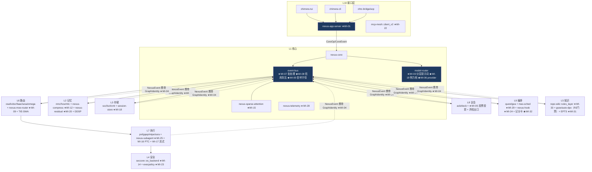
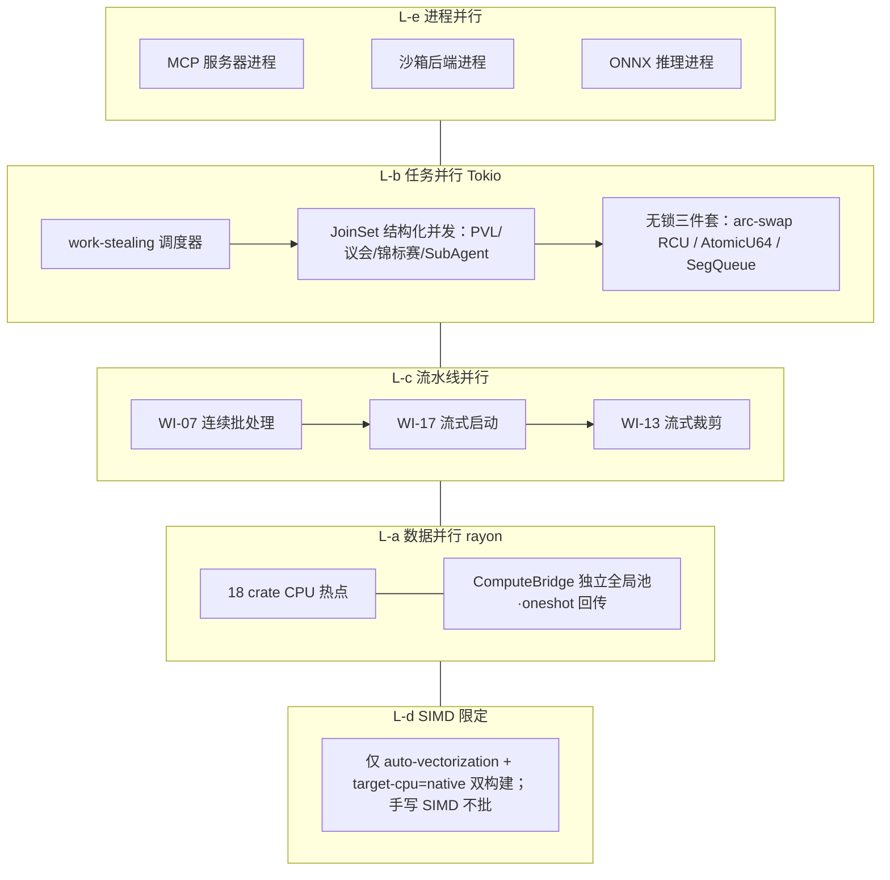

# Chimera CLI v4.0 架构重构与算法优化一体化方案（统一执行总案）
## —— 八大 CLI Agent 对标 × 五大模型工程理念迁移 × 八源文档融合的最终单一执行版

> # 🔖 档案化权威基线核准横幅（2026-09-02 追加，2026-09-06 核验刷新，历史文档只加注不改写；与本文件更下方 2026-08-30 的"执行完结状态横幅"互补，不叠加重复横幅）
>
> **档案化时点**：2026-09-02（2026-09-06 核验）
> **权威基线**：v2.28.0-omega（发布提交 af62e44 已落 2026-09-02，tag 待推）· 43 crates（28 生产可达 / 14 冻结孤岛 + 1 GATED（mca-gateway，ADR-177））· 144 NexusEvent（types.rs 单表，event_types.rs 镜像已退役）· 11,587 tests / 485 target（2026-09-02 重测，以实测为准）· ADR 主编号至 182（新编号段自 ADR-183 起）
> **tag 事实订正**：v2.27.1-omega 本地与 origin 均无 tag（CHANGELOG-only 补丁），实际最新已发 tag = v2.27.0-omega
>
> **与现行代码已知偏差**：
> - 已自我降级为历史溯源档案；
> - 10 新 crate 预算仅兑现 5（其余并按既有 crate 子模块，ADR-137/151）；
> - "17 Critical"陈旧口径同文档1（现 13，代码真值源 `event-bus/src/bus.rs::is_critical_mpsc_event()`，ADR-159 定稿）。
>
> 本文档已档案化：历史溯源 + 愿景参考，权威基线以代码 + CODE_WIKI.md + CHANGELOG.md + ADR 为准

> **版本**: v4.3.0（**六编彻底重构终版·第七源 TTS 裁决 + 第八源并行化深融**：新增 §2.6 第七源裁决（11D Test-Time Scaling，其 ADR-095~103 落 WI-19/26/09/10/31/18 增强 + 三项储备）、§2.7 第八源裁决（v5.0.0 三源融合案，含 E8 五条纠正记录：unsafe 实违规 / IO 误上 rayon / 时序风险 / 编号撞号）；§7.5 重写为彻底版（38 crate CPU/IO 全量分类 + PARA 五层升级：ComputeBridge 独立 rayon 池替换 spawn_blocking 桥接、Sharded Bus 条件化、无锁三件套、七条纪律、W1→W26 分阶段注入表）；WI-34 升级为滚动贯穿彻底版；UP-27 升 ★★★；WI/UP 总数不变（34/27）；四表联动更新；事实基线 CODE_WIKI(3)-(6)（四者一致）/ v2.27.1-omega / 144 事件 / 10,836 测试 / 86 ADR / 17 Critical）｜**日期**: 2026-08-20
> **本版定位**：将此前分立的《架构重构与工程优化方案》（任务 A）与《架构与算法深度打磨优化计划》（任务 B）**合并为一份执行总案**。合并动因：两份分立文档在执行期必然漂移——两套编号（R/OP）、两张排期表、两处风险登记、两条验收口径，执行团队会在"以哪份为准"上持续消耗。本总案给出**单一问题地图（UP）、单一工作项目录（WI-01~WI-34）、单一 26 周路线图、单一指标表、单一风险登记册**；原 R/OP/AUX 编号仅作溯源标注保留，不再作为执行依据。**v4.0.0 结构重构说明**：v3.x 的 §13/§14"深化补充"两章是本总案双主线的正式内容而非附件，本版将其拆分升格——任务 A 重构工程化内容并入第三编（§5.1/§5.3/§7.2/§7.4/§8），任务 B 算法打磨内容提升为第四编（§9-§12），执行章节后移为第五编（§13-§18）；内容零删改，仅结构重排与交叉引用重映射。
> **融合谱系**：① CODE_WIKI v2.27.1-omega 事实基线（38 crates / 144 NexusEvent / 10,836 tests）；② v4.0-omega PANTHEON 融合计划（四文档融合 + IN-01~12 创新点）；③ 任务 A/B v2.0 融合版（八系统对比 + OP-01~17 + AUX-1~6）；④ 外部修订版两份 + 外部 v2 优化计划（经批判性检查吸收）；⑤ DeepSeek Harness 专项调研（2026-08-13 开源，第 8 个对比对象）；⑥《Agent_CLI_Architecture_Fusion v2.27.1》十维度融合文档（2026-08-21 输入，ADR-086~094 逐项裁决见 §2.5）；⑦《Agent_CLI_11D_Fusion_TestTimeScaling_to_v2.28.0》十一维 TTS 融合文档（2026-08-22 输入，裁决见 §2.6）；⑧《Chimera_CLI 三源极致融合与多线程并行化改造总案 v5.0.0》（2026-08-22 输入，裁决见 §2.7，并行化内容经 E8 五条纠正后吸收至 §7.5/WI-34）。
> **边界**：只做 Rust 侧；事实/推断/建议三分；未能确认处标注【假设/待验证】；**Python RL 服务仅保留规划、实体禁止实施**（2026-08-15 治理决策）；**全程禁用 feature flag**（降级开关一律为独立子命令/配置项）。
> **效力声明**：本总案与既往文档冲突时，**以本总案为准**；任务 A/B v2.0 两份文档保留为"详规附件"，其接口契约代码与本总案 §6 一致。
> **执行导读**：① 决策者读 §1 + §14 路线图 + §15 指标；② 架构师读 §2 裁决 + §4 问题地图 + 第三编（§5-§8）全编；③ 算法/性能工程师读第四编（§9-§12）+ §13 WI 八段式；④ 执行与 QA 以 §18 全局追溯矩阵为导航中枢，按周过滤 WI、按指标定验收、按溯源列回审计；⑤ 红线守门人读 §2.4 + §17。

---

> # 🔖 v2.28.0-omega 执行完结状态横幅（2026-08-30 追加，效力高于本方案历史排期）
>
> **本总案规划的 26 周双轨路线图（W1→W26）已于 2026-08-28 全部波次收尾**，Phase 1-5 Ch12 收官，权威证据为 `docs/reports/phase{1,2,3,4,5}-wave*-closure.md` 五份波次收官报告（phase5-wave5-closure 为终态）。**本文件自此从"在执行总案"转为"已执行的历史方案/溯源档案"**:其 UP/WI/排期/预算描述保留为决策溯源,不再代表当前待办;当前待办与基线以 `CODE_WIKI.md` + `CHANGELOG.md [2.28.1-omega]` + `.trae/rules/nuxus规则.md` §1.4 为准。
>
> **计划 vs 实况对账(2026-08-30)**:
> - **crate 预算 48/53 → 实际 43**:本净增 5 个(`nexus-app-server` WI-01 / `session-store` ADR-141 / `mas-sched` ADR-145 / `nexus-hook` ADR-146 / `nexus-subagent` ADR-148);未达预算上限是**刻意结果**——ADR-137 与 ADR-151 否决了 3 个新建 crate(moe-router/learn 等),其余能力按"零新 crate 优先"落入既有 crate 子模块。
> - **ADR**:本方案 §2.5/§2.6/§2.7 裁决落为 ADR-086~094(十源融合,无独立文件);执行期落 ADR-095~160(四份合并档 095-134/135-144/145-152/153-156 + 单档 132/157/159/160,ADR-158 登记于 phase5 收官报告)。
> - **并行化(§7.5 彻底版)**:ComputeBridge 双运行时 + ShardedBus 分片总线经影子双跑零 diff 后 ADR-153 Go 全量 B 级;利用率 combined 0.552→0.999 release(ADR-157 双口径判定)。
> - **测试**:方案基线 10,836(v2.27.1)→ 终态 **11,522 passed / 0 failed**(485 test target,2026-08-29 批 A-C)。
> - **新增治理**:ADR-160 生产可达性棘轮——43 members 实测 **28 生产可达 + 15 冻结孤岛**(含本批 mas-sched/nexus-hook 两个刻意预留孤岛 + feature 门控 mca-gateway);`event_types.rs` 镜像退役,144 事件收敛 types.rs 单表。
> - **RL 边界持续有效**:本方案"只做 Rust 侧、Python RL 服务禁止实施"红线在整个执行期未被突破,仍继续生效。
>
> **尚未发生**:v2.28.0 **tag 推送**(发布提交 af62e44 已于 2026-09-02 落盘，tag 待用户指示；最新已发 tag v2.27.0-omega),GA 发布动作待用户指示;15 孤岛偿还、冗余 R4 为下一阶段事项。

---


## 目录
**第一编 总览与基线**：1. 摘要｜2. 事实基线与输入裁决（含外部文档错误纠正记录 + v2.27.0 已发布事件通道复用裁决 + 五条不可动红线 + 第六/七/八源融合文档裁决）
**第二编 情报扫描与问题诊断**：3. 八系统对比（速览/11 维矩阵/元趋势）｜4. 统一问题地图 UP-01~UP-27（张力裁决 + 三视图归并）
**第三编 目标架构与 Rust 侧工程重构【任务 A 主线】**：5. 分层职责与 crate 总账（5.1 分层×crate×重构映射矩阵 / 5.2 48/53 总账 / 5.3 新 crate 接口面与依赖方向 / 5.4 数据流图）｜6. 接口契约库（协议/trait/事件/错误）｜7. 通信、并发与进程拓扑（7.1 通道全表 / 7.2 故障语义矩阵 / 7.3 并发模型 / 7.4 进程与异步拓扑 / 7.5 多线程并行化与 CPU 饱和工程·彻底版（38 crate 全量分类 + 混合运行时 + 分阶段注入））｜8. 迁移路径与工程化发布门禁（8.1 A0-A8↔WI 对齐 / 8.2 发布门禁流水线）
**第四编 架构与算法深度打磨【任务 B 主线】**：9. L0-L10 每层打磨矩阵｜10. 核心算法优化项深化规格（8 项）｜11. 大模型理念→工程映射防套用对照表｜12. 辅助设计 AUX-1~6 落地锚点
**第五编 执行总控**：13. 统一工作项目录 WI-01~WI-34（八段式规格）｜14. 统一路线图：26 周四期单排期｜15. 统一指标与验证体系｜16. 统一风险登记册与回滚策略｜17. 治理红线与守护项｜18. 全局追溯矩阵（UP×WI×排期×指标×风险×溯源）｜19. 结论
**第六编 参考文献**

## 第一编 总览与基线

## 1. 摘要

**TL;DR**：Chimera 在**记忆/进化/治理深度**上对八大对标系统形成代际优势（八系统均无经验卡片、记忆金字塔、议会治理），且与 Codex CLI 并列唯二 Rust 原生；但在**产品化宿主层、上下文成本工程与能力可组装性**上存在结构性差距。本总案将全部分析归并为 **27 个统一问题（UP）→ 34 个工作项（WI）→ 26 周四期单排期**，全部落在既有十一层架构与 **48/53 crate 预算**内。P0 奠基五件：nexus-app-server 核心-表面分离（WI-01）、exec 非交互契约（WI-02）、LPA 分层提示词组装（WI-03）、GIP 事件身份（WI-04）、MCSM 信号守恒（WI-05）。

**一句话对标结论**：
- **Codex CLI** = 最直接参照系（Rust 分层 + 双协议 + 平台沙箱 + exec stdout 纪律）；
- **Claude Code** = 工程完成度标杆（四层提示词缓存 12.5× 价差、六权限模式、压缩降级链、读写分区批处理）；
- **OpenCode** = 开源 C/S 与 provider 开放注册范本；
- **Kimi Code CLI** = ACP 原生卡位；
- **Qwen Code** = fork 路线反证；
- **Pi** = 极简对照组（兼警示 Lethal Trifecta 暴露面）；
- **DeepSeek Harness** = 激进插件化参照系（一切皆插件微内核、事件溯源"model-visible means logged"、PTC 程序化工具调用、capability seam 三角色）。

**五大模型理念迁移主线**（全部转化为 Rust 工程改进，不设计大模型）：DeepSeek V4（mHC 流形约束 → WI-05；辅助损失-free 均衡 → WI-09；CSA 双密度 → WI-10/15）；Kimi K3（AttnRes 残留 → WI-20；Stable LatentMoE 历史感知 → WI-09；AgentEnv 快照 fork → WI-14；Agent Swarm → WI-25）；GLM-5.3（IndexShare → WI-12；slime 异步收集 → WI-30；环境合成 → WI-31）；MiniMax M3（MSA 双分支/预热 → WI-26；Interleaved Thinking → WI-19）；Qwen3.8-Max（混合注意力 3:1 → WI-19；多步 MTP → WI-14）；DSH（PTC → WI-16；事件溯源 → WI-18；capability seam → WI-01/06/12/14）。

**关键数字**：48/53 crate（新增 10、重构 10、子模块 6）；26 周四期；34 个工作项（P0×5 / P1×12 / P2×12 / P3×5）；测试基线 10,836 → 目标 ~13,500；预估收益：提示词成本降 30-60%、事件吞吐 >100K/s、首工具延迟降 ≥30%、长尾 P99 降 ≥30%、100+ 轮早期决策召回 >90%、批处理任务模型往返降一个量级。

---


## 2. 事实基线与输入裁决

### 2.1 事实基线表（源自 CODE_WIKI(3).md 2026-08-20 版）

| 项 | 事实 |
|---|---|
| 版本/规模 | **v2.27.1-omega（2026-08-20 当前基线）**：v2.27.0-omega（2026-08-19 发布）完成 Phase 10 §16 跨层协同闭环审计修复 W1-W7 全波次闭环、8 个新事件正式收编；v2.27.1 为 GPG 签名补发 + MCA E2E 超时加固（无功能性变更）；**39 crates**（nexus-app-server 已骨架化在册，v4.0 §5.2 原"38/新增"口径修正——首波为补齐而非新建）；**144 NexusEvent 变体**（types.rs 枚举 + metadata() 双重验证，2026-08-19 实测）；**10,836 tests passed / 0 failed**；**86 ADR**（58 文件/54 主编号；ADR-084 为 L6 Router Phase 6 在途落档物，2026-08-19 随 ADR-085 登记入索引）【CODE_WIKI(3).md 刷新】 |
| Critical 事件 | **17 个**（v2.3.1 基线 13 + `AffinityQuotaExhausted`（ADR-065）+ `FormalViolation`（P1-5）+ `StopRulingIssued`/`ErrorSignatureMatched`（Phase 10 W4，ADR-085 双清单对齐））；severity() 权威源已迁移至 `classification.rs:46-91` 综合 match + event_types.rs 各 struct 独立 impl；全部列入 `is_critical_mpsc_event()` mpsc 旁路清单——双清单同步红线【CODE_WIKI(3).md 刷新】 |
| 架构 | L0-L10 十一层；L0 `nexus-contracts` 零依赖纯类型；依赖铁律（同层/向下/跨层仅事件路由/跨进程仅 mcp-mesh） |
| 并发 | Tokio 多线程；`#![forbid(unsafe_code)]` 38/38；spawn_blocking 包 rusqlite；不持锁跨 .await |
| 通信 | event-bus = tokio broadcast（普通）+ mpsc（Critical 14 类事件）双通道；chtc-bridge；mcp-mesh 跨进程唯一通道 |
| 安全 | SecCore 沙箱（ADR-001 gVisor 降级记录）+ Decay 权限衰减 + QEEP；CapabilityToken 四态 + EWMA（ADR-037） |
| 记忆/进化 | HCW 窗口 + MLC + NMC 编码；CMT/LSCT/SCC 三层存储；GSOE×AutoDPO（R2 解冻影子期，fail-closed 门禁） |
| 治理 | L8 议会（acb/decb 双 governor）；L9 Quest/LoopX 配额控制面（融合设计中）；效率监控 |
| 发布 | release 单二进制 <50MB；Docker distroless <100MB；Windows GNU 工具链；cargo audit 5 ignore 与 audit.yml 一致 |
| 已知病灶 | L1 god-crate 倾向（nexus-core/event-bus）；chimera-mas 24 内部依赖全局枢纽；历史 5.4% orphan-call 教训（已立红线） |
| 治理门 | Rust-First：Python RL 服务仅保留规划，实体禁止实施（2026-08-15 治理决策） |

### 2.2 外部修订版事实错误纠正记录（批判性检查）

> 外部修订版（三份）在无 CODE_WIKI 上下文的情况下撰写，设计思想有价值，但基线论断存在以下事实性错误。本总案已全部纠正，依据为 CODE_WIKI(1).md：

| # | 外部论断 | 纠正后事实 | 处置 |
|---|---|---|---|
| E1 | "L1-L3、L5、L7 为预留层，架构存在空洞" | **错误**。L1=event-bus/nexus-core/model-router；L2=nmc-encoder/hcw-window/mlc-engine；L3=scc-cache/lsct-tiering/cmt-tiering；L5=repo-wiki/gsoe-evolution/auto-dpo；L7=pvl-layer/gqep-executor/mtpe-executor/ssra-fusion，全部在册在役 | 其新 crate 安置全部按真实层语义重新归位（§5.1/§5.2） |
| E2 | "L6 nexus-orchestrator 串行 Agent Loop" | **命名错误**。无此 crate；编排职能由 L9 quest-engine + L7 gqep-executor 承担 | 其"编排层 v2"设计映射到既有 crate 子模块 |
| E3 | "L9 concord-tui" | **命名错误**。crate 名为 chimera-tui（Concord 为其自研引擎代号，ADR-029） | 统一使用 chimera-tui |
| E4 | "无 MCP 集成" | **错误**。L10 mcp-mesh 在役（跨进程唯一通道铁律承载者）；真实差距是客户端工具发现链路浅（UP-13） | nexus-mcp 新 crate 提案降级为 mcp-mesh::client_v2 子模块 |
| E5 | "无会话持久化" | **错误**。Checkpoint 快照 + CMT/LSCT/SCC 三层存储在役；真实差距是线性无分支（UP-04） | session-store 按"快照为体、事件为流"设计 |
| E6 | 参考文献臆造：`QianWen-AI/qianwen-cli`、`inflection-ai/pi-cli`、"ACP = RFD #721"、"PI = Inflection AI" | 实际为 `QwenLM/qwen-code`（Gemini CLI fork）；Pi 为 Mario Zechner（badlogic）的 pi-mono；ACP 由 Zed Industries 2025-08 提出 | 参考文献已全部重新核实 |

> **保留并致谢**：外部修订版的 11 张分维对比表、六大架构张力、NexusEventV2 trait 概念、EventBusV2 发布流、统一错误层级、读写分区并发模型、9 新 crate 抱负、四期路线图框架、3 个辅助设计，经批判性改造后全部吸收（吸收位置以"源自外部修订版"标注）。

### 2.3 v2.27.0-omega 已发布事件与本方案的通道复用裁决【CODE_WIKI(3).md 刷新：8 事件已收编】

> v2.27.0 正式发布的 8 个事件变体（2026-08-19 收编入权威口径 144）与本总案多个 WI 高度同构。**裁决：复用已发布通道，不另立平行通道**——WI 的相应字段/消费端直接挂载到这 8 个已存在的事件上，避免双轨。

| 已发布事件（Wave） | 域归属 | 本总案复用点 | 裁决 |
|---|---|---|---|
| `TokenLedgerRecorded`（W4） | L1 token 账本→L3 持久化 | **WI-04 GIP**：账本事件已存在，WI-04 的三元组（goal/run/node）作为其载荷扩展落档，不新建账本通道 | 复用+扩字段 |
| `StopRulingIssued` [Critical]（W4） | L9 停止姿态（ThreeFactorAdjudicator→cancel_quest） | **WI-32 终止记分卡**：裁决结果经此 Critical 事件发布，记分卡成为 ThreeFactorAdjudicator 的第四因子输入 | 复用+喂因子 |
| `AssessmentUpdated`（W4） | L9 自我评估（RuntimeAuditor→策略调整） | **WI-30 RTL Shadow**：影子策略的对比指标经此周期报告通道输出，不新建学习遥测 | 复用 |
| `BusThroughputReported`（W6） | L1 总线吞吐 | **WI-07/08**：批处理命中率、信用等待时长直方图挂载此既有上报通道 | 复用+扩指标 |
| `SecurityInterceptionReported`（W6） | L4 沙箱拦截率 | **WI-14/23**：OS 后端拦截率、execpolicy allow/ask/deny 分布挂载此通道 | 复用+扩指标 |
| `ErrorSignatureMatched` [Critical]（W4） | L4 零信任错误签名（消费端待 Debug 算子路由装配） | **WI-27 一致性守护**：错误签名命中作为 Invariant 检查的触发源之一；消费端装配与本 WI 合并排期 | 复用+合并排期 |
| `VariantApproved` / `ParentSelected`（W4） | L5 GSOE 变体批准/终局父本（faae 注册表+UCB 同步） | **WI-31 EPTS**：合成任务的变体批准/父本选择走既有注册表，不另立演化状态机 | 复用 |

> **诚实数据原则继承（v4.0 预留）**：`ErrorSignatureMatched` 消费端、L10 用户满意度、L4 误拦截率、RLTrajectory 下游训练消费**均无真实数据源，禁止实施伪造采集**，仅在真实通道上线后激活——与本总案 WI-30"Shadow 限定、永不自动转正"口径完全一致，作为红线继承。
>
> **时序裁决（已落地）**：Ⅰ 期前置依赖 W0 已由 v2.27.0-omega 发布完成（2026-08-19）——136→144 收编、`check_doc_consistency.ps1` [GAP-F2] 随收编自然消除，本总案路线图实际从 W1 起跑；本方案相应 WI 的字段扩展直接在已发布事件上落档，事件演进口径：144（权威）→后续新增一律经 L0 版本化与权威口径发布门。

### 2.4 五条不可动红线

1. 十一层架构不动（L0-L10 依赖铁律保留）；2. 53 crate 硬上限不破；3. 不设"半层"编号；4. Python RL 服务实体禁止实施（含 RLTrajectory 下游训练消费，无真实数据源前禁止伪造采集）；5. 禁用 feature flag（降级开关=子命令/配置项）。

### 2.5 第六源输入裁决：《Agent_CLI_Architecture_Fusion v2.27.1》（十维度融合文档）

**输入**：外部融合文档（2026-08-21 随用户指令传入），提出"十维度融合"与 ADR-086~094 共九项 ADR、Phase 11.1-11.4 排期（自称目标 v2.28.0）。
**事实核验（E7，通过）**：其引用口径（144 NexusEvent 变体 / 10,836 tests / 17 Critical 事件 / 86 ADR / 53 命令 / R2 冻结）与本总案权威基线全部一致；其 10 篇来源为微信公众号文章【待验证，实施前需二次溯源】。
**总裁决**：**不另立 Phase 11 排期**（单一总案防漂移红线）；九项 ADR 逐项裁决为"现有 WI 增强"或"post-v4.0 储备"两类：

| ADR | 提案 | 来源 | 裁决 | 落点 |
|---|---|---|---|---|
| ADR-086 | ReversibleContext 可逆计算运行时（L0-L1） | Cordis | **post-v4.0 储备** | 改动 L0 契约面过大、与 Ⅰ 期 W1 起跑冲突；EffectToken 作用域回滚理念先行沉淀至 WI-14 快照分叉语义 |
| ADR-087 | CognitiveControlPlane 认知控制面（L6） | J-Space | **吸收** | WI-19 AERA×HAR 增加"认知预算"维度（努力档=预算函数），不新设控制面 crate |
| ADR-088 | Context Graph 三态合并（L5） | MyContext | **吸收** | WI-20 RSB 残留系统吸收 FactState 三态（Asserted/Retracted/Conflicted）作为残留置信语义 |
| ADR-089 | Procedure Memory Registry（L5） | MemoraX | **吸收** | WI-10 DDSP 五级经验缓存挂接程序记忆注册表（Procedure=固化经验卡片） |
| ADR-090 | TestHarness & Evidence Tree（L10） | HarnessEval | **吸收** | WI-31 EPTS 采纳证据树产出格式；WI-27 SymbolicChecker 复用其断言 DSL 思路；eval-harness 以 chimera-cli 子模块形态存在（不增 crate 数） |
| ADR-091 | SkillGitBridge（L10） | teamai-cli | **post-v4.0 储备** | 技能 Git 化分发引入供应链安全面（SkillLockfile/签名），需独立安全评审 |
| ADR-092 | MetaAgent Codegen（L9） | PenguinHarness | **post-v4.0 储备** | 元生成 crate 触及治理红线（议会审批链未覆盖自动生成代码），冻结 |
| ADR-093 | Causal NexusEvent（L0-L1） | 因果学习 | **部分吸收（§6.5 事件契约）** | 仅吸收 CausalMetadata（causation_id 可选字段）入契约 v1.1 预留；**144 枚举与 severity() 权威源不动**；CausalGraph 分析器留储备 |
| ADR-094 | Partial Execution & Async Rollout（L1+L7） | Kimi k1.5 | **吸收** | WI-18 session-store 事件溯源吸收"部分执行+断点续传"语义（会话树节点挂执行检查点） |

**继承的两条工程纪律**（该文档风险章提炼，与本总案红线兼容）：① 可逆性以"合流性前提"为界——凡涉 L0 契约的可逆改造须先证幂等合流；② 一切"自动生成/自动分发"能力默认冻结，待议会治理链先行覆盖。
### 2.6 第七源输入裁决：《Agent_CLI_11D_Fusion_TestTimeScaling》（十一维 TTS 文档）

**输入**：外部融合文档（2026-08-22 随用户指令传入），以 **Test-Time Scaling（推理时扩展）为元范式**统摄十一维度，核心命题是 LLM-as-a-Verifier 锦标赛闭环（N 候选生成 → M 验证者并行验证 → R(x,τ) 四维评分 → 锦标赛选优），提案 ADR-095~103（其自称编号）、Phase 11.1-11.4（自称目标 v2.28.0）、事件 144→152。
**事实核验（E9，通过、两处存疑）**：基线口径（38 crate / 144 事件 / 10,836 tests / 86 ADR / R2 冻结 / forbid(unsafe)）与权威基线一致；**存疑①**："DeepSeek V4 Flash ×5 验证 79%→88%、成本仍低 4-11×"引自公众号文章【待验证】，不进入承诺指标；**存疑②**：NexusEvent 144→152（+8 验证变体）触碰事件演进发布门——裁决：验证事件先落 WI-21 DynamicEvent 双轨注册表，转内置枚举须经 L0 版本化 + 议会审批，**144 基线不动**。
**总裁决**：不另立 Phase 11 排期（单一总案防漂移红线）；**锦标赛闭环为真增量**，落 WI-26/WI-19 增强；其余多为第六源同源提案的 TTS 重述，裁决口径与 §2.5 保持一致：

| 其编号 | 提案 | 裁决 | 落点 |
|---|---|---|---|
| ADR-095 | VerifierTournamentEngine（L7/L8 协同） | **吸收** | WI-26 增强：TIE-SWA 第二级落地为锦标赛引擎（PVL×Parliament 协同；向后兼容——新增方法不改签名） |
| ADR-096 | MultiCandidateBudgetPool（L8 ACB/DECB） | **吸收** | WI-19 增强：认知预算扩展为多候选预算池（提前终止 + token 级追踪，复用 TokenLedgerRecorded） |
| ADR-097 | UncertaintyRouter（OSA 五维→六维） | **吸收** | WI-09 增强：TSR 路由信号增加不确定度维 |
| ADR-098 | VerificationProcedureMemory | **吸收** | WI-10 增强：验证轨迹提炼为 Procedure（同源 §2.5 ADR-089） |
| ADR-099 | CausalVerificationEvent | **部分吸收（§6.5）** | 同 §2.5 ADR-093 口径；走 WI-21 双轨 |
| ADR-100 | TestHarness for Verifier | **吸收** | WI-31 增强（同源 §2.5 ADR-090） |
| ADR-101 | SkillGitBridge for Verification | **post-v4.0 储备** | 同 §2.5 ADR-091 口径（供应链安全评审前置） |
| ADR-102 | PartialCandidateExecution | **吸收** | WI-18 增强（同源 §2.5 ADR-094） |
| ADR-103 | ReversibleContext for Tournament | **post-v4.0 储备** | 同 §2.5 ADR-086 口径（L0 面冻结） |

**两条额外吸收**：① 锦标赛事件量 5-10× 放大预警 → 写入 WI-34 Sharded Bus 设计约束（容量规划）；② 复杂度爆炸防护（O(N·M·K)，N≤5/M≤3 上限 + 提前终止）→ 写入 WI-26 验收门禁。

### 2.7 第八源输入裁决：《Chimera_CLI 三源极致融合与多线程并行化改造总案 v5.0.0》

**输入**：外部融合文档（2026-08-22 随用户指令传入），以本总案（其"文档②"）+ 第六源（其"文档①"）+ CODE_WIKI（其"文档③"）为三源，识别出三源共同的**"并发并行盲区"**，提出 Tokio+Rayon+crossbeam 混合运行时、38 crate CPU/IO 全量分类、ADR-095~102（其自称编号，**与第七源撞号**）、逐周并行化注入表。
**总体评价**：方向正确、工程粒度为三源之最（逐 crate 分类 / 接口契约 / 注入表 / 风险册），其并行化内容**经 E8 五条纠正后全量吸收**至 §7.5 与 WI-34；面试叙事框架等非工程内容不吸收。
**E8 纠正记录**（对外部文档的事实性纠正，逐条留痕）：
1. **红线违反（严重）**：其 §2.6.3 在 nexus-core 内直接书写 `unsafe fn` + 裸指针运算（`a.as_ptr().add(i)`）+ `unsafe {}` 调用——`#![forbid(unsafe_code)]` 下**编译即失败**；`std::simd` 为 nightly-only（项目钉 stable Rust 2021）；`safe_arch` 的 target_feature 调用在 stable 仍越不过 unsafe 边界。**裁决**：维持 §7.5 L-d 原判——仅 auto-vectorization + `target-cpu=native` 双构建，手写 SIMD 一律不批，ADR-SIMD-001 继续预留评审、默认不批。
2. **任务分类错误（中）**：PVL produce/verify、议会 debate、auto-dpo 采样的实质是 LLM 网络调用（IO 密集），其 rayon 化方案南辕北辙。**裁决**：归入 §7.5 L-b async 结构化并发（JoinSet/FuturesUnordered），不进 rayon 池。
3. **API 与纪律错误（中）**：`rayon::join` 仅接受 2 个闭包，其 4 参写法不编译；MLC 四级召回含 sqlite IO，违反"IO 不上 rayon"纪律。**裁决**：内存层召回入 rayon，sqlite 层留 spawn_blocking 白名单，多路汇流用 JoinSet。
4. **时序语义风险（中）**：Sharded Bus 跨分片丢失全局时序，与事件溯源（WI-18）/回放审计冲突；消费端忙轮询 + yield 空转耗核。**裁决**：分片仅限可乱序订阅者通道，顺序敏感通道（session-store / 审计 / Critical）保持单流；消费端改 Notify 唤醒；影子双跑 ≥1 周 + 漏发率=0 硬门禁后方可切换。
5. **编号冲突（轻）**：其 ADR-095~102 与第七源 ADR-095~103 同号不同义。**裁决**：外部 ADR 编号一律视为"提案临号"，落档时由项目 ADR 流程分配正式编号（当前权威 86 份）。

**全量吸收清单**：① 38 crate CPU/IO 全量分类（→§7.5.1）；② **ComputeBridge 独立 rayon 全局池标准接口**（→§7.5.2 L-a，优于 v4.2.0 的 spawn_blocking 桥接，已替换）；③ ShardedEventBus + RCU 订阅表 + 无锁计数器（→§7.5.2 L-b，条件化）；④ 分阶段注入表（→§7.5.5）；⑤ 利用率/吞吐指标（→§7.5.4，标注【待验证】）；⑥ D15 rayon 池死锁熔断（→§16）；⑦ 四盲区诊断（→§7.5.1）；⑧ 新依赖审计项 rayon 1.10 / crossbeam 0.8 / arc-swap（→WI-34 验收）。
**不吸收**：面试叙事框架（非工程内容）；v2.28.0-alpha→v4.0.0 状态机时间线（与单一 26 周排期冲突，其意图已由注入表吸收）；"~15,000 测试"口径（本总案维持 ~13,500 + WI-34 增量，15,000 仅作上限参考）。


---


## 第二编 情报扫描与问题诊断

## 3. 外部世界扫描：八大 CLI Agent 对比

### 3.1 八系统架构速览

**① OpenAI Codex CLI —— Rust 原生四层架构（最直接参照系）**：TypeScript 原型 → 2025-06 起 Rust 重写（零依赖安装/原生安全绑定/无 GC）；codex-rs workspace 60+ crates 四层：入口层（cli/tui/exec/app-server）→ 协议层（Op/Event/SandboxPolicy；JSON-RPC v1/v2）→ 核心层（session/turn、thread-store、rollout 回放）→ 执行安全层（Landlock+seccomp/seatbelt/Windows 沙箱、execpolicy 命令分类引擎）→ 模型服务层（model-provider 抽象）。关键设计：App Server 三原语 Thread/Turn/Item（断线重连断点恢复）；"核心层不知道自己在哪种表面层中运行"；exec stdout 纪律（stdout 只写最终结果/JSONL）；AGENTS.md 分层收集；MCP 双角色 [^1^][^2^][^3^][^4^]。

**② Claude Code —— 工程完成度标杆（TypeScript）**：turn engine 单核；sub-agent = 同一引擎换参数复用；工具为横跨提示词/执行/权限/UI 四层的运行时对象（默认保守：未声明=不可并发+可能写）；**流式输出期间即启动工具**；权限四层校验 + 六模式（default/acceptEdits/plan/dontAsk/auto/bypassPermissions），后台 agent 无法弹窗即拒否；**上下文成本工程**（对本总案价值最大）：提示词缓存四层（静态→组织→会话→动态）、SYSTEM_PROMPT_DYNAMIC_BOUNDARY 动静分界、三级压缩降级链、from/up_to 双模式压缩（from 保缓存前缀）、cache_edits 透明删旧工具结果；cache_read vs cache_creation 价差 12.5× [^5^][^6^][^7^][^8^][^14^]。

**③ OpenCode —— 开源客户端-服务端范本（TypeScript/Bun）**：REST+SSE；SDK 与 ACP 双接入路径；serve/web/attach 多表面；OpenAPI 自描述；provider 由 models.dev 驱动（75+）；session fork [^9^][^10^]。

**④ Kimi CLI → Kimi Code CLI —— ACP 原生卡位**：Kimi CLI（2025-10，Python 异步）四大系统含原生 ACP（JSON-RPC 2.0 over stdio/HTTP；ACP 由 Zed 2025-08 提出，定位"终端 Agent 领域的 LSP"）+ 内置 Shell 模式；Kimi Code CLI（TypeScript monorepo + 子 Agent 并行）接班 [^11^]。

**⑤ Qwen Code —— fork 路线反证**：Gemini CLI 直接 fork（`QwenLM/qwen-code`）；OpenAI 兼容 + Qwen OAuth 2000 请求/天；架构创新≈0——证明无架构差异化的 fork 天花板明显 [^12^]。

**⑥ Pi（pi-mono）—— 极简主义对照组**：系统提示词 <1000 token；仅 4 工具，LLM 自编程扩展；会话 JSONL 树 + /tree /fork；明确不用 MCP；暴露 Lethal Trifecta（隐私数据+外部输入+无限制执行同存）[^13^]。

**⑦ DeepSeek Harness（DSH）—— 激进插件化参照系（TypeScript，2026-08-13 开源）**：`Agent = Model + Harness`；**一切皆插件**——模型适配器/工具注册表/会话日志/Agent Loop 本身全部是 Cordis 微内核插件，无特权内核，129 行启动清单可全量替换；48 包 monorepo；**capability seam**：每个可替换能力 = Service Definition/Provider/Consumer 三角色；**事件溯源**：append-only SessionEvent 日志为唯一真源，不变量"model-visible means logged"，44 事件类型仅 3 种模型可见，resume/fork/search/replay 同一份事件流；**四预设模式**：Standard / Code(PTC) / Minimal / Creator；**PTC**：工具打包为 TypeScript SDK，模型写程序经 run_code 在隔离 worker 执行，中间数据不进上下文仅结论回填，实测 token 差近 20×，子调用仍走完整权限/审计流水线；安全：landlock/seatbelt/bwrap + fs fence + 三档权限 + 单次提权；运行形态 web/headless/cli/**ACP**/SDK；40+ provider；64 天 12,293 提交 + 683 篇设计笔记随源码公开；发布次日安全评审实录 4 漏洞（动态插件接缝处）[^15^][^16^][^17^][^18^][^19^][^20^]。

### 3.2 11 维 × 8 系统对比矩阵

> 评级：●强 ◐中 ○弱/无；信息不足标【待验证】。Chimera 列为 v2.27.1 现状。

| 维度 | Chimera (现状) | Codex CLI | Claude Code | OpenCode | Kimi Code | Qwen Code | Pi | DSH |
|---|---|---|---|---|---|---|---|---|
| 1. 分层与模块边界 | ● L0-L10 契约先行 | ● 四层+双协议 | ◐ 单核+功能层 | ● C/S 二分 | ◐ 四系统 | ◐ 继承 | ○ 极简 | ● 微内核插件树 48 包 |
| 2. 进程/异步模型 | ● Tokio+forbid(unsafe) | ● Tokio 核心纯库 | ◐ Node | ◐ Bun | ◐ Py→TS | ◐ Node | ◐ Node | ◐ Node+worker 隔离 |
| 3. 上下文/会话 | ● HCW+三级存储；○ 无分支 | ● thread fork+回放 | ● 压缩降级链+cache_edits | ◐ session fork | ◐【待验证】 | ◐ /compress | ● JSONL 树 | ● 事件溯源+replay |
| 4. 工具/执行/沙箱 | ● 统一契约+SecCore | ● 四平台沙箱+execpolicy | ● 运行时对象+流式启动 | ◐ 权限配置 | ◐ MCP | ◐ MCP | ○ 自扩展 | ● 四事件链+PTC+三档沙箱 |
| 5. IPC/通信 | ● 双通道+Critical mpsc | ● 内外双协议 | ◐ 内部事件+bridge | ● REST+SSE+ACP | ● ACP 原生 | ◐ 进程内 | ○ 无 | ● Cordis 服务/事件+ACP |
| 6. 安全/权限/隔离 | ● SecCore+Decay+QEEP | ● execpolicy+OS 沙箱 | ● 四层权限+六模式 | ◐ ask | ○【待验证】 | ○ 继承 | ○ 暴露面大 | ● 三档+单次提权（但有 4 漏洞实录） |
| 7. 扩展/插件/技能 | ● 技能加载+MCP | ● skills+plugins+MCP | ● 统一平面+31 hooks | ◐ MCP+agents | ● MCP+ACP | ◐ MCP | ● 自编程 | ● **一切皆插件**+hooks 桥接 |
| 8. 性能/背压 | ● 双通道+降级+配额 | ● 无 GC+预热 | ● 缓存成本工程 | ◐ 未公开 | ○【待验证】 | ○【待验证】 | ○ 低 token | ◐ PTC 省 20× token |
| 9. 可观测/调试 | ● 144 事件+TokenLedger | ● rollout 回放+doctor | ◐ telemetry+hooks | ◐ OpenAPI | ○【待验证】 | ○【待验证】 | ○ | ● Trajectory+全审计 |
| 10. 错误/降级 | ● 熔断矩阵+降级链 | ◐ execpolicy+审批 | ● 压缩降级链 | ◐ 未公开 | ○【待验证】 | ○ 继承 | ○ | ◐ cancel 4 cause+重试 |
| 11. Rust 工程化 | ● 单二进制<50MB | ● npm 门卫分发 | ○ TS | ○ TS/Bun | ○ Py→TS | ○ TS | ○ TS | ○ TS monorepo |

### 3.3 四条元趋势（2026-08 时点）

1. **协议化**："核心引擎 + 稳定外部协议 + 多表面"成头部共识；ACP 复现 LSP 历史，DSH 内建 ACP 使其从差异化变为入场券；
2. **缓存作为架构约束**：提示词前缀稳定性是 CLI Agent 最大单项成本杠杆（12.5× 价差）；
3. **权限模式谱系化**：Claude 六模式 / Codex execpolicy / DSH 三档+单次提权——声明式策略 + 最小权限默认 + 临时单次放开，殊途同归；
4. **Harness 独立成类 + 插件化军备**：模型趋于同质可替换，护城河移向"跑模型的基础设施"；扩展粒度从 MCP（能调什么）/Skills（会做什么）/Hooks（何时插一脚）推进到第四层——**Agent 本身应该怎么组成**。Chimera 的对等回答见 T7 裁决（§4）。

---


## 4. 统一问题地图 UP-01~UP-27（差距×张力×病灶三视图归并）

> 本表是"融会贯通"的核心：任务 A 的差距 G1-G13、张力 T1-T7 与任务 B 的病灶 F1-F11 在此归并为 27 个统一问题，每个问题唯一归属一个（或一组）工作项。**执行期只认 UP/WI 编号。**

### 4.1 七大架构张力（裁决策略内联）

| # | 张力 | 两极 | 裁决策略 |
|---|---|---|---|
| T1 | Terminal-First vs Platform-First | TUI 单表面 vs 多宿主 | **先协议后表面**：WI-01 只立协议 + TUI dogfooding，IDE/Web 不提前建设 |
| T2 | Static Commands vs Dynamic Agents | 53 命令 vs 动态代理 | **命令为骨架、代理为肌肉**：动态 sub-agent（WI-25）禁止注册新命令 |
| T3 | Event Safety vs Iteration Speed | 144 强类型枚举 vs 动态注册 | **双轨制**：内置枚举不动 + 动态注册表（WI-21），元数据层统一 |
| T4 | Context Window vs Compression | HCW 扩容 vs 压缩保缓存 | **扩为体、压为用**：HCW ≥64K 红线不动；压缩走 from 模式保前缀（WI-12） |
| T5 | Application vs OS Sandbox | SecCore 语义层 vs Landlock/seccomp | **双层叠加**：CapabilityToken 决策面 + OS 后端执行面兜底（WI-14） |
| T6 | Closed vs Open Protocol | 自有事件体系 vs MCP/ACP | **内闭外开**：NexusEvent 永不进外部协议；对外协议全开设转译层 |
| T7 | 编译期分层 vs 运行时插件组合 | L0-L10 DAG vs DSH 微内核 | **分层为体、接缝为用**：不移植微内核（DSH 动态插件接缝已现 4 漏洞为戒）；在模型/传输/沙箱/压缩 4 个能力点长 capability seam；"模式"= seam 实现的装配清单（编译期确定、启动期装配、运行期不换） |

### 4.2 统一问题地图

| UP | 问题 | 三视图来源 | 证据（对标/现状） | 严重度 | 承接 WI |
|---|---|---|---|---|---|
| UP-01 | 核心-表面未分离，无稳定外部协议 | G1 / T1 | Codex app-server、OpenCode serve、DSH headless 均已协议化 | ★★★ | WI-01 |
| UP-02 | 无 ACP 支持（已成入场券） | G2 / T6 | Kimi 原生、OpenCode 双路径、DSH packages/acp | ★★★ | WI-11 |
| UP-03 | 提示词无前缀稳定性纪律，压缩不感知缓存 | G3 / F1 / T4 | Claude 四层缓存 12.5× 价差 | ★★★ | WI-03、WI-12 |
| UP-04 | 会话线性：无 fork/回放/溯源审计 | G4 | Codex rollout、Pi 会话树、DSH 事件溯源 44/3 | ★★★ | WI-18 |
| UP-05 | 模型供应商抽象未开放、无热更 | G5 / T7 | OpenCode models.dev、Codex provider crate、DSH 40+ | ★★ | WI-06 |
| UP-06 | 权限无 UX 模式谱系、无命令分类、无单次提权 | G6 / T5 | Claude 六模式、Codex execpolicy、DSH 三档+单次 | ★★ | WI-23 |
| UP-07 | chimera-mas 24 内部依赖全局枢纽 | G7 | CODE_WIKI §13 自诊 | ★★ | WI-29 |
| UP-08 | 无 exec 非交互契约 | G8 | Codex stdout 纪律、DSH headless | ★ | WI-02 |
| UP-09 | 工具等待完整模型输出 | G9 | Claude 流式启动 | ★ | WI-17 |
| UP-10 | 无 AGENTS.md 式分层项目规则 | G10 | Codex/Claude/DSH 同款惯例 | ★ | WI-33 |
| UP-11 | 无生命周期 Hook 扩展点 | G11 / F10 | Claude 31 hooks、Kimi 13 hooks、DSH 桥接 | ★★ | WI-24 |
| UP-12 | 能力编译期绑定，无 capability seam | G12 / T7 | DSH 一切皆插件+三角色 | ★★ | WI-01/06/12/14 |
| UP-13 | MCP 客户端链路浅（发现/缓存/路由联动缺） | G13 / T6 | Codex 双角色、DSH 每服务器一插件 | ★★ | WI-22 |
| UP-14 | 事件逐条分发、无批处理合并、工具串行 | F2 | GQEP 5.4% orphan-call 教训；Claude 读写分区 | ★★ | WI-07 |
| UP-15 | 背压=慢消费者丢弃，热路径锁竞争 | F4 | LLM serving admission control | ★★ | WI-08 |
| UP-16 | 工具/技能全量注入上下文 | F3 | Dressage 实证 33→4 工具、13.5K→1.7K | ★★ | WI-09 |
| UP-17 | 工具结果原样回填、旧结果永久占位 | F5 | Claude cache_edits | ★★ | WI-13 |
| UP-18 | 推理深度静态，与配额/模型能力脱钩 | F6 | 三大家 effort 档位标配；Qwen 混合注意力 | ★★ | WI-19 |
| UP-19 | 沙箱不可快照分叉、无 OS 级后端兜底 | F7 / T5 | Kimi AgentEnv <50ms/fork；Codex/DSH 三后端 | ★★ | WI-14 |
| UP-20 | 成本归因粗粒度、无 OTel 标准遥测 | F8 | Graph Engineering 身份传播；OTel 三支柱 | ★★ | WI-04、WI-28 |
| UP-21 | 事件空间封闭（外部事件无法表达） | F9 / T3 | 外部修订版有效发现（批判性吸收） | ★★ | WI-21、WI-15 |
| UP-22 | 工具编排逐次往返，批处理成本爆炸 | F11 | DSH PTC 实测 4min→30s、token 20× | ★★ | WI-16 |
| UP-23 | 深层 Loop 早期信息指数衰减 | （独立病灶） | Kimi AttnRes；A-mem/EvolveR 学术线 | ★★ | WI-20 |
| UP-24 | 记忆单档保真、全量物化扫描 | （对应 OP-11） | DeepSeek CSA+HCA、GLM LayerSplit | ★ | WI-10 |
| UP-25 | 聚合信号无约束，高音量淹没风险 | （对应 OP-12） | DeepSeek mHC 双随机流形 | ★ | WI-05 |
| UP-26 | 策略无法从反馈自我改进；回归任务/终止判据缺失 | （对应 OP-17/AUX-3/4） | GLM slime、Kimi RLVR；Loop Engineering 五要素 | ★★ | WI-30、WI-31、WI-32 |
| UP-27 | CPU 密集路径单线程化：18/38 crate 存在可并行 CPU 任务（CLV/ONNX/KNN/Merkle/DDSP/掩码/路由打分/衰减/门控等，§7.5.1 全量分类）；多核利用率未测【外部估计 15-25%，W1 补测】；无数据并行原语与统一计算桥；GQEP 单 actor 循环限制工具并发 | （新增——用户指令 2026-08-21/22） | §7.5 彻底版诊断（四大盲区）；Codex 进程隔离 / Claude Worker Threads / DSH 隔离 Worker 皆有专用计算隔离 | ★★★ | WI-34 |

> **Chimera 独有优势（不可丢失）**：经验卡片全栈、MemoryPyramid、议会治理、LoopX 配额控制面、144 事件全链可观测、forbid(unsafe)、Critical-mpsc 红线——八系统均无对应物。总原则：**以 Chimera 深层能力为体，以对标系统产品化工程为用。**

---


## 第三编 目标架构与 Rust 侧工程重构【任务 A 主线】

> 原"深化补充 A"已并入本编正章（§5.1/§5.3/§7.2/§7.4/§8 全部），不再是附录——架构重构与工程优化即本编内容本身。

## 5. 分层职责与 crate 总账

### 5.1 L0-L10 分层职责、crate 归属与重构映射矩阵

| 层 | 在役 crate（38 基线，CODE_WIKI §3） | 本方案增量 | 层职责边界（出层接口） | 重构动作 → WI |
|---|---|---|---|---|
| L0 Contracts | `nexus-contracts` | +`{app, event_v2, errors}` 子模块（不占槽） | 纯类型零逻辑零依赖；跨层语义不变量；出层=编译期类型导出 | 契约三模块落地 → WI-01/04/21 + 统一错误（§6.6） |
| L1 Core | `nexus-core`、`event-bus`、`model-router` | +`nexus-sparse-attention`、`nexus-telemetry`；+`model-router::provider` | 领域类型/唯一跨层事件通道/模型注册路由；出层=`publish/subscribe` + `ModelProvider` seam | GIP 身份字段（WI-04）、MCSM 守恒聚合（WI-05）、CBF 信用背压（WI-08）、SER 索引（WI-15）、provider 热更（WI-06）、OTel（WI-28） |
| L2 Memory | `nmc-encoder`、`hcw-window`、`mlc-engine` | +`nexus-compress`、`nexus-residual` | 多模态编码/分层上下文窗口/四级记忆；出层=CLV 与窗口选择类型（跨层仅事件） | LPA 四层组装（WI-03）、CSC 四级压缩链（WI-12）、RSB 残留（WI-20） |
| L3 Storage | `scc-cache`、`lsct-tiering`、`cmt-tiering` | +`session-store` | 推测缓存/延迟敏感分层/能力内存分层；出层=`nexus-core` 存储 trait | 事件溯源会话树（WI-18）、DDSP 五级经验缓存（WI-10） |
| L4 Security | `seccore`、`decay-engine`、`qeep-protocol` | +`seccore::{os_backend, execpolicy}` 子模块 | 零信任沙箱/能力衰减/聚集-超时红线；出层=`SandboxProvider` trait + Critical 事件 | 快照分叉+OS 后端（WI-14）、execpolicy 六模式（WI-23）、错误签名消费联动（WI-27） |
| L5 Knowledge | `repo-wiki`、`gsoe-evolution`、`auto-dpo` | 无新 crate（rules_layer 为模块级） | 知识索引/引导进化/偏好对生成；出层=`VariantApproved` 等事件 | 分层规则（WI-33）、EPTS 评测（WI-31）、GIP 消费（WI-04） |
| L6 Router | `osa-coordinator`、`kvbsr-router`、`faae-router`、`sesa-router`、`omega-learner` | +`nexus-moe-router` | 五维稀疏协调/KV 块路由/工具专家路由/子专家激活/LinUCB 学习；出层=`SelectorPolicy` 下发+路由决策事件 | TSR×MoE 门控（WI-09）、TIE-SWA 两级评估（WI-26）、RTL Shadow（WI-30） |
| L7 Execution | `pvl-layer`、`gqep-executor`、`mtpe-executor`、`ssra-fusion` | +`nexus-subagent`；+`gqep-executor::{streaming_dispatch, toolplan_runner, consistency_guardian}` | 生成-验证循环/聚集执行/伪预测加速/多策略融合；出层=工具调用协议+执行结果事件 | CBMR 批处理（WI-07）、SOT 裁剪（WI-13）、QBHE 对冲（WI-14）、PTC 计划（WI-16）、流式启动（WI-17）、一致性守护（WI-27）、SubAgent（WI-25） |
| L8 Parliament | `parliament`、`acb-governor`、`decb-governor` | 无新增（刻意） | 多模型议会/预算治理；出层=治理裁决事件（Critical 道） | **不动**：治理层保持纯净，用户代码禁入（nexus-hook 归 L9 的裁决理由） |
| L9 Quest | `quest-engine`、`gea-activator`、`efficiency-monitor`、`chimera-mas` | +`mas-sched`（mas 拆出）、+`nexus-hook` | 长任务编排/门控激活/效率监控/多 Agent 协同；出层=Quest 生命周期事件+`StopRulingIssued` | mas 拆分（WI-29）、hooks（WI-24）、终止记分卡（WI-32）、RTL 影子指标消费（WI-30） |
| L10 Interface | `mca-gateway`、`mcp-mesh`、`csn-substitutor`、`chtc-bridge`、`chimera-tui`、`chimera-cli` | +`nexus-app-server`；+`mcp-mesh::client_v2` | 协议网关/跨进程 MCP/降级链/IDE 桥/TUI/CLI；出层=AppOp/AppEvent JSON-RPC + MCP | 核心-表面分离（WI-01）、exec 契约（WI-02）、ACP 桥（WI-11）、MCP 客户端（WI-22）、HAR 能力路由（WI-19） |

**矩阵判读**：① L8 是全案唯一"零改动层"——治理纯净性是议会裁决可信度的根基；② 新增 crate 全部落在职责语义契合层（压缩/残留归 L2 记忆编码、事件路由归 L1 基础设施、门控路由归 L6、hooks 归 L9 编排），无一生硬安置；③ 每层的重构动作均可反查到 §13 具体 WI 的八段式规格。


### 5.2 crate 调整总账（48/53，余量 5）

| 操作 | crate | 层 | 融合来源 | 核心职责 | 裁决说明 |
|---|---|---|---|---|---|
| 新增 | `nexus-app-server` | L10 | R1+外部 daemon | App 协议 JSON-RPC v1 + 多传输 + ACP 子进程托管 + 多客户端会话共享 | 外部 nexus-daemon 并入，不重复立项 |
| 新增 | `session-store` | L3 | R4+DSH 事件溯源 | append-only 事件段 + SQLite 树索引 + fork/replay + model-visible 不变量 | L3 存储层语义契合 |
| 新增 | `mas-sched` | L9 | R7 | chimera-mas 拆出的控制面（Claim/Lease/Quota/Handoff） | 1 拆 2，净 +1 |
| 新增 | `nexus-sparse-attention` | **L1** | 外部（再安置） | 订阅者模式索引 + 事件稀疏路由（分阶段） | 事件路由归 L1（L5 是知识层） |
| 新增 | `nexus-moe-router` | **L6** | 外部（再安置） | 工具/技能/SubAgent 门控路由 | L6 即路由层，语义完美契合 |
| 新增 | `nexus-compress` | **L2** | 外部（再安置） | 四级压缩链 + IndexShare + ThinkingPreserve | 压缩是记忆编码职能，归 L2 |
| 新增 | `nexus-residual` | **L2** | 外部 v2 计划 | 三层残留缓冲 + 相位自适应门控 | 残留=跨轮记忆注入，归 L2 |
| 新增 | `nexus-subagent` | L7 | 外部 | 类型化 SubAgent 运行时 + Arena + 禁嵌套 | L7 执行层，维持原判 |
| 新增 | `nexus-hook` | **L9** | 外部（再安置） | 13+ 生命周期事件 + 用户可编程挂载 | 生命周期编排归 L9；L8 议会不挂用户代码 |
| 新增 | `nexus-telemetry` | L1 | 外部 | OpenTelemetry 接入 | 基础设施横切层；与 L9 efficiency-monitor 分工 |
| 子模块 | `seccore::os_backend` | L4 | 外部 sandbox 降级 | Landlock/seccomp/Seatbelt/bwrap 四后端+三档 | ADR-001 先例：后端内置可换，不另立 crate |
| 子模块 | `mcp-mesh::client_v2` | L10 | 外部 mcp 降级 | MCP 客户端发现/schema 缓存/连接池/路由注册 | mcp-mesh 在役，补客户端链路即可 |
| 子模块 | `model-router::provider` | L1 | R5=OP-09 | ModelProvider seam + TOML 注册表 + ArcSwap 热更 | seam 一号位 |
| 子模块 | `seccore::execpolicy` | L4 | R6 | 命令分类引擎 + 六模式映射 | — |
| 子模块 | `gqep-executor::{streaming_dispatch, toolplan_runner, consistency_guardian}` | L7 | R9+OP-16+AUX-6 | 流式启动 / PTC 计划执行 / 一致性守护 | — |
| 子模块 | `nexus-contracts::{app, event_v2, errors}` | L0 | R2+R11+外部 | 协议原语 + 事件双轨 + 统一错误 | 零依赖模块不占槽 |

**合计**：38 + 10 = **48 ≤ 53**。**重构 crate**（职责不变、内部改造）：nexus-core、event-bus、model-router、nmc-encoder、gqep-executor、seccore、mcp-mesh、chimera-mas、chimera-tui、mca-gateway。


### 5.3 新增 10 crate 接口面与依赖方向详单

> 依赖方向按铁律 `L(N)→L(N)/L(N-1)/L(0)` 推导【推断】；公开 API 面以 §6 契约库为准【事实】。

| crate | 层 | 公开 API 面（核心类型/trait） | 允许直接依赖 | 预期被依赖方 | 边界理由 |
|---|---|---|---|---|---|
| `nexus-app-server` | L10 | `AppTransport`、`AppSession`、Thread/Turn/Item 三原语、JSON-RPC v1 编解码 | L0 契约 + event-bus + nexus-core | 无编译期被依赖（chimera-tui/cli 经协议交互） | 宿主层唯一协议门面，核心-表面分离 |
| `session-store` | L3 | `SessionStore` 实现、`TreeIndex`、`ForkHandle`、`to_model_view()` 投影 | nexus-core 存储 trait + rusqlite | quest-engine、chimera-cli（经 L3 接口） | 事件溯源事实源；与 scc-cache（推测缓存）分工：事实 vs 加速 |
| `mas-sched` | L9 | Claim/Lease/Quota/Handoff 控制面类型 | L0 + L9 内部 | chimera-mas | strangler 拆分第一步；依赖 ≤16 门禁 |
| `nexus-sparse-attention` | L1 | `PatternIndex`、`RouteQuery`、订阅者模式索引 | event-bus + nexus-core | event-bus 路由面 | 事件路由属基础设施层（L5 是知识层的纠正裁决） |
| `nexus-moe-router` | L6 | `GatingNetwork`、`ExpertRegistry`、无辅助损失均衡统计 | L0 + L6 在役 router 类型 | gqep-executor（经事件消费路由决策） | L6 即路由层，语义契合 |
| `nexus-compress` | L2 | `CompressionLayer` trait、四级链、IndexShare、ThinkingPreserve | hcw-window + mlc-engine | WI-03 LPA 组装器（经接口调用） | 压缩=记忆编码职能归 L2 |
| `nexus-residual` | L2 | `ResidualGate`、`ResidualBuffer`（三层）、相位门控 | mlc-engine + event-bus（订阅跨轮事件） | LPA 组装器 | 残留=跨轮记忆注入归 L2 |
| `nexus-subagent` | L7 | `SubAgentRuntime`、`Arena`、`BidEngine`（竞价） | gqep-executor + L0 | quest-engine（经事件发起） | 执行层；禁嵌套纪律编译期断言 |
| `nexus-hook` | L9 | `HookRegistry`、13+ `LifecycleEvent`、`HookContext` | L0 + event-bus | 用户配置/CLI 子命令管理 | 生命周期编排归 L9；L8 议会不挂用户代码 |
| `nexus-telemetry` | L1 | `OtelExporter`、`SpanBuilder`、自适应采样器 | event-bus + tracing 生态 | 全 crate（经 tracing 宏，采样率=配置项） | 基础设施横切；与 L9 efficiency-monitor 分工=采集 vs 治理消费 |

**统一纪律**：10 个新 crate 全部 `#![forbid(unsafe_code)]` 与伴随测试强制（§16 风险表 CI 覆盖率门禁）；公开 API 首版冻结 ≥3 个月；crate 边界审计进 CI（编译时间守护）。


### 5.4 目标分层数据流图



---


## 6. 接口契约库（协议 / trait / 事件 / 错误 统一规格）

> 全部契约集中于此，为 WI 实施的唯一契约依据。L0 模块保持零依赖铁律（serde/thiserror only）。

### 6.1 外部协议契约（L0 `nexus-contracts::app`，WI-01）

```rust
/// 外部协议：稳定、可演进（版本化）；内部 NexusEvent 不变、不进协议（T6 内闭外开）
pub enum AppOp {
    ThreadStart(ThreadStartParams),
    TurnSubmit { thread_id: ThreadId, input: UserInput },
    TurnInterrupt { turn_id: TurnId },
    ApprovalRespond { request_id: ReqId, decision: ApprovalDecision },
    ThreadFork { thread_id: ThreadId, at: ItemId },
    ModeSet { mode: PermissionMode },                 // 六模式，见 WI-23
}
pub enum AppEvent {
    ThreadStarted { thread_id: ThreadId },
    ItemChanged { item: Item },                        // started→in_progress→completed/failed
    ApprovalRequested { request: ApprovalRequest },
    TurnCompleted { turn_id: TurnId, usage: TokenUsage },
    Error(AppError),
}
/// 协议三原语映射：Thread=QuestSession(goal_id+run_id)；Turn=一次用户请求及后续工作（内含多 Step）；Item=最小 I/O 单元
/// 断线恢复：客户端持 last_item_id，重连后从 session-store 回放增量
```

### 6.2 传输 seam（L10 `nexus-app-server`，WI-01）

```rust
#[async_trait]
pub trait AppTransport: Send + Sync {                  // capability seam ①：stdio/SSE 双实现
    async fn recv_op(&self) -> Result<AppOp>;
    async fn send_event(&self, ev: AppEvent) -> Result<()>;
}
pub struct AppServer { runtime: RuntimeHandle, sessions: DashMap<ThreadId, SessionHandle> }
// chimera serve = AppServer + SSE 传输 + 每 Workspace 绑定 + ACP 子进程托管 + SSE ring-buffer 断线重连
```

### 6.3 模型 provider seam（L1 `model-router::provider`，WI-06）

```rust
#[async_trait]
pub trait ModelProvider: Send + Sync {                 // capability seam ②（三角色规范化）
    fn id(&self) -> &str;
    fn capabilities(&self) -> ProviderCaps;            // context/vision/tools/streaming/effort/attention_mode
    async fn complete(&self, req: &CompletionReq) -> Result<CompletionStream>;
    async fn health(&self) -> Health;                  // 接 Decay/EWMA 既有机制
}
// ProviderSpec（Service Definition）= TOML 注册表条目；ProviderRegistry（Consumer）= ArcSwap 快照，热更零重启
```

### 6.4 会话存储契约（L3 `session-store`，WI-18）

```rust
#[async_trait]
pub trait SessionStore: Send + Sync {                  // rusqlite 必须 spawn_blocking（红线）
    async fn append(&self, thread: ThreadId, item: Item) -> Result<ItemId>;
    async fn fork(&self, thread: ThreadId, at: ItemId) -> Result<ThreadId>;
    async fn replay(&self, thread: ThreadId, from: Option<ItemId>) -> Result<Vec<Item>>;
    async fn tree(&self, thread: ThreadId) -> Result<SessionTree>;
    fn to_model_view(&self, items: &[Item]) -> Vec<ModelVisibleItem>;  // 白名单投影（44/3 纪律）
}
/// 不变量：model-visible means logged —— 凡进入模型请求的内容必须可从日志重建；
/// 快照为体（Checkpoint 快速恢复）、事件为流（store 为事实源），经 checkpoint_ptr 互引
```

### 6.5 事件双轨契约（L0 `nexus-contracts::event_v2`，WI-21）

```rust
/// 轨一（不动）：builtin 枚举保持编译期穷尽匹配与优化
/// 轨二（新增）：DynamicEvent 注册表，供 MCP/SubAgent/Hook 等外部源注册
pub trait DynamicEvent: Send + Sync + 'static {
    fn event_type(&self) -> EventTypeId;               // 命名空间化："mcp.github.issue_created"
    fn namespace(&self) -> EventNamespace;             // Builtin / Mcp / SubAgent / Hook / External
    fn serialize(&self) -> Result<Bytes, NexusError>;
    fn metadata(&self) -> &EventMetadataV2;
    fn importance(&self) -> ImportanceScore;
}
pub struct EventMetadataV2 {                            // 双轨统一元数据
    pub timestamp: Timestamp, pub source: EventSource, pub correlation_id: CorrelationId,
    pub graph_identity: Option<GraphIdentity>,          // WI-04：goal/run/node 三元组
    pub residual_weight: f64, pub residual_decay: f64,  // WI-20：残留驱动
    pub compressibility: Compressibility,               // WI-12：可压缩性评级
    pub key_symbols: Vec<Symbol>,                       // 不可压缩关键符号
    pub subscriber_pattern: Option<EventPattern>,       // WI-15：索引数据源
}
/// 路由语义：builtin 走既有 broadcast+Critical mpsc（红线不动）；dynamic 默认普通道；
/// importance ≥ Critical 的动态事件强制升格广播。注册表配命名空间配额（≤64 类型/空间）+ 注册审计。
```

### 6.6 统一错误层级（L0 `nexus-contracts::errors` + L1 实现，吸收外部修订版）

```rust
#[derive(thiserror::Error, Debug)]
pub enum NexusError {
    #[error("event serialization failed: {0}")] SerializationError(String),
    #[error("invalid event type: {0}")] InvalidEventType(EventTypeId),
    #[error("context budget exceeded: {current} > {max}")] ContextBudgetExceeded { current: usize, max: usize },
    #[error("tool execution timeout: {tool_name} after {duration:?}")] ToolTimeout { tool_name: String, duration: Duration },
    #[error("sandbox violation: {details}")] SandboxViolation { details: String },
    #[error("subagent nesting forbidden")] NestedSubAgentForbidden,
    #[error("MCP server disconnected: {server_name}")] McpDisconnected { server_name: String },
    #[error("approval denied: {operation}")] ApprovalDenied { operation: String },
    #[error("model API error: {status} - {message}")] ModelApiError { status: u16, message: String },
}
pub enum RecoveryStrategy { Retry{max_attempts:u8}, RetryWithBackoff, FallbackToBuiltin, CompressAndRetry, FailFast }
pub trait Recoverable { fn recovery_strategy(&self) -> RecoveryStrategy; }
// 约定：库层结构化枚举错误；应用层 anyhow 包装人类可读消息
```

### 6.7 算法侧 trait 一览（详见 §13 各 WI）

```rust
// WI-03 分层提示词（L1 model-router::prompt_builder）
pub trait PromptAssembler: Send + Sync {
    fn assemble(&self, req: &AssembleReq) -> AssembledPrompt;      // 四层：静态→组织→会话→动态
    fn boundary(&self) -> StaticBoundary;                          // 缓存断点声明
    fn compact_plan(&self, direction: CompactDir) -> CompactPlan;  // from(保前缀)/up_to(保最新)
}
// WI-12 四级压缩链（L2 nexus-compress；capability seam ④）
pub trait CompressionLayer: Send + Sync {
    fn level(&self) -> CompressLevel;                              // Snip/Microcompact/Collapse/Autocompact
    async fn apply(&self, ctx: &mut ConversationContext, idx: &SharedSemanticIndex) -> Result<()>;
}
// WI-09 门控路由（L6 nexus-moe-router）
pub trait GatingNetwork: Send + Sync {
    async fn encode_context(&self, ctx: &SessionContext) -> Embedding;
    async fn score(&self, ctx_emb: &Embedding, expert: &ExpertSpec) -> f64;
}
// WI-08 信用制背压（L1 event-bus::credit_flow）
pub trait CreditFlow: Send + Sync {
    fn acquire(&self, sub: SubscriberId, n: u32) -> CreditGrant;   // 无信用挂起发布者（自然背压）
    fn release(&self, grant: CreditGrant);
}
// WI-13 结果裁剪（L7 gqep-executor::result_trimmer）
pub trait ResultTrimmer: Send + Sync {
    fn trim(&self, raw: &ToolOutput, budget: TokenBudget) -> TrimmedOutput;
    fn evict_stale(&self, ctx: &mut ContextView, older_than: TurnId);
}
// WI-14 沙箱（L4 seccore；capability seam ③）
#[async_trait]
pub trait SandboxProvider: Send + Sync {
    async fn spawn(&self, spec: &SandboxSpec) -> Result<SandboxHandle>;
    async fn snapshot(&self, h: &SandboxHandle) -> Result<SnapshotId>;   // P50 <200ms（Docker 近似）
    async fn fork(&self, snap: &SnapshotId) -> Result<SandboxHandle>;
    async fn restore(&self, snap: &SnapshotId) -> Result<SandboxHandle>;
}
pub enum SandboxBackend { ProcessFence, Seatbelt, LandlockSeccomp, Bwrap }
pub enum SandboxMode { ReadOnly, WorkspaceWrite, DangerFullAccess }       // 与 WI-23 模式谱系对齐
// WI-16 PTC 工具计划（L0 schema + L7 执行）
pub struct ToolPlan { pub steps: Vec<PlanStep>, pub guards: PlanGuards } // 声明式 DAG：tool_call/map/filter/aggregate/limit
pub trait PlanRunner: Send + Sync {
    async fn run(&self, plan: &ToolPlan) -> Result<PlanSummary>;         // 子调用仍走 gqep 完整流水线
}
// WI-20 残留门控（L2 nexus-residual）
pub trait ResidualGate: Send + Sync {
    fn phase(&self, ctx: &SessionContext) -> Phase;                      // Exploration/Execution/Debugging/Planning
    fn weights(&self, phase: Phase) -> [f64; 3];
}
// WI-24 生命周期（L9 nexus-hook）
pub enum LifecycleEvent { SessionStart, SessionEnd, PreToolUse{..}, PostToolUse{..}, ApprovalRequest{..},
    SubAgentSpawn{..}, ContextCompact{..}, SessionSave{..}, PreCompact, Stop, Error, GoalStart, GoalComplete }
// WI-25 SubAgent（L7 nexus-subagent）：Agent 接口 + AgentHandle + Registry + cancel() 四因 + 禁嵌套
// WI-27 一致性守护（L7 gqep-executor::consistency_guardian）
pub trait Invariant: Send + Sync {
    fn applies_to(&self, op: &ToolCall) -> bool;
    async fn verify(&self, op: &ToolCall, res: &ToolResult) -> Result<(), ConsistencyError>;
}
```

---


## 7. 通信、并发与进程拓扑

### 7.1 通道全表（优化后）

| 通道 | 类型 | 背压 | 优先级 | 超时/取消 | 调度 | 关联 WI |
|---|---|---|---|---|---|---|
| event-bus 普通道 | broadcast + SPSC 环阵列 | 信用制（发布者挂起）+ 分级等待 | Critical 专道不动 | 订阅方 CancellationToken | tokio + 微批 2ms/64 | WI-07/08/05 |
| event-bus Critical 道 | mpsc 专道（红线不动） | 既有 | 最高 | 既有 | 既有 | 仅加 GraphIdentity（WI-04） |
| 稀疏路由面 | PatternIndex 精确路由 | 高重要性 ≤100ms 等待 | importance≥Critical 强制广播 | 路由超时降级全量广播 | 与总线同循环 | WI-15 |
| app-server ↔ 客户端 | 每会话 bounded mpsc 1024 + JSON-RPC | 满则服务端挂起（自然背压） | Approval 插队 | turn 级 CancellationToken | 每 Thread 一 actor | WI-01 |
| app-server ↔ core | 单消费者 mpsc + broadcast | bounded + 信用计数 | Critical 不变 | GQEP gather/timeout 红线 | 核心 actor 循环 | WI-01 |
| ACP 桥 | stdio JSON-RPC / Streamable HTTP | 管道背压 / SSE ring-buffer | 无 | 父进程生命周期 | 子进程 | WI-11 |
| mcp-mesh | MCP 协议 + client_v2 连接池 | 既有 + 池级并发上限 | 既有 | 健康检查 | 跨进程唯一通道铁律 | WI-22 |
| 工具结果回流 | 裁剪管线 | 预算驱动 | — | evict_stale 每轮 | gqep 内 | WI-13 |
| 工具编排 | ToolPlan DAG 本地执行 | PlanGuards 硬约束 | 副作用逐条确认 | 单计划超时 | 退化逐次调用 | WI-16 |
| 遥测导出 | OTel Exporter | 采样率自适应 | — | 开销 >5% 降采样 | 独立 task | WI-28 |


### 7.2 通道故障语义矩阵

| 通道 | 故障模式 | 检测 | 降级路径 | 恢复 |
|---|---|---|---|---|
| event-bus 普通道 | 订阅者 lag 积压 | `Lagged` 错误 + 信用回收信号 | 重要性分级等待→丢弃低优先级并记录 Dropped 事件 | 自动 |
| Critical mpsc 道 | 永不丢弃（红线）；队列满=发送失败上抛 | 发送返回值检查 | 上游熔断 + 告警 | 人工介入 |
| 稀疏路由面（WI-15） | PatternIndex 未命中/超时 | miss 计数 + 路由查询计时 | 全量广播兜底（漏发率=0 门禁） | 自动 |
| app-server 会话道 | 客户端断线 | ping 超时 | Thread 三原语保留，断点恢复 | 重连 <500ms/1000 Item |
| mcp-mesh | 服务器无响应 | 健康检查 + 调用超时 | csn-substitutor 降级链切换 | 自动 |
| ACP 桥 | 子进程崩溃 | exit code 监控 | 会话保持，桥重启 | 自动/手动 |
| OTel 导出 | 后端不可达 | exporter 错误率 | 降采样→本地 ring buffer | 自动 |
| ToolPlan 执行（WI-16） | 单步失败 | PlanGuards 校验 | 单步重试（幂等步）→整体退化逐次调用 | 自动退化 |


### 7.3 并发模型

- **不变项**：Tokio 多线程单运行时；forbid(unsafe)；不持锁跨 .await；rusqlite→spawn_blocking；subscribe-before-spawn；select_nth_unstable Top-K。
- **app-server actor 模式**：每 Thread 一 actor 拥有会话状态，外界只经消息交互；协议编解码独立 blocking 池；传输 task 经 AppTransport 汇入 actor。
- **读写分区**（WI-07）：读池并行、写队列串行保序、模型调用与工具执行重叠（WI-17）；默认保守原则。
- **SubAgent 并行**（WI-25）：spawn+join_all 汇聚；禁嵌套；取消四因传播。

---


### 7.4 进程 / 线程 / 异步拓扑深化

**进程清单与生命周期红线**：

| 进程 | 启动方式 | 对外通道 | 生命周期红线 |
|---|---|---|---|
| chimera-cli 主进程 | 用户直接启动 | stdin/stdout（exec 模式 stdout 纯净断言） | 内嵌 app-server actor，单进程自足 |
| app-server 独立进程 | `chimera serve` 子命令【推断】 | UDS/TCP JSON-RPC | 会话状态随 Thread 持久，客户端断线不丢 |
| MCP servers | mcp-mesh 托管外部子进程 | MCP 协议（跨进程唯一通道铁律） | 健康检查+断连降级链（csn-substitutor） |
| ACP 桥 | WI-11 子进程 | stdio JSON-RPC / Streamable HTTP | 父进程生命周期绑定，崩溃可重启桥 |

**Tokio runtime 拓扑**（并发模型不变项见 §7.3）：

- **单多线程 runtime**，actor 循环（app-server 每 Thread 一 actor、event-bus 路由面、GQEP 聚集器）全部运行其上；
- **blocking 池白名单**（仅四处）：rusqlite 持久化、tract-onnx 推理（nmc-encoder）、协议编解码大消息、大文件 IO；actor 循环内禁 `block_in_place`；
- **任务 pinning 表**：会话 actor→主 runtime；OTel 导出→独立低优 task（开销 >5% 自动降采样）；沙箱后端→进程外；SubAgent→`spawn`+`join_all` 汇聚、禁嵌套。

**取消安全规则**：

1. `CancellationToken` 树：turn → tool → subagent 四级传播（user_cancel / timeout / quota / stop_ruling 四因），与 DSH AgentLoop cancel 四因对齐 [^16^]；
2. `tokio::select!` 分支偏序：Critical 事件分支与取消分支置前，防止被业务分支饿死；
3. QEEP 聚集/超时红线不变：所有异步操作零孤儿调用（历史 5.4% orphan-call 教训）；
4. 验证手段：loom 场景三件套（信用背压/SPSC 环阵列/动态注册表并发）+ 混沌背压测试（人为滞后订阅者注入）。


### 7.5 多线程并行化与 CPU 饱和工程（彻底版：38 crate 全量分类 × PARA 五层混合运行时，WI-34 前置）

**缘起**：用户指令（2026-08-21 首提、2026-08-22 升级为"彻底完整的多线程并行处理，极大程度利用 CPU"）。第六源、第七源经全量扫描**零 CPU 并行内容**（rayon/多线程/work-stealing 均 0 命中）；第八源（v5.0.0）为此专项产出，经 E8 五条纠正（§2.7）后全量吸收为本节。

**7.5.1 现状诊断——四大并发盲区 + 38 crate CPU/IO 全量分类**

**四大盲区**（吸收第八源 §1.3，与本总案 §7.3/7.4 对勘成立）：
1. **CPU 任务饿死 IO 任务**：tract-onnx 推理等 CPU 计算在 async worker 上直接执行，事件投递延迟抖动，Critical 事件投递受威胁；
2. **伪并行**：`FuturesUnordered` 仅为单 worker 内协程切换、不跨核——8 核利用率外部估计仅 15-25%【待验证，W1 补测】；
3. **spawn_blocking 边界模糊**：blocking 池（默认上限 512 线程）面向阻塞 IO 设计，承载 CPU 计算会引发线程风暴与背压误触发；
4. **无数据并行原语**：无 `rayon::join/scope/ParallelIterator`，批量向量计算、批量路由决策无法利用多核。

**38 crate CPU/IO 全量分类表**（吸收第八源 §2.2，经 E8-2/E8-3 纠正：LLM 调用类一律划回 L-b async 列，sqlite 类留 blocking 白名单；加速比均为外部估计【待验证】）：

| 层 | crate | CPU 密集路径 | 并行归属 | 预估加速【待验证】 |
|---|---|---|---|---|
| L1 | event-bus | 事件分发扇出 | L-b：Sharded Bus（条件化，见 7.5.2） | 吞吐 2-4× |
| L1 | model-router | MoE 批量打分 | L-a rayon | 3-6× |
| L2 | nmc-encoder | tract-onnx 推理 / CLV 批量编码 | L-a rayon offload | 2-4× |
| L2 | hcw-window | 四层级窗口选择 / 压缩段间 | L-a rayon（段内保序） | 2-3× |
| L2 | mlc-engine | L0/L1 内存层召回并行（sqlite 层留 blocking 白名单，E8-3） | L-a + L-b 混排 | 2-3× |
| L3 | scc-cache | LRU 批量预取 | L-a rayon | 1.5-2× |
| L3 | lsct-tiering | 负载画像 | L-a rayon | 2× |
| L3 | cmt-tiering | 批量衰减 | L-a rayon | 2× |
| L4 | seccore | Merkle 批量哈希（进程启动留 async） | L-a rayon | 1.5× |
| L4 | decay-engine | 流体模型批量衰减 | L-a rayon | 3-5× |
| L5 | repo-wiki | KNN 批量检索 | L-a rayon | 3-6× |
| L5 | gsoe-evolution | 变体适应度批量评估（离线通道，R2 约束不动） | L-a rayon | 4-8× |
| L6 | osa-coordinator | 五维稀疏掩码 | L-a rayon par_iter | 3-5× |
| L6 | kvbsr-router | 批量块路由 / 再平衡 | L-a rayon | 2-4× |
| L6 | faae-router | 批量专家评分 | L-a rayon | 3-6× |
| L6 | sesa-router | 稀疏激活阈值批量计算 | L-a rayon | 2-3× |
| L6 | omega-learner | LinUCB 批量更新 | L-a rayon | 2-4× |
| L7 | pvl-layer | produce/verify 实为 LLM 网络调用（E8-2） | **L-b async 结构化并发，禁 rayon** | 2-3× |
| L7 | gqep-executor | 批量执行编排 | L-a（批内纯计算）+ L-b | 2-3× |
| L7 | mtpe-executor | 多步预测 | L-a rayon | 2× |
| L7 | ssra-fusion | 模板匹配融合 | L-a rayon | 2× |
| L8 | parliament | 多角色 debate 实为 LLM 调用（E8-2）；投票统计轻量 | **L-b async 并发** | 2-3× |
| L8 | acb-governor | EWMA 批量预算调整 | L-a rayon | 2× |
| L9 | quest-engine | DAG 节点批处理 | L-b async | 2× |
| L9 | gea-activator | 门控批量计算 | L-a rayon | 3-5× |
| L9 | chimera-mas | 四象限评估（LLM 调用部分归 L-b） | L-a + L-b 混排 | 2-4× |
| L10 | mca-gateway | 协议批量编解码 | L-a rayon | 1.5× |
| L10 | csn-substitutor | 相似度批量匹配 | L-a rayon | 2-3× |
| L10 | chimera-tui | 面板数据批量准备 | L-a rayon | 1.5× |
| 其余 | L0 nexus-contracts、L4 qeep-protocol、L8 decb-governor、L9 efficiency-monitor、L10 mcp-mesh / cht-bridge / chimera-cli 等 9 crate | IO 或轻量 | 不入并行面 | — |

**统计**：38 crate 中 **18 crate 上 L-a rayon 面、6 crate 上 L-b async 并发面**（含混排）；**crate 总数不变**（全部模块级改造，48/53 预算不动）。

**7.5.2 PARA 五层并行模型（升级版）**（全部 safe Rust，`#![forbid(unsafe_code)]` 38/38 红线不动）



- **L-a 数据并行（rayon × ComputeBridge）**：**桥接层替换为第八源 ComputeBridge 方案**（优于 v4.2.0 的 spawn_blocking 桥接——blocking 池为阻塞 IO 设计，不承载 CPU 计算）：`once_cell::Lazy` 全局单例 rayon ThreadPool（线程名 `chimera-compute-*`、栈 2MB、**池 = num_cpus - 2**，为 Tokio worker 预留 2 核防互饿），`spawn_compute` / `spawn_compute_batch` 两接口，oneshot 回传结果；落位 `nexus-core/src/compute_pool.rs`（L1）。契约纪律：rayon 闭包内**禁 `.await`、禁 IO、禁持锁跨边界**；CI 静态扫描兜底。
- **L-b 任务并行（Tokio 结构化并发 + 无锁升级）**：JoinSet / FuturesUnordered 承载 LLM 类并发（PVL produce/verify、议会多角色、WI-26 锦标赛 N×M、SubAgent 池），GQEP 配额化且服从 CBF 信用背压；无锁升级三件套：订阅表 `arc-swap` RCU（读无锁）、计数器 `AtomicU64`（Relaxed）、非 Critical 内部缓冲 `crossbeam::SegQueue`——全部过 loom 模型检测。
- **L-c 流水线并行**：WI-07 批处理 → WI-17 流式启动 → WI-13 流式裁剪三段重叠（既有 WI 增益叠加，不新增 WI）。
- **L-d SIMD 限定（裁决维持，E8-1 否决手写 SIMD）**：仅编译器 auto-vectorization + `target-cpu=native` 双构建（release / release-native）；第八源 §2.6.3 的 `unsafe fn` / 裸指针 / nightly `std::simd` / `safe_arch` target_feature 边界**全部不批**（forbid(unsafe) × stable Rust 2021 双红线）；ADR-SIMD-001 继续预留评审、默认不批。
- **L-e 进程并行**：MCP 服务器、沙箱后端、ONNX 推理进程外隔离延续（对标：Codex 独立进程沙箱、Claude Worker Threads、DSH 隔离 Worker——三家均有专用计算隔离，Chimera 现状无，本层即补齐）。

**Sharded Event Bus（条件化吸收，E8-4 修正版）**：按事件类型 FNV-1a 哈希分片（分片数 2^N，默认 64）至 crossbeam `ArrayQueue`；**Critical 事件走 mpsc 红线不动**；**顺序敏感消费者（session-store 事件溯源 / 审计回放）保持单流通道不分片**；消费端改 `tokio::sync::Notify` 唤醒（禁忙轮询）；分片满 → 降级 broadcast 兜底；**影子双跑 ≥1 周 + 漏发率=0 硬门禁**后方可切换，回滚 = 关分片退化 broadcast。容量按第七源预警预留锦标赛事件量 5-10× 放大余量。

**7.5.3 七条裁决纪律**：
① **确定性归约**——并行归约固定分块，浮点 criterion 回归容差 1e-6；
② **背压优先**——CBF 信用背压信号优先于并行度提升；
③ **观测先行**——W1 先补基线（perf + tokio-metrics + procfs per-core），未实测前不扩大并行面；
④ **桥接唯一**——ComputeBridge 单点封装，禁止散落 spawn_blocking / 裸 rayon 调用；
⑤ **逐一回滚**——每个热点独立 `--no-parallel-*` 子命令开关（配置项形态，禁用 feature flag 红线兼容）；
⑥ **IO 不上 rayon**——sqlite / 网络 / LLM 调用禁入 rayon 池（E8-2/E8-3 教训）；
⑦ **顺序敏感不分片**——事件溯源 / 审计 / Critical 通道保持单流（E8-4 教训）。

**7.5.4 验证基准（两档）**：
- **中期（W15-16）**：8 核基准机批处理多核利用率 ≥70% 且事件 P99 不退化；
- **终验（W21-22）**：8 核 ≥75% / 16 核 ≥65%；Sharded Bus 切换后 stretch 目标 **>500K/s**【待验证，影子双跑实测后锁数；WI-07 承诺口径 >100K/s 不变】；
- **回归**：loom 扩展 rayon / 分片 / RCU 场景；criterion 1e-6 浮点归约回归；`cargo deny` 审计三枚新依赖（rayon 1.10 / crossbeam 0.8 / arc-swap）；测试 10,836 → ~13,500 基线 + WI-34 增量 +300~400【推断】（第八源 ~15,000 口径仅作上限参考）。

**7.5.5 分阶段注入表（唯一排期 §14 的周内子任务，不另立排期）**：

| 周 | 注入内容（随当周 WI 并行推进） | 验收 |
|---|---|---|
| W1 | ComputeBridge 接口冻结评审 + 基线测量（perf / tokio-metrics 全量） | 接口 ADR 过评审；基线报告落档 |
| W2-3 | nmc-encoder offload + hcw-window 四层并行 | NMC 批量编码 P50 降 ≥50%【待验证】 |
| W4-5 | ShardedEventBus 影子双跑启动 + decay 批量并行预研 | 双跑零漏发 |
| W6-7 | OSA 五维 / faae 批量并行 | 路由 P99 降 ≥40%【待验证】 |
| W8-9 | decay-engine 批量衰减 + repo-wiki KNN 并行 | 扫描成本降 ≥85%【待验证】 |
| W10-12 | PVL / 议会 L-b async 并发化（JoinSet） | PVL 吞吐 2×【待验证】 |
| W13-14 | gsoe 变体评估 rayon（Shadow 限定，R2 约束） | 变异评估 4×【待验证】 |
| W15-16 | gqep 批量执行并行 → **中期验收** | 8 核 ≥70% |
| W17-18 | mas 四象限混排并行 + SubAgent 配额扩核 | SubAgent 真 8 核并发 |
| W19-20 | 无锁 RCU / 计数器全量切换（随 WI-26/31/32） | loom 全绿 |
| W21-22 | 混合运行时压测收口 → **终验** | 8 核 ≥75% / 16 核 ≥65% |
| W23-26 | D15（rayon 池死锁）熔断演练 + 稳定性观察 | 零死锁事故 |

## 8. 迁移路径与工程化发布门禁

### 8.1 迁移路径 A0-A8 ↔ WI/周次对齐表

> 源自任务 A §12 迁移骨干，此处与统一路线图（§14）逐格对齐；全程禁用 feature flag（降级=子命令/配置项）。

| 迁移步 | 周 | 对齐 WI | 前置 | 动作 | 验证 | 回滚点 |
|---|---|---|---|---|---|---|
| A0 | W1 | WI-01 前置 + WI-04/21 | L0 契约评审 | `app`+`event_v2`+`errors` 契约 + Thread/Turn/Item 映射评审 | 契约编译期评审 | 契约模块独立，废弃零成本 |
| A1 | W2-4 | WI-01 | A0 | app-server MVP；chimera-tui 改协议客户端 dogfooding | TUI 全量 E2E 经协议重跑 + 50 行 mock 客户端连通 | 直联路径保留双跑一周后删 |
| A2 | W5 | WI-02 + WI-33 | 无 | exec stdout 纪律 + doctor + 规则层 | stdout 可 jq 直解；退出码四类语义 | 独立子命令，默认行为不变 |
| A3 | W6-7 | WI-06 | 无 | provider TOML 注册表 + ArcSwap 热更 | 改 TOML→路由行为变化 <1s | Registry 快照回滚内置表 |
| A4 | W8-9 | WI-18 | L3 存储 trait 稳定 | 会话树 + fork + 回放 + model-visible 白名单投影；与 Checkpoint 双写 | fork <100ms；崩溃重建；模型请求 100% 可重放 | store 为事实源可重建；关 fork 退化为线性 |
| A5 | W10 | WI-11 | A1 | ACP 桥 + Zed 实测 | Zed 内完整会话含审批往返 | 桥层隔离，停用子命令即可 |
| A6 | W11-13 | WI-23 + WI-17 | 无 | execpolicy 六模式 + 单次提权；流式启动 | 后台 agent fail-closed；TTFT 降 ≥30% | 默认 default 模式；命中率不达标即关 |
| A7 | W14-16 | WI-29 | L0 类型先移 | mas 拆分 strangler | 依赖图 CI 断言 ≤16 | 每步可独立 revert |
| A8 | W17-20 | WI-21 + WI-22 + WI-24 | A0 | 动态事件双轨 + client_v2 + hooks 挂载 | 144 内置零回归；1000 动态事件注册 <10ms；5+ MCP 服务器全链路 | 注册表空载=现状；MCP 锁定版本 |


### 8.2 工程化发布门禁流水线

> 全部有 v2.24.0~v2.27.1 真实先例【事实】，本方案将其固化为门禁：

1. **三方一致性**：`Cargo.toml` 版本 ⇔ `CHANGELOG.md` 最新条目 ⇔ CODE_WIKI §1.1，发布前巡检必过；
2. **事件演进**：新增事件 L0 版本化 + types.rs 枚举/metadata() 双重验证 + **17 个 Critical 双清单同步**（classification.rs severity() + is_critical_mpsc_event()）；
3. **文档一致性**：`check_doc_consistency.ps1` 全绿（GAP-F2 已随 v2.27.0 收编消除，保持零复发）；
4. **供应链安全**：RUSTSEC 扫描（v2.24.0 修复 0217/0222/0223 先例）+ 依赖审计；
5. **安全红线**：`#![forbid(unsafe_code)]` 48/48 CI 断言；
6. **制品门禁**：release binary <50MB；GPG 签名（v2.27.1 补发先例固化为必须项）；
7. **ADR 落档**：新架构决策未落档不得合并（86+ 口径，索引同步登记）。

---

## 第四编 架构与算法深度打磨【任务 B 主线】

> 原"深化补充 B"提升为正编：本编给算法与机制规格，§13 WI 八段式给工程落地，二者互为表里；每项均可反查病灶（F1-F11）与既有 WI。

## 9. L0-L10 每层打磨矩阵（病灶 → 打磨焦点 → WI）

| 层 | 关联病灶 | 打磨焦点 | 接口收紧 | 数据流优化 | 错误处理 | 性能与可测试性 | WI |
|---|---|---|---|---|---|---|---|
| L0 | F8/F9 | 契约类型扩容（身份三元组、双轨事件、统一错误） | 零逻辑红线不变；新增类型须 `serde` 双向兼容 | 身份字段随事件全链传播 | `NexusError` 层级 + `Recoverable` 标记 | 类型级 property test；序列化回归 | WI-04/21 + §6.6 |
| L1 | F2/F4/F8 | 事件批处理、信用背压、信号守恒、遥测基座 | `publish_batch` 原语沿用；信用 API 只增不改 | 微批 2ms/64；SPSC 环阵列消锁 | Lagged→分级丢弃+Dropped 事件留痕 | 吞吐 >100K/s 基准；loom 三场景 | WI-05/07/08/15/28 |
| L2 | F1 | 前缀稳定纪律、四级压缩、跨轮残留 | `CompressionLayer` trait 单一入口 | 静态前缀前置；IndexShare 跨会话共享 | 压缩失败→原样保留（保召回优先） | 缓存命中率埋点；召回 >90% 基准 | WI-03/12/20 |
| L3 | F8 | 会话树事件溯源、五级经验缓存 | `SessionStore` trait + `to_model_view()` 白名单投影 | append-only 段 + SQLite 树索引 | 崩溃→checkpoint 重建；双写校验 | fork <100ms；回放 <500ms/1000 Item | WI-18/10 |
| L4 | F7 | 快照分叉、OS 后端、命令分类 | `SandboxProvider` 三方法（snapshot/fork/restore） | 拦截率经 `SecurityInterceptionReported` 上报 | fail-closed：未分类命令默认 ask | 快照 P50 <200ms；六模式矩阵测试 | WI-14/23/27 |
| L5 | F3 | 规则就近覆盖、进化变体注册 | 规则层四级优先级 API | `VariantApproved`/`ParentSelected` 复用 faae 注册表 | 偏好对一致性验证（auto-dpo M1 在役） | EPTS 周产 ≥20 任务 | WI-33/31 |
| L6 | F3/F6 | 稀疏门控路由、自适应努力、影子学习 | 门控输出=Top-K + 置信度；`SelectorPolicy::Learned` 影子限定 | 路由决策事件化（经总线下发 L7） | 门控置信度低于阈值→全量注入兜底 | 注入 token 降 ≥60% 且召回 ≥98% | WI-09/19/26/30 |
| L7 | F2/F5/F11 | 批编排、流式裁剪、一致性守护 | ToolPlan JSON DAG 声明式契约；裁剪管线预算驱动 | 中间产物驻留执行侧，仅摘要回流 | 单步失败→幂等重试→退化逐次；不变量违反→Critical | 批处理往返降一个量级；扫描成本降 ≥80% | WI-07/13/16/17/25/27 |
| L8 | —（零改动层） | 仅埋点增强 | 不动 | 协调度量全路径埋点（v2.10.0 已闭环） | 不动 | 不动 | — |
| L9 | F10 | 生命周期挂载、终止显式化、mas 瘦身 | 13+ LifecycleEvent 枚举；ShouldRunVerdict 显式裁决 | hooks 经事件挂载；记分卡经 `StopRulingIssued` 发布 | hook 超时/失败隔离（不阻断主流程） | 误停率 <2%；mas 依赖 ≤16 | WI-24/29/32 |
| L10 | F6 | 协议门面、能力路由、降级链 | AppOp/AppEvent v1 冻结；HAR 能力探针接口 | 多客户端会话共享；exec stdout 纯净 | 传输断连→Thread 保留；provider 死通道→降级链 | 断点恢复 <500ms；热更 <1s | WI-01/02/11/19/22 |


## 10. 核心算法优化项深化规格（8 项）

> 每项含：现状瓶颈 → 算法（伪代码）→ 参数表 → 复杂度 → 验证基准。收益数字与 §15 指标表一致。

**① 调度：UCB 变体选择 × WSJF × 竞价（WI-25/31/32）**
- 现状：SubAgent/变体选择无显式效用模型；Quest 终止靠人工判断。
- 算法：变体选择 UCB1（`ParentSelected` 同步 `register_visit`）；任务排序 WSJF（chimera-mas 在役）；SubAgent 竞价=出价（预估 token 成本）×成功率先验。
```
score(a) = UCB1(a.visits, a.reward)           # 变体/父本选择
bid(s)   = prior_success(s) / est_cost(s)     # SubAgent 竞价，高者优先
stop(q)  = converge×0.5 + marginal×0.3 + quota×0.2 < τ   # 终止记分卡（WI-32）
```
- 参数：UCB 探索系数 c=√2；记分卡权重 [0.5,0.3,0.2]、τ=0.35【建议值，Shadow 期调参】。
- 复杂度：选择 O(K)，竞价 O(n log n)。
- 验证：EPTS 周产 ≥20；误停率 <2%；竞价决策可回放审计。

**② 路由：TSR×MoE 稀疏门控 + PatternIndex 精确路由（WI-09/15）**
- 现状：工具/技能全量注入（F3）；事件全连接广播。
- 算法：门控 Top-K（无辅助损失均衡=历史偏好统计替代，免训练）；事件侧 PatternIndex=命名空间前缀树+字面量哈希，语义与广播等价。
```
gate(tools)  = softmax(W·embed(task)) → top_k(k=4~8)   # Dressage 实证 33→4
route(evt)   = PatternIndex.match(evt.ns) or BROADCAST  # 未命中兜底全量
```
- 参数：k 默认 6；置信度阈值 0.6 低于则全量注入；HNSW 近似路由仅当订阅者 >500 且精确索引 P99 超标才评审启用（阶段二门禁）。
- 验证：注入 token 降 ≥60% 且召回 ≥98%；索引漏发率=0。

**③ 缓存：LPA 四层前缀断点 + DDSP 五级经验缓存（WI-03/10）**
- 现状：动静混排、压缩不感知缓存（F1）——cache_read vs cache_creation 12.5× 价差是最大单项杠杆 [^7^]。
- 算法：提示词四层组装（静态→组织→会话→动态），断点标记置动静交界；经验五级缓存（L0 工作→L3 程序+磁盘），双密度扫描：热区精确、冷区签名。
- 参数：断点 ≤4 个；冷区签名 64bit；缓存层级切换由 lsct-tiering 负载画像驱动。
- 验证：缓存命中率埋点上线即观测；提示词成本降 30-60%；扫描成本降 ≥80%。

**④ 去重与陈旧清除：SOT（WI-13）**
- 现状：工具结果原样回填、永久占位（F5）。
- 算法：每轮 `evict_stale`——同工具新结果透明替换旧结果（cache_edits 式）；跨轮按"最后引用轮次"衰减，残留移交 WI-20 三层缓冲。
- 验证：100 轮会话 token 降 ≥40%；早期决策召回 >90%（与 WI-20 联合指标）。

**⑤ 流式输出：streaming_dispatch 流式期间启动工具（WI-17）**
- 现状：工具调用等完整响应解析后启动（F2 长尾）。
- 算法：流式解析窗口内提前识别完整 tool_call 块→立即派发；解析歧义回退等待。
- 验证：首工具 TTFT 降 ≥30%；解析误判率埋点，不达标即关（回滚=配置项）。

**⑥ 上下文摘要：CSC 四级压缩链（WI-12）**
- 算法：四级降级链（语义摘要→分组截断→from/up_to 标记→硬截断），每级保召回校验；IndexShare 跨会话共享索引；ThinkingPreserve 保留思考痕迹锚点。
- 验证：召回 >90% 且压缩比达标；`DANGEROUS_uncachedSection()` 式编译期告警进 CI 防破坏前缀稳定。

**⑦ 信用制背压：CBF（WI-08）**
- 现状：背压靠慢消费者丢弃（F4）。
- 算法：发布者持信用，信用耗尽挂起；订阅者处理即归还；热路径 SPSC 环阵列 + ArcSwap RCU 消锁（arc-swap 先例 ADR-003）。
```
on_publish(p): if credits[p]==0 { park(p) } else { credits[p]-=1; ring.push(evt) }
on_consume(c): credits[p]+=1; unpark(p)
```
- 验证：吞吐 >100K/s；loom 零竞态；Critical 道零信用依赖（红线隔离）。

**⑧ 影子学习：RTL Shadow-only（WI-30）**
- 现状/红线：RLTrajectory 下游训练无真实数据源，诚实数据原则禁止伪造采集。
- 算法：指数加权成功率先验 + 上下文化多臂老虎机（复用 TodoClaimBandit），影子表双跑对比；对比指标经 `AssessmentUpdated` 周期输出；转正须议会治理审批（对齐 R2 解冻签名流程），禁自动生效。
- 验证：Shadow 趋势图上线即为验收；永不自动转正为永久门禁。


## 11. 大模型理念 → 工程映射防套用对照表

| 理念来源 | 映射为（Chimera 工程机制） | 明确**不**映射为（防生硬套用） | WI |
|---|---|---|---|
| MoE 稀疏路由（DeepSeek/Qwen） | 工具/技能/SubAgent Top-K 门控 | 在 CLI 内训练专家网络、引入梯度 | WI-09 |
| 前缀缓存（各家推理引擎） | LPA 四层组装断点纪律 | 模型侧 KV cache 复用（不可控） | WI-03 |
| 连续批处理（vLLM 等） | CBMR 事件/请求合并、读写分区 | GPU 级 iteration-level 调度 | WI-07 |
| 推测执行（Speculative Decoding） | MTPE 伪预测 + QBHE 对冲沙箱 | 双模型投机采样 | WI-14 |
| 多 Token 预测（MTP） | 流式期间提前启动工具 | 多 token 预测头训练 | WI-17 |
| RLHF/GRPO | Shadow 复盘 + auto-dpo 偏好对（在役） | Rust 侧梯度训练/Python 训练服务实体 | WI-30 |
| Attention Sink 保留 | ThinkingPreserve 思考锚点 | 保留全部 thinking 全文 | WI-12 |
| KV 分层/分页 | HCW 分层窗口 + cmt-tiering（在役） | 显存级分页管理 | —（已在役） |
| MLA/低秩压缩 | SER PatternIndex 精确索引（批判性收窄） | 注意力矩阵低秩分解、HNSW 默认开启 | WI-15 |
| 程序化工具调用（DSH PTC） | ToolPlan 声明式 JSON DAG | 内嵌 JS 引擎执行模型生成代码 | WI-16 |


## 12. 辅助设计 AUX-1~6 落地锚点（已全部并入 WI，此处定验收锚点）

| AUX | 并入 WI | 落地接口锚点 | 验收门禁 |
|---|---|---|---|
| AUX-1 协议化宿主 | WI-01/11 | `AppTransport` + ACP 桥子进程 | TUI 零直联核心；Zed 完整会话 |
| AUX-2 会话树探索 | WI-18 | `SessionStore::fork/replay` + `to_model_view()` | fork <100ms；model-visible 不变量 CI 抽查 |
| AUX-3 评测流水线 | WI-31 | EPTS 沙箱快照评测（复用 WI-14 快照） | 周产 ≥20 任务；评测结果落 `VariantApproved` |
| AUX-4 终止记分卡 | WI-32 | `ShouldRunVerdict` + `StopRulingIssued` 第四因子 | 误停率 <2%；TUI 可解释"为何继续/停止" |
| AUX-5 Swarm 竞价 | WI-25 | `BidEngine` + Arena 隔离 | 竞价决策全审计；禁嵌套编译期断言 |
| AUX-6 一致性守护 | WI-27 | `consistency_guardian` + `ErrorSignatureMatched` 触发 | 写操作不变量覆盖 100%；签名消费端与 WI 合并排期 |

---


## 第五编 执行总控

## 13. 统一工作项目录 WI-01~WI-34（八段式规格）

> 每个工作项：现状问题 / 理念与证据来源 / 改造思路 / 涉及模块与接口 / 算法与数据流变化 / 收益 / 实施步骤 / 验证方法。**执行只认 WI 编号**；括号内为融合溯源（R/OP/AUX/外部引擎）。

> **八段式 ↔ 评审七要素映射**（对照提示词"问题/依据/方案/收益/成本/风险/验证"要求）：现状问题=**问题**；理念与证据来源=**依据**；改造思路+涉及模块与接口+算法与数据流变化=**方案**；收益=**收益**；**成本**=实施步骤内工时估算 + 48/53 crate 预算占用（§5.2 总账）；**风险**=各 WI 内联"回滚"段（18 个高变更面 WI 显式携带）+ §16 风险登记册（全量）+ §17 禁止回退项；验证方法=**验证**。

### WI-01 核心-表面分离：nexus-app-server【P0｜Ⅰ期 W2-4｜L10｜R1+R2+AUX-1+外部 daemon】
- **现状问题**：chimera-tui 直接 `use nexus-core`，核心类型即界面类型；任何 IDE/Web/远程宿主必须链接整个核心（UP-01）。
- **理念/证据**：Codex app-server"核心不知道自己在哪种表面层运行"；OpenCode serve/attach；DSH dsh-headless+acp 五形态。
- **改造思路**：新建 L10 crate，对外稳定 JSON-RPC v1（四族原语：Thread/Turn/Item/Approval，实验字段走 `#[serde(flatten)] extras`），对内 CoreOp/CoreEvent 单向驱动核心；`chimera serve` 形态 = SSE 传输 + Workspace 绑定 + ACP 子进程托管 + 多客户端审批仲裁。
- **模块/接口**：§6.1 AppOp/AppEvent + §6.2 AppTransport；核心侧收敛为 `RuntimeHandle` 单一入口。
- **数据流变化**：旧：TUI→核心直联。新：TUI/CLI/ACP/未来宿主→App 协议→app-server（每 Thread 一 actor）→核心。
- **收益**：TUI 成为协议第一客户端（dogfooding）；多宿主零核心改动；协议 schema 可导出。
- **实施步骤**：① L0 契约+评审（W1）；② app-server MVP+TUI 改造（W2-3）；③ 双跑对比删直联（W4）。
- **验证方法**：TUI 全量 E2E 经协议重跑零回归；50 行 mock 客户端完成完整 Turn；kill -9→重连渲染一致。**回滚**：直联路径保留一周双跑；协议 v1 冻结 ≥3 个月。

### WI-02 exec 非交互契约 + doctor【P0｜Ⅰ期 W5｜L10｜R8】
- **现状问题**：stdout/stderr 语义未形式化，CI/脚本集成脆弱（UP-08）。
- **理念/证据**：Codex exec stdout 纪律 + doctor；DSH headless 一次性运行器。
- **改造思路**：`chimera exec`：默认 stdout 仅最终结果；`--json` 时 stdout=JSONL（每行一 AppEvent）；日志/进度全走 stderr；退出码语义化（0 成功/2 审批拒否/3 预算耗尽/4 工具失败）。`chimera doctor` 环境/配置/认证/沙箱自检。
- **收益**：CI/管道一等公民，P0 级性价比。**成本**：3 天。
- **验证方法**：CI 管道集成测试（stdout 可 `jq` 直解；退出码四类断言）。

### WI-03 LPA 分层提示词组装【P0｜Ⅰ期 W2-3｜L1｜OP-01a】
- **现状问题**：提示词动静混排，每轮全量重建前缀（UP-03）。
- **理念/证据**：LLM 推理 prefix caching（DeepSeek 缓存命中定价 ¥1.5 vs ¥12）；Claude 四层缓存 + 动静分界。
- **改造思路**：四层组装——L1 静态层（角色/安全策略/稳定工具 schema，跨会话共享）→L2 组织层（CHIMERA.md/MCP 工具）→L3 会话层（目标锚点/经验卡/残留段）→L4 动态层（cwd/git/本轮输入）；边界显式缓存断点；易变内容只经消息通道注入，不进静态层。
- **模块/接口**：§6.7 PromptAssembler；nexus-core 会话状态。
- **数据流变化**：全量拼装→四层拼装+断点标记→调用（命中时仅 L4 计费）。
- **收益**：静态前缀重复计费消除，输入成本降 30-60%（视命中率）。
- **实施步骤**：① 四层分类审计（2 天）；② 组装器+断点标记（3 天）；③ cache_read 命中率埋点（1 天）。
- **验证方法**：A/B 50 轮长会话命中率 ≥80%、成本降 ≥30%；`DANGEROUS_uncachedSection()` 式编译期告警进 CI。**回滚**：旧组装路径保留双跑一周；断点标记可整体关闭。

### WI-04 GIP 图身份传播【P0｜Ⅰ期 W1｜L0+L5｜OP-08a】
- **现状问题**：144 事件无身份三元组，成本只能算总账（UP-20）。
- **理念/证据**：Graph Engineering graph_id/run_id/node_id 全链传播；preserve_thinking"痕迹一等公民"。
- **改造思路**：事件基座加 `Option<GraphIdentity{goal_id,run_id,node_id}>`（经 §6.5 EventMetadataV2 承载，渐进铺开）；TokenLedgerEntry 按三元组聚合。**【v2.27.0 已发布复用】** 三元组字段作为已发布事件 `TokenLedgerRecorded` 的载荷扩展落档（§2.3），不新建账本通道。
- **收益**：任意 Goal/节点成本可归因；超支定位从小时级到分钟级。
- **实施步骤**：① L0 字段+事件版本化（3 天）；② 账本聚合（2 天）。
- **验证方法**：给定 run_id 拉出完整成本瀑布；无身份事件计数每日清零目标。

### WI-05 MCSM 流形约束信号守恒聚合【P0｜Ⅰ期 W1｜L1+L8｜OP-12｜PANTHEON IN-01】
- **现状问题**：IETA 写回聚合与议会投票为未约束加权和，高音量信号可淹没他源（UP-25）。
- **理念/证据**：DeepSeek mHC——混合矩阵 Sinkhorn 投影到双随机流形，深层信号不爆炸不消失。
- **改造思路**：聚合权重矩阵 Sinkhorn 行列归一化（≤20 次迭代，纯 Rust f32）；投票权重同法。
- **模块/接口**：`event-bus::ieta_aggregator::mcsm`；`acb-governor::vote_mixer`。
- **收益**：聚合数值稳定性可证明；极端分布无单源淹没。
- **实施步骤**：① 投影器+单测（2 天）；② 两处接入（1 天）。
- **验证方法**：行列和≈1 数值测试；对抗回放（单源 100× 音量不淹没）。**回滚**：identity() 直通。

### WI-06 provider 开放注册与热更（seam ①）【P1｜Ⅰ期 W6-7｜L1｜R5=OP-09】
- **现状问题**：provider 接入硬编码，新供应商需改码发版（UP-05）。
- **理念/证据**：Codex model-provider crate；OpenCode models.dev；DSH provider 插件+capability seam。
- **改造思路**：§6.3 ModelProvider trait + TOML 注册表 + ArcSwap 原子换表热更；既有 model-router 消费快照接口不变。
- **收益**：新供应商=加配置+独立 crate；零重启。
- **实施步骤**：① trait+注册表（3 天）；② 热更+回滚（2 天）。
- **验证方法**：改 TOML→路由行为变化 <1s；快照回滚可复现。

### WI-07 CBMR+CBE 连续批处理、请求合并与读写分区并发【P1｜Ⅰ期 W4-5｜L1+L7｜OP-02+外部引擎⑦】
- **现状问题**：事件逐条分发；重复只读调用各自执行；工具完全串行（UP-14）。
- **理念/证据**：LLM serving continuous batching；MoonEP 零拷贝静态形状；Claude 读写分区批处理。
- **改造思路**：(a) event-bus 热路径微批（≤64 条或 2ms 窗口，同键合并保留最新+计数）；(b) GQEP 同参数只读调用合并为一次执行+Arc 结果扇出（SCC 承载）；(c) ToolCategory{ReadOnly/IdempotentWrite/DestructiveWrite/SideEffect} 分区：读并行 join_all、写串行 Mutex<VecDeque> 保序；**默认保守**（未声明=不可并发+可能写）。
- **收益**：吞吐 >100K/s；重复只读调用消除 ≥60%；多工具场景总延迟降 40-60%。
- **实施步骤**：① 批缓冲+合并键（2 天）；② 扇出兼容（2 天）；③ 合并注册表（2 天）；④ 分类器+分区（3 天）。
- **验证方法**：100K/s 压测零 Critical 丢失；loom 写零竞态；orphan-call <0.5% 红线复测。**回滚**：合并白名单仅幂等 topic；逐条模式一键回退。

### WI-08 CBF 信用制背压与热路径锁消除【P1｜Ⅰ期 W2-3｜L1｜OP-04】
- **现状问题**：背压=丢弃；broadcast 锁竞争（UP-15）。
- **理念/证据**：serving admission control+令牌桶；ultimate 文档 ArrayQueue+ArcSwap 提案。
- **改造思路**：SPSC 环阵列（每订阅者一环）+ ArcSwap RCU 换表；信用制：订阅者按消费速率获信用，发布者无信用挂起（自然背压优于丢弃）；分级语义：高重要性事件信用不足时阻塞 ≤100ms，低重要性记录丢弃；Critical 道不动。
- **收益**：SlowConsumerDropped 降一个量级；吞吐 >100K/s。
- **验证方法**：混沌注入慢消费者：零 Critical 丢失、普通道无长尾爆炸；Critical 端到端 <5ms SLO。**回滚**：信用超时自动续发；可退回 broadcast（外壳不变）。

### WI-09 TSR×MoE 工具/技能/SubAgent 稀疏路由【P1｜Ⅰ期 W6-7｜L6｜OP-03+外部引擎②】
- **现状问题**：全部工具 schema+技能正文常驻上下文；静态映射"激活所有工具知识"（UP-16）。
- **理念/证据**：MoE 稀疏激活（K3 896 选 16 Stable LatentMoE；Qwen3.8 512 选 10+1）；DeepSeek 辅助损失-free 均衡；Dressage 剪枝实证。
- **改造思路**：三级路由：① CheapIndex 廉价打分（WI-26 复用）；② top-k（默认 6-8）schema 注入；③ 技能索引先行正文按需+冷技能归档。MoE 增强：路由分数=语义相似度+历史偏好 bonus（RoutingHistory 任务类型×成功率矩阵）+负载均衡偏置（aux-loss-free 直接调分）；MCP 工具经 WI-22 注册为同平面专家。
- **模块/接口**：nexus-moe-router{gating_network, load_balancer, routing_history}（§6.7）；osa-coordinator::cheap_index；ToolSchemaPruner；ProgressiveSkillLoader。
- **收益**：工具/技能上下文占用降 60-85%；复杂任务工具调用次数降 30%+。
- **验证方法**：召回率 ≥98% 且注入 token 降 ≥60%；50 工具 Top-8 准确率 >85%；误剪救回率埋点。**回滚**：召回 <98% 自动放开；历史矩阵定期衰减清零。

### WI-10 DDSP 双密度扫描与五级经验缓存【P1｜Ⅰ期 W4-5｜L2+L3｜OP-11｜PANTHEON IN-02】
- **现状问题**：HCW/SCC 单档保真、全量物化扫描（UP-24）。
- **理念/证据**：DeepSeek CSA+HCA 双密度交替；GLM LayerSplit；HySparse。
- **改造思路**：ScanLite（元数据/签名全量浅扫）+ScanDeep（top-k 物化深读）；逐层 FidelityPolicy 表；CMT 五级缓存（hot DashMap→HNSW→写缓冲→错误索引→SQLite 冷层）。
- **收益**：1M 上下文场景扫描成本降 ≥80%。
- **验证方法**：扫描成本基准；HCW ≥64K 断言（Dressage 32K 失败教训）进 CI。**回滚**：锚段/错误签名强制深读；ScanDeep 预算动态上调。

### WI-11 ACP 支持【P1｜Ⅱ期 W10｜L10｜R3+AUX-1】
- **现状问题**：无 ACP（UP-02）。
- **理念/证据**：ACP 由 Zed 2025-08 提出；Kimi 原生、OpenCode 双路径、DSH 内建。
- **改造思路**：`chimera acp` 子命令（JSON-RPC 2.0 over stdio）实现 ACPAgent 接口，桥接 AppOp/AppEvent（转译层 <500 行）；双传输共存：stdio NDJSON + Streamable HTTP。
- **收益**：Zed/JetBrains 面板即刻可用；协议优先免逐 IDE 插件维护。
- **验证方法**：Zed 面板完整会话（含审批往返）。**回滚**：桥层隔离，停用子命令即可。

### WI-12 CSC 四级缓存安全压缩链【P1｜Ⅱ期 W8-9｜L2｜OP-01b+外部引擎③】
- **现状问题**：窗口溢出截头压缩→缓存全失效；"能看多远"已解（HCW 256K/1M），"看了什么"未解（UP-03）。
- **理念/证据**：Claude 三级压缩降级链+from/up_to 双模式+分组截断重试≤3；GLM IndexShare 跨层索引复用；Kimi/Qwen preserve_thinking。
- **改造思路**：四级渐进链（nexus-compress）：Snip（规则去重截断）→Microcompact（签名化）→Collapse（语义聚类合并）→Autocompact（轻模型摘要），每级后检查预算，够即停；全程 from 模式保前缀，压缩请求复用原前缀+尾追加压缩指令；SharedSemanticIndex（符号/决策/错误三类索引跨层共享）；ThinkingPreserve 8 槽推理痕迹环形缓冲（压缩不触碰）。
- **模块/接口**：§6.7 CompressionLayer×4 + SharedSemanticIndex + ThinkingPreserve；与 HCW 集成。
- **收益**：长会话 token 降 40-60%（与 WI-03 叠加）；关键决策保留。
- **实施步骤**：① 四层实现+索引（1 周）；② from 模式+分组截断重试（2 天）；③ ThinkingPreserve（2 天）。
- **验证方法**：100 轮 token 计数降 ≥40%；关键决策召回人工评估 >90%；压缩后缓存命中率不跌。**回滚**：`--no-compress` 配置关闭，回退 HCW 原生管理。

### WI-13 SOT 流式工具结果裁剪与陈旧清除【P1｜Ⅱ期 W4-5（提前并行）｜L7｜OP-05】
- **现状问题**：工具输出原样回填；旧结果永久占位（UP-17）。
- **理念/证据**：Claude cache_edits 服务端透明删旧工具结果。
- **改造思路**：三段管线：① 裁剪（头尾保留+中段省略标记+重复行去重，预算驱动）；② 摘要（超预算进 NMC 压缩，原文存 L3 冷层可回取）；③ 陈旧清除（turn 推进后旧只读结果标记 evicted，模型视图透明移除、存储层保留——与 WI-18"model-visible means logged"闭环：清的是视图不是日志）。
- **收益**：工具结果 token 占用降 50-80%。
- **验证方法**：100 轮上下文增长曲线对比；下游任务成功率不降；裁剪率上限硬约束 80%。**回滚**：冷层回取契约保底。

### WI-14 快照分叉沙箱 + OS 级后端 + QBHE 对冲执行【P1｜Ⅱ期 W10-12｜L4+L7｜OP-07+外部引擎⑧降级｜PANTHEON IN-05/08】
- **现状问题**：沙箱不可快照/分叉，试错=重来；线程池按均值均衡长尾饿死；无 OS 级隔离兜底（UP-19）。
- **理念/证据**：Kimi AgentEnv Firecracker 快照 <50ms/运行中 fork；MoonEP 动态冗余均衡；MTP 多步预测；Codex 四平台沙箱；DSH landlock/seatbelt/bwrap+三档。
- **改造思路**：(a) §6.7 SandboxProvider 增 snapshot/fork/restore（Docker commit/pause 近似，P50 <200ms）；(b) 推测执行：预测 top-3 下一动作（n-gram+TodoGraph），只读动作 fork 沙箱预热，命中复用未中销毁；(c) mtpe 分位均衡（t-digest 直方图驱动，P99 窃取）+幂等任务超 P90 对冲副本；(d) `seccore::os_backend` 四后端（Seatbelt 先行/Landlock+seccomp 跟进/bwrap/ProcessFence 兜底）+三档模式——bash 包 argv，越界写 OS 层拒否并语义化反馈 agent。
- **收益**：推测命中尾延迟归零；P99 降 ≥30%；试错成本降一个量级；安全基线对齐 Codex/DSH。
- **实施步骤**：① 快照 trait+Docker（1 周）；② OS 后端（1 周）；③ fork 预热+熔断（1 周）；④ 分位均衡+对冲（1 周）。
- **验证方法**：快照 P50 <200ms；推测命中率 ≥30%（低于即熔断 D13）；逃逸测试（写 /etc、越界网络被拒）；合法操作零误伤。**回滚**：后端 none 退化应用层沙箱（ADR-001 先例）。

### WI-15 SER 稀疏事件路由（分阶段）【P1｜Ⅱ期 W10-12 阶段一｜L1｜OP-13+外部引擎①批判性收窄】
- **现状问题**：动态事件注册后订阅者/事件空间膨胀，全连接广播 O(n²) 不可持续（UP-21）。
- **理念/证据**：DeepSeek CSA 低秩压缩+稀疏路由；MiniMax MSA 块级聚合；HNSW 近似最近邻。
- **批判性收窄**：当前 144 事件量级 broadcast 无瓶颈，近似路由漏发风险不可接受——**阶段一·索引先行**：只建 PatternIndex（命名空间前缀树+字面量哈希的精确匹配索引），语义与广播等价；**阶段二·近似路由门禁**：仅当订阅者 >500 且精确索引 P99 >1ms 时启动 HNSW 层；importance ≥ Critical 事件永久强制广播。
- **数据流变化**：publish→索引精确定位订阅者→定向投递（省无效唤醒）；阶段二：查询向量→HNSW 候选块 k=5→块内精确匹配；超时/失败降级全量广播。
- **收益**：无效事件处理降 60%+；阶段一零语义风险。
- **验证方法**：影子双跑逐事件比对**漏发率=0**（硬门禁）；1000 订阅者 10K 事件/秒 P99 <1ms 基准；关键事件 100% 送达断言进 CI。**回滚**：索引降级为全连接+缓存。

### WI-16 PTC 工具计划批编排（ToolPlan DSL）【P1｜Ⅲ期 W15-16｜L0+L7｜OP-16+DSH PTC Rust 化】
- **现状问题**：N 次工具调用=N 次模型往返，中间原始数据全量进上下文（UP-22）。
- **理念/证据**：DSH PTC——工具打包 TS SDK、模型写程序 run_code 隔离执行、中间数据不进上下文仅结论回填，实测 token 差近 20×、4min→30s；子调用仍走完整权限/审计流水线。
- **魔改设计（不生硬照搬）**：不内嵌 JS/TS 引擎（V8/QuickJS 依赖重、安全面大，违 forbid(unsafe) 精神），改为**声明式 ToolPlan DSL（JSON）**：模型输出有界 DAG（tool_call/map/filter/aggregate/limit/sort），PlanRunner 在 gqep-executor 内解释执行，中间结果驻留执行环境，仅聚合结果回填。**安全不变量**：计划内每个 tool_call 子节点仍走 execpolicy 审批/沙箱/超时/审计完整流水线；PlanGuards 硬约束（只读白名单/步数 ≤64/单计划超时/回填预算）；副作用节点逐条确认。
- **数据流变化**：旧：模型→工具→模型…（N 往返）。新：模型→ToolPlan（1 次）→本地 DAG 执行（M 子调用 0 往返）→PlanSummary 回填（1 次）；不可表达时退化逐次调用。
- **收益**：批处理任务往返降一个量级；中间数据字节降 ~95%。
- **实施步骤**：① schema+验证器（3 天）；② DAG 解释器+聚合算子（1 周）；③ guards+审批集成（2 天）；④ 能力提示+退化路径（2 天）。
- **验证方法**：基准集（日志聚合/批量重构扫描/依赖审计）对比往返数/token/延迟/结果一致性；guards 越限即拒测试。**回滚**：计划校验失败即拒，自动退化逐次模式。

### WI-17 流式期间启动工具（streaming_dispatch）【P1｜Ⅲ期 W11-13（并入）｜L7｜R9+外部 SpeculativeExecutor】
- **现状问题**：GQEP 等完整输出再批处理，首工具启动晚一个完整生成周期（UP-09）。
- **理念/证据**：Claude Code 流式启动；DeepSeek MTP 思想。
- **改造思路**：增量解析模型输出流，工具调用块闭合即校验启动（只读立即并发、写等轮末）；仅置信度 >0.9（完整闭合块+schema 校验过）才 dispatch；fallback 时已启动只读结果作废（无副作用）、写工具未启动无回滚问题。
- **收益**：首工具 TTFT 降 ≥30%。
- **验证方法**：A/B 首工具启动延迟；预执行与正式执行结果一致率 100%；命中率埋点不达标即关（配置开关，非 feature flag）。

### WI-18 session-store 事件溯源会话树【P2｜Ⅱ期 W8-9｜L3｜R4+AUX-2+DSH】
- **现状问题**：Checkpoint 线性快照，无 fork/回放；审计粒度粗（UP-04）。
- **理念/证据**：Codex thread fork+rollout；Pi JSONL 树 /tree /fork；DSH 事件溯源 44 事件/3 模型可见+Trajectory。
- **改造思路**：append-only JSONL 段（每 Thread 一段）+SQLite 树索引（parent_item_id 指针）；fork=复制前缀元数据零数据拷贝；回放=顺序物化 Item；立 **"model-visible means logged" 不变量**（prompt_builder/result_trimmer 出口统一打点）；模型可见白名单投影（§6.4 to_model_view）。
- **收益**：分支式工程探索（A/B 方案不互斥）；审计达"模型所见即可重建"；与 WI-14 组合后分支试错零污染。
- **实施步骤**：① 段文件+索引（1 周）；② fork/replay/tree（3 天）；③ 白名单投影+打点（2 天）。
- **验证方法**：fork <100ms；崩溃后从 store 重建 checkpoint；模型请求内容 100% 可从日志重建（CI 抽查）。**回滚**：关闭 fork 入口退化线性；store 为事实源。

### WI-19 AERA×HAR 自适应努力调度与模型能力路由【P2｜Ⅰ期 W6-7｜L1+L10｜OP-06+外部引擎⑫】
- **现状问题**：ThinkingMode 静态三档，与配额/任务关键性脱钩；mca-gateway 统一策略不区分模型能力（UP-18）。
- **理念/证据**：DeepSeek/Kimi/Qwen effort 档位标配；DeepSeek 前瞻路由粘性先验；Qwen 混合注意力 3:1 交错；MiniMax Interleaved Thinking。
- **改造思路**：(a) effort=f(配额余量 0.2+任务关键性 0.45+近期错误率 EWMA 0.35) 连续打分映射三档；粘性先验（上一决策×时间衰减）；(b) 模型 spec 扩展能力标签（attention_mode/supports_delta_net），按任务类型选策略：轻量任务走"DeltaNet 风格"（低努力+窄上下文+快速模型），关键决策走"Full Attention 风格"（高努力+全量上下文+旗舰模型），默认 Hybrid（delta_ratio 0.7）。
- **收益**：模型成本降 15-30%【假设，待实测校准】；轻量任务响应快 20-30%。
- **验证方法**：Shadow 一周：成功率不降+成本降才转正；A/B 三策略对比；关键性标签人工可覆盖。**回滚**：档位分布面板监控，异常即回静态。
- **v4.3.0 吸收（第七源 ADR-096）**：认知预算扩展为**多候选锦标赛预算池**（MultiCandidateBudgetPool）——锦标赛场景 N≤5 候选 × M≤3 验证者上限 + 提前终止 + token 级成本追踪（复用已发布 `TokenLedgerRecorded` 通道）；锦标赛预算与单任务预算隔离，互不吃额度。

### WI-20 RSB 跨轮事件残留系统【P2｜Ⅱ期 W8-9｜L2｜OP-14+外部引擎④】
- **现状问题**：50+ 轮后早期事件影响指数衰减——与深层 Transformer 梯度消失同构（UP-23）。
- **理念/证据**：Kimi AttnRes 跨层信息残留；残差连接 y=F(x)+x；A-mem/EvolveR 学术线。
- **改造思路**：三层残留缓冲（L1 高频近 5 轮/L2 中频近 20 轮/L3 低频摘要）；轮末提取关键信息写入；轮首相位自适应门控注入——Exploration [0.8,0.6,0.4]/Execution [0.3,0.2,0.1]/Debugging [0.9,0.7,0.5]/Planning [0.5,0.8,0.9]；注入公式 context'=context+α·residual(context)；残留权重/衰减由 §6.5 元数据逐事件驱动；注入走 OP-01 会话层通道（不污染静态前缀）；经事件总线残留注入事件传递（拒绝外部 Layer trait 层间直联设计）。
- **收益**：100+ 轮后早期决策召回 >90%；调试相位自动增强错误历史。
- **验证方法**：100 轮后早期决策问答召回 >90%（人工月度）；消融对比；注入 token <5% 会话预算。**回滚**：`--no-residual` 配置；相位检测错误回退中性门控。

### WI-21 事件双轨（NexusEventV2 批判性吸收）【P2｜Ⅲ期 W17-18｜L0+L1｜R11+外部】
- **现状问题**：144 变体扁平枚举，新增事件改 L0；MCP/SubAgent/Hook 外部事件无法表达，语义磨损（UP-21）。
- **批判性改造**：外部提案全面 trait 化（Box<dyn>+typetag）——拒绝：丧失编译期穷尽匹配（144 事件可观测与熔断矩阵的根基）、冲击 L0 零依赖铁律。采纳**双轨制**（§6.5）：builtin 枚举不动；DynamicEvent 注册表供外部源；EventMetadataV2 双轨统一。
- **收益**：外部事件零核心改动；内置事件性质分毫不动。
- **验证方法**：144 内置变体序列化回归；1000 动态事件注册/查询 <10ms；MCP 工具事件正确路由；命名空间配额（≤64/空间）+注册审计。**回滚**：注册表空载=现状逐比特一致。

### WI-22 mcp-mesh::client_v2（MCP 客户端闭环）【P2｜Ⅲ期 W17-18｜L10｜R12+外部降级】
- **现状问题**：mcp-mesh 重跨进程通道、轻客户端链路：无动态发现/schema 缓存/路由联动（UP-13）。
- **理念/证据**：Codex MCP 双角色；Claude 3000+ 生态；DSH 每服务器一插件。
- **改造思路**：McpTransportPool（stdio/SSE/WebSocket，Workspace 级复用）；discover_and_register()——连接即列工具、生成嵌入（复用 WI-09 CheapIndex）、注册进 nexus-moe-router 同平面竞争；McpSchemaCache 版本失效；结果经 to_model_view 投影进 session-store；断连→McpDisconnected→FallbackToBuiltin。
- **收益**：MCP 生态即插即用且服从 Chimera 路由/配额/审计纪律；跨进程唯一通道铁律不变。
- **验证方法**：5+ 主流服务器（GitHub/数据库/浏览器类）全链路集成测试；版本适配层锁定协议版本。

### WI-23 execpolicy 命令分类 + 权限模式谱系 + 单次提权【P2｜Ⅲ期 W11-13｜L4｜R6+DSH】
- **现状问题**：CapabilityToken 底层强、交互弱（UP-06）。
- **理念/证据**：Codex execpolicy 规则引擎；Claude 六模式；DSH 三档+单次批准提权。
- **改造思路**：(a) `seccore::execpolicy` 规则引擎（pattern→allow/ask/deny，`Bash(npm *)` 作用域规则）；(b) ScopeSpec 映射六模式：plan=全只读+DryRun 投影；acceptEdits=writable_patterns 自动批准；default=ask 规则触发审批；dontAsk=仅预批准清单（headless）；auto=分类器裁决【假设：复用 omega-learner 统计，禁新模型依赖】；bypassPermissions=仅容器/CI（isolated=true）；(c) 单次提权=CapabilityToken `SingleUse` 消耗型变体（当次生效不常驻）。
- **收益**：安全能力不变、交互跃迁；后台 agent fail-closed。
- **验证方法**：六模式场景矩阵；SingleUse 单次消耗断言；auto 默认不启用+全量审计。**回滚**：默认 default 模式。

### WI-24 nexus-hook 生命周期系统【P2｜Ⅲ期 W15-16｜L9｜OP-15+外部引擎⑩】
- **现状问题**：无用户可编程生命周期挂载点（UP-11）。
- **理念/证据**：Claude 31 hooks；Kimi 13 hooks；DSH hooks 桥接双生态。
- **改造思路**：13+ LifecycleEvent（§6.7）；TOML 配置 shell 命令；环境变量注入（$TOOL_NAME/$SESSION_ID/$GOAL_ID）；非零退出码可中断（PreToolUse 拒否）；**安全门**：hook 走 WI-14 OS 沙箱（上限 WorkspaceWrite）+项目信任提示+全量审计进 session-store。
- **收益**：git 自动 stash/通知/自定义门禁零核心改动；可编程治理面打开。
- **验证方法**：13 事件触发-执行-审计集成测试；恶意 hook 被沙箱+信任提示拦截；hook 故障超时熔断不阻主流程。

### WI-25 nexus-subagent 运行时 + Swarm 竞价协调【P2｜Ⅲ期 W17-18｜L7｜外部+AUX-5+DSH/K3】
- **现状问题**：无类型化 SubAgent 运行时（T2）。
- **理念/证据**：Claude sub-agent=turn engine 换参数；Kimi K3 Agent Swarm（≤300）；DSH subagent provider 注册表（可调度 Codex/Claude Code）；2026 市场式协调研究趋势。
- **改造思路**：类型化 SubAgent（coder/explore/plan）= 同一执行引擎换参数（模型/工具集/权限上下文/worktree）；**禁嵌套**（NestedSubAgentForbidden）；Arena 竞争模式；**Task Auction Market**（AUX-5）：SubAgent 按能力标签+负载自报价 `bid(task)->Bid{cost, capability_match}`，编排层 `min_by(cost/match)` 择胜；与 mas-sched 分工——Claim 管长任务租约、Auction 管短任务派发；取消经 CancellationToken 四因传播（用户取消/超时/配额耗尽/父级撤销）。
- **门禁**：Swarm 规模上限 8（配额控制面对齐，Rust 单进程求稳，远低于 K3 的 300）。
- **验证方法**：3 类型并行执行 E2E；竞价抖动/饿死测试（负载因子平滑+最低价兜底队列）；嵌套禁止断言。

### WI-26 TIE-SWA 两级评估与选择复用【P2｜Ⅲ期 W19-20｜L6｜OP-10｜PANTHEON IN-10】
- **现状问题**：每次路由/检索全量深算；新打分器上线无安全网。
- **理念/证据**：MiniMax MSA Index/Main 双分支+KL 对齐+预热；GLM IndexShare；DeepSeek CSA 闪电索引器。
- **改造思路**："廉价索引全量打分→深查 top-k"统一范式；相邻高相似查询共享一次选择结果（TTL+相似度双闸）；新打分器 Shadow 预热（分桶一致率 ≥85% 且样本 ≥1000 才转正）。
- **收益**：深查成本仅为 top-k 比例；复用命中 ≥35%；打分器事故归零。
- **验证方法**：命中率/一致率埋点；A/B 延迟对比；命中率 <20% 自动退化逐查。
- **v4.3.0 吸收（第七源 ADR-095）**：TIE-SWA 第二级落地为 **VerifierTournamentEngine**——多候选生成 → 验证者并行评分（R(x,τ) 四维：不确定度/粒度/重复/分解）→ 锦标赛选优；PVL×Parliament 协同，`produce_and_verify()` 签名不动、新增锦标赛方法；O(N·M·K) 复杂度上限 N≤5/M≤3 + 提前终止为硬门禁；验证事件走 WI-21 DynamicEvent 双轨（144 内置枚举不动）。

### WI-27 神经符号一致性守护（SymbolicChecker×CCV）【P2｜Ⅱ期 W13-14｜L7｜AUX-6+外部辅助设计】
- **现状问题**：LLM 生成代码/配置后无即时符号验证，错误可累积至不可恢复。
- **理念/证据**：神经符号混合工程实践；分布式"持续一致性验证"（每次操作后增量验证不变量）。
- **改造思路**：`gqep-executor::consistency_guardian`：§6.7 Invariant trait；内置 ProjectCompilesInvariant（写文件后 cargo check，大仓库降级为变更 crate 局部 check）等；验证报告喂 WI-30 奖励函数（编译+类型双过 +3.0，否则 −1.0）。
- **收益**：代码生成错误即时暴露；WI-30 的可验证奖励主信号源。
- **验证方法**：写操作不变量覆盖率 100%；大仓库局部 check 延迟 <5s。**红线**：纯 Rust 调既有工具链，零模型组件。

### WI-28 OTel 开放遥测（nexus-telemetry）【P2｜Ⅱ期 W13-14 起｜L1｜OP-08b+外部引擎⑪】
- **现状问题**：事件流可观测但无结构化 Span/指标，无 OTel 标准接入（UP-20 后半）。
- **理念/证据**：OpenTelemetry 三支柱标准。
- **改造思路**：每 Agent Turn 一 Span（turn.id/session.id 属性）；工具/模型延迟直方图；事件结构化导出 JSON/Protobuf 至 Jaeger/Zipkin/Prometheus；与 L9 efficiency-monitor 分工（基础设施追踪 vs 业务效能）。
- **收益**：P99 瓶颈可量化；行为可审计；行业标准对齐。
- **验证方法**：Jaeger UI 完整调用链；追踪开销 <5% CPU（超限自动降采样）。

### WI-29 chimera-mas 拆分（24→≤16 内部依赖）【P3｜Ⅲ期 W14-16｜L9｜R7】
- **现状问题**：24 内部依赖全局枢纽，变更半径大（UP-07，CODE_WIKI §13 自诊）。
- **改造思路**：1 拆 2——新 crate `mas-sched`（控制面：Todo Claim/Lease/Quota/Handoff，LoopX 融合落点，仅依赖 L0/L1/L6）；chimera-mas 瘦身执行面（ExpertConsultant/MutualInquirer/WikiRetriever/MemoryBudget/ArchiveTier）。
- **接口**：`PeerScheduler{claim/renew_lease/handoff/should_run}`（控制面纯调度不碰工具执行）。
- **验证方法**：依赖图 CI 断言 ≤16；strangler 渐进每步可 revert；类型先移 L0（ADR-033 先例）。**红线**：禁大爆炸重写。

### WI-30 RTL 运行时策略复盘（Shadow 限定，R2 门禁）【P3｜Ⅱ期 W13-14 Shadow 上线｜L6｜OP-17+外部引擎⑤红线改造】
- **现状问题**：路由/压缩/审批策略无法从"决策-结果"反馈自我改进（UP-26 前半）。
- **理念/证据**：GLM slime 异步 RL（收集与更新解耦）；Kimi RLVR 可验证奖励；EvolveR/MemSkill 学术线。
- **红线合规改造**：(a) **零 Python、零梯度、零权重更新**——Rust 规则/统计实现（指数加权成功率先验+上下文化多臂老虎机，复用 TodoClaimBandit）；(b) **Shadow 限定**——策略产物仅写影子表双跑对比，转正须议会治理审批（对齐 R2 解冻签名流程），禁自动生效；(c) 反馈对写入 DualExperienceBank 冷层，不新建训练设施。**【v2.27.0 已发布复用与诚实数据继承】** 影子对比指标经已发布事件 `AssessmentUpdated`（RuntimeAuditor 周期报告→L9 策略调整）输出；RLTrajectory 下游训练消费无真实数据源，按诚实数据原则禁止伪造采集，仅在真实通道上线后激活（§2.3）。
- **改造思路**：AsyncFeedbackCollector 记录 (context_signature, decision, outcome)；可验证奖励纯 Rust：测试通过 +2.0/构建成功 +1.5/工具调用 >10 −0.5/用户纠正 −2.0/工具失败 −1.0；三类策略候选（路由偏好/压缩阈值/审批自动度）Shadow 更新统计先验；周度 Shadow 报告供议会审阅。
- **收益**：10 次同类会话后路由准确率 +15%（Shadow 口径）；审批打扰下降。
- **验证方法**：长期趋势图；A/B 影子 vs 现行；**红线审计**：无 Python 进程/无网络外发/无自动转正路径（CI 五关键词扫描，对齐 R2 治理）。

### WI-31 EPTS 快照沙箱评测流水线【P3｜Ⅲ期 W19-20｜L5｜AUX-3｜PANTHEON IN-09】
- **现状问题**：回归任务集靠人工维护，无法自我增殖（UP-26 中段）。
- **理念/证据**：GLM-5.3 环境合成流水线（研究→生成→评判可解性）；Kimi AgentEnv 快照+KG 引导任务合成。
- **改造思路**：`gsoe-evolution::epts` 三段式 Extractor→Generator→Judge；从生产轨迹（TokenLedger/经验卡）合成可验证回归任务；Judge 在 WI-14 快照沙箱试跑验证可解性；产出入 DualExperienceBank 与回归测试目录；纯 Rust 规则/统计。
- **收益**：测试集与路由评估基准自我增殖——质量飞轮。
- **验证方法**：周产 ≥20 任务；Judge 通过率门禁 <40% 暂停合成+人工抽检。

### WI-32 Loop 终止记分卡【P3｜Ⅲ期 W19-20｜L9｜AUX-4】
- **现状问题**：LoopX 六态中"停止"最弱，BalancingLoop 收敛判据缺量化（UP-26 末段）。
- **理念/证据**：2026 Loop Engineering 五要素（可验证目标/上下文/工具/评估/**停止标准**）；"无限烧 Token"争议对 Quota 的反向论证。
- **改造思路**：终止决策显式化：收敛分（Gate 满足度）×边际收益（近 N 轮 Evidence 增量）×配额余量三维打分；低于阈值→ShouldRunVerdict::AlreadyConverged/NoActionableWork；配合 IN-03 弃权出口（不计失败）；TUI 显示"为何继续/为何停止"。**【v2.27.0 已发布复用】** 裁决输出经已发布 Critical 事件 `StopRulingIssued` 发布，记分卡作为 ThreeFactorAdjudicator 的第四因子输入（§2.3）。
- **验证方法**：记分卡误停率 <2%；人工"继续"覆盖键；阈值保守化。

### WI-33 分层项目规则（rules_layer）【P3｜Ⅰ期 W5（低成本先行）｜L5｜R10】
- **现状问题**：repo-wiki 重知识、轻"就近规则"（UP-10）。
- **理念/证据**：Codex AGENTS.md 分层收集；Claude/DSH 同款惯例。
- **改造思路**：仓库根→当前目录逐级收集 `CHIMERA.md`（兼容 AGENTS.md），就近优先；注入提示词**组织层**（服从 WI-03 前缀稳定性纪律，禁入静态层）。
- **验证方法**：多级规则优先级测试；就近覆盖语义正确。**成本**：2 天。

---


### WI-34 PARA 五层并行与 CPU 饱和工程（彻底版）【P2｜Ⅰ期 W1 启动 → Ⅳ期 W21-22 终验（滚动注入，主落位 Ⅲ期 W15-16）｜L1-L3+L5-L9｜UP-27｜用户指令 2026-08-21/22 + 第八源吸收】
- **现状问题**：四大并发盲区（CPU 任务饿死 IO / 伪并行 / spawn_blocking 边界模糊 / 无数据并行原语）；18/38 crate 存在可并行 CPU 任务（§7.5.1 全量分类）；多核利用率未测【外部估计 15-25%，W1 补测】；GQEP 单 actor 循环限制工具并发（UP-27）。
- **理念/证据**：§7.5 PARA 五层升级版；第八源三源诊断 + ComputeBridge 接口（经 E8 五条纠正后吸收）；对标差距——Codex 独立进程沙箱 / Claude Worker Threads / DSH 隔离 Worker 皆有专用计算隔离，Chimera 现状无。
- **改造思路**：L-a ComputeBridge 独立 rayon 全局池（num_cpus-2、栈 2MB、oneshot 回传、闭包禁 await/IO）；L-b JoinSet 结构化并发（PVL/议会/锦标赛 LLM 类）+ 无锁三件套（arc-swap RCU / AtomicU64 / SegQueue，过 loom）；L-c 与 WI-07/17/13 流水线联调；L-d 仅 auto-vectorization + target-cpu=native 双构建（手写 SIMD 不批，ADR-SIMD-001 预留评审）；L-e 进程隔离延续；Sharded Bus 条件化（顺序敏感单流 + Notify 唤醒 + 影子双跑漏发率=0 门禁 + 5-10× 事件量余量）。按 §7.5.5 注入表滚动交付，**crate 零新增**（全部模块级），新外部依赖仅 rayon 1.10 / crossbeam 0.8 / arc-swap（cargo deny 审计过门）。
- **收益**：CPU 利用率 15-25% → 8 核 ≥75% / 16 核 ≥65%【待验证】；事件总线 stretch >500K/s【待验证】；18 crate 热点 1.5-8× 加速【待验证】。
- **成本**：滚动贯穿 26 周（每周注入 0.5-2 人天），不挤占当周 WI 主交付；**回滚**：热点逐一 `--no-parallel-*` 子命令开关；分片一键退化 broadcast；D15 熔断杀 rayon 池退化单线程。
- **验证方法**：§7.5.4 两档基准（W15-16 中期 8 核 ≥70%；W21-22 终验 8 核 ≥75% / 16 核 ≥65%）；criterion 1e-6 归约回归；loom 扩展场景；10,836+ 测试零回归。
- **红线约束**：forbid(unsafe) 不动；IO 不上 rayon；顺序敏感通道不分片；禁用 feature flag；RL 相关（gsoe）限 Shadow 通道（R2 门禁）。

## 14. 统一路线图：26 周四期单排期

> 唯一排期表。任务依赖经拓扑排序；每周标注验收门禁。

| Phase | 周 | 工作项 | 验收门禁 |
|---|---|---|---|
| Ⅰ 地基 | W0 ✅ 已完成 | **v2.27.0 在途 8 事件提交与验收已由 v2.27.0-omega 发布落地**（2026-08-19，Phase 10 §16 W1-W7 全波次闭环）；WI 字段扩展直接在已发布事件上落档（§2.3） | 136→144 事件已收编；check_doc_consistency [GAP-F2] 已消除 |
| | W1 | WI-04（L0 身份字段，挂载 TokenLedgerRecorded）+ WI-05（MCSM 投影器）+ L0 契约评审（WI-01 前置） | 10,836 测试零回归；行列和数值测试 |
| | W2-3 | WI-03（LPA 四层组装+断点）+ WI-08（SPSC+信用背压）+ WI-01 app-server MVP 启动 | 缓存命中率埋点上线；混沌背压测试 |
| | W4-5 | WI-07（批合并+读写分区）+ WI-13（SOT 裁剪）+ WI-10（DDSP）+ WI-02（exec+doctor）+ WI-33（规则层）+ WI-01 TUI dogfooding 收尾 | 吞吐 >100K/s；扫描成本降 ≥80%；loom 零竞态；stdout 纯净断言 |
| | W6-7 | WI-06（provider 热更）+ WI-09（TSR×MoE）+ WI-19（AERA×HAR+Shadow） | 注入 token 降 ≥60% 且召回 ≥98%；热更 <1s |
| Ⅱ 认知 | W8-9 | WI-12（四级压缩链+IndexShare+ThinkingPreserve）+ WI-20（RSB 残留）+ WI-18（会话树+白名单投影） | 100 轮 token 降 ≥40%；召回 >90%；fork <100ms |
| | W10-12 | WI-14（快照/OS 后端/QBHE/推测全量）+ WI-15（PatternIndex+影子双跑）+ WI-11（ACP 桥，Zed 验证） | 快照 P50 <200ms；P99 降 ≥30%；索引漏发率=0 |
| | W13-14 | WI-30（RTL Shadow 上线，不转正）+ WI-27（一致性守护）+ WI-28（OTel 导出） | Shadow 趋势图上线；写操作不变量覆盖 100%；Jaeger 可视化 |
| Ⅲ 生态 | W15-16 | WI-16（PTC 全量）+ WI-24（Hooks）+ WI-29 启动（mas 拆分 strangler）+ WI-34 中期验收（gqep 批量并行落位） | 批处理基准往返降一个量级；13 事件挂载测试；8 核利用率 ≥70% 中期门禁 |
| | W17-18 | WI-25（SubAgent+竞价）+ WI-21（事件双轨）+ WI-22（MCP client_v2）+ WI-17（流式启动并入窗口） | 5+ MCP 服务器全链路；144 内置零回归；TTFT 降 ≥30% |
| | W19-20 | WI-26（TIE-SWA 影子门）+ WI-31（EPTS）+ WI-32（记分卡）+ WI-29 收尾 + WI-15 阶段二门禁评审（仅数据达标启动） | EPTS 周产 ≥20；误停率 <2%；mas 依赖 ≤16 |
| Ⅳ 打磨 | W21-22 | 全量指标联调；性能 profiling（P99 再降 30%）；WI-23（execpolicy+六模式+单次提权）+ WI-34 终验（混合运行时压测收口） | **v3.3.0**：成本/延迟/质量三维全达标；8 核利用率 ≥75% / 16 核 ≥65% 终验门禁 |
| | W23-26 | 200hr 稳定性观察期 + 熔断演练（D13/D14）+ R2 治理对齐复审 + ADR 更新 + 文档 | **v4.0.0**：零 Critical 事故；~13,500 测试；86+ ADR |

**里程碑**：M1(W1) 契约与身份字段稳定 → M2(W7) 路由/缓存/背压三件套达标 → M3(W12) 压缩/残留/沙箱/索引达标 → M4(W14) Shadow 学习上线（不转正） → M5(W18) PTC/MCP/双轨/SubAgent 闭环 → M6(W20) 辅助设计全落地 → M7(W22) v3.3.0 → M8(W26) v4.0.0。

---


## 15. 统一指标与验证体系

| 指标 | 基线 | 目标 | 测量 | 关联 WI |
|---|---|---|---|---|
| 提示词输入成本（50 轮） | 100% | ≤60% | cache_read/creation 埋点+A/B | WI-03/12 |
| 长会话 token（100 轮） | 100% | 降 40-60% | 端到端计数 | WI-12/13 |
| 早期决策召回（100 轮后） | ~30%【推断】 | >90% | 人工问答（月度） | WI-20 |
| 事件吞吐 | 未测【假设 ~50K/s】 | >100K/s | 合成负载压测 | WI-07/08 |
| 稀疏路由漏发率 | N/A | =0（硬门禁） | 影子双跑逐事件比对 | WI-15 |
| 首工具启动延迟 | 完整生成周期 | 降 ≥30% | A/B | WI-17 |
| 长尾 P99 | 待测 | 降 ≥30% | t-digest 直方图 | WI-14 |
| 工具注入 token | 全量 | 降 ≥60% 且召回 ≥98% | 注入计数器 | WI-09 |
| 工具结果 token | 原样 | 降 ≥50% | 裁剪率埋点 | WI-13 |
| 批处理任务模型往返 | N 次 | 降一个量级 | 基准集对比 | WI-16 |
| 扫描成本（1M 场景） | 全量物化 | 降 ≥80% | DDSP 基准 | WI-10 |
| 模型成本（混合负载） | 100% | 降 15-30% | Shadow 对比 | WI-19 |
| 成本归因覆盖率 | 0% | 100% | 无身份事件计数 | WI-04 |
| 快照恢复 P50 | N/A | <200ms | seccore 基准 | WI-14 |
| RTL 路由准确率（Shadow） | 基线 | +15%（10 次会话后） | 长期趋势图 | WI-30 |
| EPTS 周产任务 | 0 | ≥20 | 流水线计数 | WI-31 |
| 记分卡误停率 | N/A | <2% | 人工抽检 | WI-32 |
| 测试总数 | 10,836 | ~13,500 | nextest 三 profile | 全部 |
| 熔断演练 | 十层 | 十二层（+D13/D14） | 季度演练 | WI-14/16 |
| 批处理多核利用率（8 核基准机） | 未测【外部估计 15-25%，W1 补测】 | W15-16 中期 ≥70% → W21-22 终验 ≥75%（16 核 ≥65%）且事件 P99 不退化 | tokio-metrics + procfs per-core | WI-34 |
| 事件吞吐（Sharded Bus stretch） | >100K/s（WI-07 承诺口径不变） | 影子双跑漏发率=0 达标后切换，目标 >500K/s【待验证】 | 合成负载压测 + 双跑对账 | WI-34 / WI-07 |

**验证总纪律**：性能指标走 Shadow/A-B 双跑；"训练/对齐/蒸馏/强化学习"语义限定 Rust 规则/统计实现；HCW ≥64K 断言与 19 条 FUSION_UNLEARNABLE_RULES 全量继承；WI-30 永不开自动转正路径。

---


## 16. 统一风险登记册与回滚策略

| WI | 主要风险 | 概率/影响 | 回滚策略 |
|---|---|---|---|
| WI-01 | 协议 v1 设计失误成长期负债 | 中/高 | extras 逃逸舱+冻结期；版本化 v2 并行 |
| WI-04/21 | 事件改造面大/注册表膨胀 | 中/中 | Option 字段渐进；命名空间配额+审计；空载=现状 |
| WI-15 | 索引与广播语义偏差 | 中/高 | 漏发率=0 硬门禁；阶段二仅数据达标启动；Critical 永久广播；降级全连接+缓存 |
| WI-14 | OS 后端平台兼容差；推测污染环境 | 高/中 | 后端可插拔降级（ADR-001）；只读白名单+fork 销毁+D13 熔断 |
| WI-16 | 副作用不可回滚；非法计划 | 中/高 | 副作用逐条确认；schema 校验即拒；guards 越限即拒；退化逐次 |
| WI-30 | 统计过拟合；红线触碰 | 低/高 | 回放上限+先验衰减；议会审批才转正；CI 五关键词扫描 |
| WI-06 | 热更配置错误 | 中/中 | 注册表快照回滚；schema 校验失败拒载 |
| WI-08 | 信用协议死锁 | 低/高 | 信用超时自动续发；退回 broadcast 外壳不变 |
| WI-07 | 批合并改时序语义 | 中/中 | 合并白名单仅幂等；逐条模式一键回退 |
| WI-09 | 误剪关键工具 | 中/中 | 发现回调补录；召回 <98% 自动放开 |
| WI-12/13 | 压缩/裁剪丢关键信息 | 中/高 | ThinkingPreserve 兜底；冷层回取；裁剪率硬上限 80% |
| WI-19 | 降档误伤关键任务 | 中/中 | 人工覆盖；Shadow 一周才转正 |
| WI-22 | MCP 协议版本漂移 | 中/中 | 版本适配层；锁定版本+回归 |
| WI-23 | auto 误判/单次提权滥用 | 低/高 | 默认 default；SingleUse 审计+速率限制 |
| WI-24 | 恶意/故障 hook | 中/中 | 沙箱上限+信任提示+超时熔断+全审计 |
| WI-25 | 竞价抖动/嵌套失控 | 中/中 | 规模上限 8；负载平滑+兜底队列；禁嵌套断言 |
| WI-29 | 拆分循环依赖 | 中/中 | strangler 每步可 revert；类型先移 L0 |
| WI-31 | 合成任务噪声 | 中/低 | Judge 通过率 <40% 暂停+人工抽检 |
| WI-32 | 过早收敛 | 低/中 | 阈值保守+人工"继续"覆盖 |
| WI-34 | rayon×Tokio 互饿；并行归约浮点不确定性；分片总线跨类型乱序；rayon 池死锁 | 中/中 | ComputeBridge 桥接隔离+池=num_cpus-2；固定分块归约+criterion 1e-6 回归；顺序敏感通道不分片+影子双跑漏发率=0 门禁；D15 熔断（杀池退化单线程）；热点逐一 `--no-parallel-*` 回滚 |
| 全局 | 48 crate 编译时间激增 | 中/中 | 增量编译+sccache+边界审计；余量 5 槽内合并 |
| 全局 | 测试覆盖率下降 | 低/高 | 新 crate 强制伴随测试；CI 覆盖率门禁阻断合并 |

---


## 17. 治理红线与守护项

**禁止回退项**：Critical-mpsc 红线（17 个 Critical 事件双清单同步：`classification.rs` severity() 综合 match + `is_critical_mpsc_event()` 旁路清单）；forbid(unsafe)；事件演进 144（权威，v2.27.0 已收编）→后续新增一律须经 L0 版本化与权威口径发布门；mas 拆分禁大爆炸；协议 v1 冻结期 ≥3 个月；"model-visible means logged"进 CI 抽查；诚实数据原则（无真实数据源禁止伪造采集）；禁用 feature flag。

**Rust-First 治理门**：Python RL 服务仅保留规划、实体禁止实施；WI-30 全程 Shadow；待整个 Rust 系统彻底成熟并稳定运行后（R2 解冻 + 稳定性观察期通过）再议 RL。

**与 PANTHEON 计划的关系**：本总案吸收其 IN 编号为对应 WI 的"机制细节附件"（IN-01→WI-05、IN-02→WI-10、IN-04→WI-19、IN-05/08→WI-14、IN-09→WI-31、IN-10→WI-26、IN-12→WI-04）；PANTHEON 其余创新点（ASV/ESD/CLRC/EPTS/TIE-SWA/RTP/GIP-SCP 等）按其原排期执行，不占本总案 crate 预算。

---


## 18. 全局追溯矩阵（UP × WI × 排期 × 指标 × 风险 × 溯源）

> 最终版导航中枢：34 个工作项全量可追溯——任何一行均可前向查到问题来源（UP/融合谱系）、执行位置（期/周/层）、验收口径（§15 指标）与风险回滚（§16）。本表由 §4/§13/§14/§15/§16 自动汇总生成，与各章口径一致；若冲突以各专章为准并即时回本表同步。

| WI | 名称 | 优先级 | 期/周 | 层 | 承接 UP | 验收指标 | 主要风险 | 融合溯源 |
|---|---|---|---|---|---|---|---|---|
| WI-01 | 核心-表面分离：nexus-app-server | P0 | Ⅰ期 W2-4 | L10 | UP-01 | — | 协议 v1 设计失误成长期负债 | R1+R2+AUX-1+外部 daemon |
| WI-02 | exec 非交互契约 + doctor | P0 | Ⅰ期 W5 | L10 | UP-08 | — | — | R8 |
| WI-03 | LPA 分层提示词组装 | P0 | Ⅰ期 W2-3 | L1 | UP-03 | 提示词输入成本（50 轮） | — | OP-01a |
| WI-04 | GIP 图身份传播 | P0 | Ⅰ期 W1 | L0+L5 | UP-20 | 成本归因覆盖率 | 事件改造面大/注册表膨胀 | OP-08a |
| WI-05 | MCSM 流形约束信号守恒聚合 | P0 | Ⅰ期 W1 | L1+L8 | UP-25 | — | — | PANTHEON IN-01 |
| WI-06 | provider 开放注册与热更（seam ①） | P1 | Ⅰ期 W6-7 | L1 | UP-05 | — | 热更配置错误 | R5=OP-09 |
| WI-07 | CBMR+CBE 连续批处理、请求合并与读写分区并发 | P1 | Ⅰ期 W4-5 | L1+L7 | UP-14 | 事件吞吐 | 批合并改时序语义 | OP-02+外部引擎⑦ |
| WI-08 | CBF 信用制背压与热路径锁消除 | P1 | Ⅰ期 W2-3 | L1 | UP-15 | — | 信用协议死锁 | OP-04 |
| WI-09 | TSR×MoE 工具/技能/SubAgent 稀疏路由 | P1 | Ⅰ期 W6-7 | L6 | UP-16 | 工具注入 token | 误剪关键工具 | OP-03+外部引擎② |
| WI-10 | DDSP 双密度扫描与五级经验缓存 | P1 | Ⅰ期 W4-5 | L2+L3 | UP-24 | 扫描成本（1M 场景） | — | PANTHEON IN-02 |
| WI-11 | ACP 支持 | P1 | Ⅱ期 W10 | L10 | UP-02 | — | — | R3+AUX-1 |
| WI-12 | CSC 四级缓存安全压缩链 | P1 | Ⅱ期 W8-9 | L2 | UP-03 | 长会话 token（100 轮） | 压缩/裁剪丢关键信息 | OP-01b+外部引擎③ |
| WI-13 | SOT 流式工具结果裁剪与陈旧清除 | P1 | Ⅱ期 W4-5（提前并行） | L7 | UP-17 | 工具结果 token | — | OP-05 |
| WI-14 | 快照分叉沙箱 + OS 级后端 + QBHE 对冲执行 | P1 | Ⅱ期 W10-12 | L4+L7 | UP-19 | 长尾 P99；快照恢复 P50；熔断演练 | OS 后端平台兼容差；推测污染环境 | PANTHEON IN-05/08 |
| WI-15 | SER 稀疏事件路由（分阶段） | P1 | Ⅱ期 W10-12 阶段一 | L1 | UP-21 | 稀疏路由漏发率 | 索引与广播语义偏差 | OP-13+外部引擎①批判性收窄 |
| WI-16 | PTC 工具计划批编排（ToolPlan DSL） | P1 | Ⅲ期 W15-16 | L0+L7 | UP-22 | 批处理任务模型往返 | 副作用不可回滚；非法计划 | OP-16+DSH PTC Rust 化 |
| WI-17 | 流式期间启动工具（streaming_dispatch） | P1 | Ⅲ期 W11-13（并入） | L7 | UP-09 | 首工具启动延迟 | — | R9+外部 SpeculativeExecutor |
| WI-18 | session-store 事件溯源会话树 | P2 | Ⅱ期 W8-9 | L3 | UP-04 | — | — | R4+AUX-2+DSH |
| WI-19 | AERA×HAR 自适应努力调度与模型能力路由 | P2 | Ⅰ期 W6-7 | L1+L10 | UP-18 | 模型成本（混合负载） | 降档误伤关键任务 | OP-06+外部引擎⑫ |
| WI-20 | RSB 跨轮事件残留系统 | P2 | Ⅱ期 W8-9 | L2 | UP-23 | 早期决策召回（100 轮后） | — | OP-14+外部引擎④ |
| WI-21 | 事件双轨（NexusEventV2 批判性吸收） | P2 | Ⅲ期 W17-18 | L0+L1 | UP-21 | — | — | R11+外部 |
| WI-22 | mcp-mesh::client_v2（MCP 客户端闭环） | P2 | Ⅲ期 W17-18 | L10 | UP-13 | — | MCP 协议版本漂移 | R12+外部降级 |
| WI-23 | execpolicy 命令分类 + 权限模式谱系 + 单次提权 | P2 | Ⅲ期 W11-13 | L4 | UP-06 | — | auto 误判/单次提权滥用 | R6+DSH |
| WI-24 | nexus-hook 生命周期系统 | P2 | Ⅲ期 W15-16 | L9 | UP-11 | — | 恶意/故障 hook | OP-15+外部引擎⑩ |
| WI-25 | nexus-subagent 运行时 + Swarm 竞价协调 | P2 | Ⅲ期 W17-18 | L7 | — | — | 竞价抖动/嵌套失控 | 外部+AUX-5+DSH/K3 |
| WI-26 | TIE-SWA 两级评估与选择复用 | P2 | Ⅲ期 W19-20 | L6 | — | — | — | PANTHEON IN-10 |
| WI-27 | 神经符号一致性守护（SymbolicChecker×CCV） | P2 | Ⅱ期 W13-14 | L7 | — | — | — | AUX-6+外部辅助设计 |
| WI-28 | OTel 开放遥测（nexus-telemetry） | P2 | Ⅱ期 W13-14 起 | L1 | UP-20 | — | — | OP-08b+外部引擎⑪ |
| WI-29 | chimera-mas 拆分（24→≤16 内部依赖） | P3 | Ⅲ期 W14-16 | L9 | UP-07 | — | 拆分循环依赖 | R7 |
| WI-30 | RTL 运行时策略复盘（Shadow 限定，R2 门禁） | P3 | Ⅱ期 W13-14 Shadow 上线 | L6 | UP-26 | RTL 路由准确率（Shadow） | 统计过拟合；红线触碰 | OP-17+外部引擎⑤红线改造 |
| WI-31 | EPTS 快照沙箱评测流水线 | P3 | Ⅲ期 W19-20 | L5 | UP-26 | EPTS 周产任务 | 合成任务噪声 | PANTHEON IN-09 |
| WI-32 | Loop 终止记分卡 | P3 | Ⅲ期 W19-20 | L9 | UP-26 | 记分卡误停率 | 过早收敛 | AUX-4 |
| WI-33 | 分层项目规则（rules_layer） | P3 | Ⅰ期 W5（低成本先行） | L5 | UP-10 | — | — | R10 |
| WI-34 | PARA 五层并行与 CPU 饱和工程（彻底版） | P2 | Ⅰ期 W1 启动 → Ⅳ期 W21-22 终验（滚动注入） | L1-L3+L5-L9 | UP-27 | 批处理多核利用率（8 核基准机）+ 事件吞吐（Sharded Bus stretch） | rayon×Tokio 互饿；归约不确定性；分片乱序；池死锁 | 用户指令 2026-08-21/22 + 第八源吸收 |

**矩阵用法**：① 排期评审按"期/周"列过滤当周 WI，顺"验收指标"列定验收脚本；② 变更影响分析从"层"列反查同层 WI；③ 治理审计从"融合溯源"列回溯至 R/OP/AUX/IN/外部来源与对应 ADR；④ 里程碑 M1-M5（§14）= 本表对应周次行的全绿集合。

---

## 19. 结论

> 全案收敛为六条判定，均可经 §18 追溯矩阵反查证据链。

### 19.1 诊断结论
Chimera 在**记忆/进化/治理深度**上对七大对标系统形成代际优势（经验卡片、记忆金字塔、议会治理均无对应物），且与 Codex CLI 并列唯二 Rust 原生；结构性差距集中在**产品化宿主层**（无协议化 app-server/ACP/exec 契约）、**上下文成本工程**（无前缀稳定纪律与缓存安全压缩）、**能力可组装性**（编译期绑定、无 capability seam）三组——归并为 27 个统一问题（UP），全部有承接 WI，无悬空问题。

### 19.2 架构决策结论
七大架构张力全部裁决落定：分层为体、接缝为用（4 capability seam）；事件双轨（内置 144 枚举不动 + DynamicEvent 注册表）；扩为体、压为用（HCW ≥64K 断言不动 + 四级压缩链）；命令为骨架、代理为肌肉；快照分叉与 OS 级后端走 seccore 子模块而非新 crate；ACP/MCP 双协议并入 L10；mas 拆分 strangler 禁大爆炸。目标态 **48/53 crate**（新增 10、重构 10、子模块 6），十一层依赖铁律不变。

### 19.3 算法决策结论
八项核心算法（§10）全部完成"工程化转译"判定：MoE→工具门控、前缀缓存→LPA 断点、连续批处理→CBMR、推测执行→QBHE、MTP→流式启动、RLHF→Shadow-only 复盘（零梯度零权重）、MLA→PatternIndex 精确索引（近似路由留门禁）、PTC→声明式 ToolPlan DAG（不嵌 JS 引擎）。无一项生硬套用大模型结构。

### 19.4 执行承诺与预期收益
26 周四期单排期（W0 已由 v2.27.0 发布落地，实际 W1 起跑）；验收口径：提示词成本降 30-60%、事件吞吐 >100K/s（Sharded Bus stretch >500K/s【待验证】）、首工具延迟降 ≥30%、长尾 P99 降 ≥30%、100 轮早期决策召回 >90%、批处理往返降一个量级、批处理多核利用率 8 核 ≥75% / 16 核 ≥65%（WI-34 终验）、成本归因覆盖率 100%、测试 10,836 → ~13,500、ADR 86+。

### 19.5 不做清单（边界结论）
不设计或改进大模型本身；不动十一层架构与 Critical-mpsc 红线；不实施 Python RL 服务实体（R2 解冻前）；不以 feature flag 做降级；不伪造任何无真实数据源的训练/满意度/误拦截数据（诚实数据原则）；不设半层编号；不破 53 crate 硬上限。

### 19.6 起跑行动（W1 三件事）
① WI-04 GIP 身份字段挂载已发布事件 `TokenLedgerRecorded`（L0 版本化过门）；② WI-05 MCSM 投影器（行列和数值测试）；③ WI-01 前置 L0 契约评审（A0 迁移步）。三项全部通过即点燃 Ⅰ 期。

---

## 第六编 参考文献

## 参考文献

**CLI Agent 系统**：
[^1^]: OpenAI Codex CLI Rust 重写公告与动机, InfoQ, 2025-06-05 — https://www.infoq.cn/article/i4fzvm0xqowqqyod6lyt
[^2^]: Codex CLI 源码剖析（codex-rs 分层/execpolicy/沙箱）, aigccamp, 2026-07-07 — https://aigccamp.com/source/codex-cli
[^3^]: 一文读懂 OpenAI Codex 源码原理架构与未来, CSDN-xuanwu, 2026-06-29 — https://xuanwu.csdn.net/6a422bce10ee7a33f283b602.html
[^4^]: Codex CLI 内部实现解析（App Server 三原语/双传输）, yage.ai, 2026-03-14 — https://yage.ai/share/codex-cli-internals-survey-20260314.html
[^5^]: Claude Code 架构拆解（工具运行时对象/流式启动/31 hooks/读写分区）, 腾讯云, 2026-04-10 — https://developer.cloud.tencent.com/article/2652828
[^6^]: Claude Code Agent SDK 官方文档（六种权限模式）, 2026-07 — https://claudecode.ac.cn/docs/en/agent-sdk/agent-loop
[^7^]: Claude Code 源码解析：四层提示词缓存与 cache_edits, CSDN, 2026-04-19 — https://deepseek.csdn.net/6a05aefb10ee7a33f2728e48.html
[^8^]: Claude Code 缓存架构与四层缓存实战（12.5× 价差）, yeasy 指南, 2026-02/08 — https://yeasy.gitbook.io/claude_guide/
[^9^]: OpenCode 源码详解（SDK/ACP 双路径/V2 拆包）, segmentfault, 2026-07-24 — https://segmentfault.com/a/1190000048070604
[^10^]: OpenCode 官方 CLI 文档, opencode.ai, 2026-08-18 — https://opencode.ai/docs/cli/
[^11^]: Kimi CLI→Kimi Code CLI 演进（原生 ACP/Shell 模式）, CSDN, 2026-07-18 — https://adg.csdn.net/6a5b8ad610ee7a33f28ec7cb.html
[^12^]: Qwen Code 发布与测评（QwenLM/qwen-code, Gemini fork）, rits.shanghai.nyu, 2025-07/08
[^13^]: Pi Coding Agent 极简架构（pi-mono/JSONL 树/Lethal Trifecta）, innobu, 2026-02-15 — https://www.innobu.com/en/articles/pi-coding-agent-minimalism.html
[^14^]: Claude Code 三级压缩系统（from/up_to/分组截断重试）, 腾讯云, 2026-04-10 — https://cloud.tencent.com/developer/article/2653153
[^15^]: DeepSeek Harness 官方站点与仓库（一切皆插件/四模式/事件溯源 44/3）, deepseek.com/harness & github.com/deepseek-ai/deepseek-harness, 2026-08-13
[^16^]: DSH 技术文档系列（48 包地图/四事件链/cancel 4 cause/hooks 桥接/ACP 形态）, CSDN 头茬韭菜, 2026-08-16 — https://deepseek.csdn.net/6a81c85010ee7a33f29bc942.html
[^17^]: DSH 安全评审实录（capability seam/三档权限/4 漏洞）, 腾讯新闻, 2026-08-14 — https://view.inews.qq.com/a/20260814A0446M00
[^18^]: DSH PTC 原理与实测（TS SDK/run_code/20× token 差）, 源码七号站, 2026-08-13/17 — https://www.fuyuan7.com/post-2743.html
[^19^]: DSH 发布与研发过程（64 天 12,293 提交/683 设计笔记/Agent Note）, 玉米小站/IT时代网/TNS, 2026-08-13/15
[^20^]: Cordis 元框架与时空可组合性论文（cordiverse/cordis）, 2022-2026 — https://github.com/cordiverse/cordis

**大模型机制（2026-08-16 事实基线）**：
[^21^]: DeepSeek V4 技术报告（CSA+HCA、mHC、前瞻路由、三档努力、辅助损失-free MoE）, fe-static.deepseek.com 及腾讯云解析, 2026-04/07
[^22^]: Kimi K3 官方文档（KDA+AttnRes、Stable LatentMoE、MoonEP、AgentEnv、Agent Swarm）, platform.kimi.com / SegmentFault, 2026-07/08
[^23^]: Qwen3.8-Max 模型页（3:1 Gated DeltaNet、512 选 10+1、多步 MTP、reasoning_effort）, ModelScope / 华尔街见闻, 2026-08
[^24^]: MiniMax M3 MSA（Index/Main 双分支、KL 对齐、预热、Interleaved Thinking）, arXiv:2606.13392, 2026-06-11
[^25^]: GLM-5.2/5.3 IndexShare、LayerSplit、slime 异步 RL、环境合成流水线, Hugging Face Blog / 智谱技术博客 / 力扣, 2026-06/08
[^26^]: Graph Engineering 企业实践（graph_id/run_id/node_id）, TrueFoundry / Andrew Ng playbook, 2026-07/08
[^27^]: Loop Engineering 方法论（五要素、Quota 必要性）, 钛媒体 / 七牛云, 2026-06
[^28^]: 学术支撑全集（A-mem/EvolveR/MemSkill/EvoRoute/SparseServe/HySparse 等）, research/scholar_*.csv, 2025-2026
[^29^]: OpenTelemetry Specification, CNCF, 2026

**用户输入融合文档**：
[^30^]: 《Agent_CLI_Architecture_Fusion v2.27.1》十维度融合文档（ADR-086~094 / Phase 11.1-11.4）, 用户输入, 2026-08-21 — 逐项裁决见 §2.5；其 10 篇来源为微信公众号文章【待验证】
[^31^]: 《Agent_CLI_11D_Fusion_TestTimeScaling_to_v2.28.0》十一维 TTS 融合文档（LLM-as-a-Verifier 锦标赛 / ADR-095~103）, 用户输入, 2026-08-22 — 逐项裁决见 §2.6
[^32^]: 《Chimera_CLI_三源极致融合与多线程并行化改造总案_v5.0.0》（Tokio+Rayon+crossbeam 混合运行时 / 38 crate 分类 / ADR-095~102）, 用户输入, 2026-08-22 — 裁决与 E8 纠正见 §2.7，吸收落 §7.5/WI-34

---

> **最终边界声明**：本总案全部"理念来源"为大模型系统工程实践与 2026 CLI Agent 工程实践，全部"改造思路"为 Rust 软件架构设计；未设计任何大模型组件。事实/推断/建议三分；标注【假设/待验证】处实施前实测校准。**本总案为唯一执行依据**；任务 A/B v2.0 与 PANTHEON 计划为附件详规。执行期如发现本总案内部矛盾，按 §2.4 红线与 §17 守护项裁决，并回写修订记录。

---

